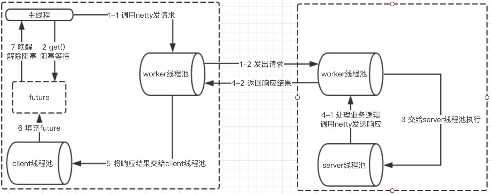

# Dubbo原理

基于dubbo V2.7.7

## spring中dubbo的启动

初始化基于spring event，监听ContextRefreshedEvent。启动调用 DubboBootstrap.start()。

### 初始化

1. 初始化配置中心相关配置，默认是将注册中心用作配置中心，RegistryConfig中的地址、协议、用户名等信息设置到ConfigCenterConfig。
2. 检查dubbo各个配置对象中的配置是否合法。
3. 初始化元数据服务`MetadataService`，定义了服务提供者和消费者的接口协议。

## dubbo服务导出

需要导出的服务，定义在ConfigManager中，每个service都会设置成一个`ServiceBean`，它继承自`ServiceConfig`，通过`export()`导出。

具体导出过程如下：

1. 检查和更新配置。包括 protocol、registry、泛化调用等配置的检查和更新。
2. 如果配置了delay，则使用调度线程执行，否则直接导出。
3. 进入ServiceConfig的doExportUrls()方法，这里只考虑普通情况，将服务按dubbo协议导出。
   1. 首先是获取定义的registry，校验参数后组装成url。例如配置为`<dubbo:registry address="multicast://224.5.6.7:1234" protocol="multicast" port="1234" />`，生成的url是`registry://224.5.6.7:1234/org.apache.dubbo.registry.RegistryService?application=meteor-consumer&dubbo=2.0.2&pid=9136&qos.enable=false&registry=multicast&release=2.7.7&timestamp=1603662243360`。
   2. 结合Protocal和Registry，将本服务导出。和上面的registry一样，service也是拼装成url，过程复杂，略。下面是一段服务生成的url。`dubbo://192.168.18.229:20880/priv.cxs.dubbo.TestService?anyhost=true&application=meteor-consumer&bind.ip=192.168.18.229&bind.port=20880&default=true&deprecated=false&dubbo=2.0.2&dynamic=true&generic=false&interface=priv.cxs.dubbo.TestService&methods=nothing&pid=9136&qos.enable=false&release=2.7.7&side=provider&timestamp=1603663001577`。
   3. 如果scope不是`remote`，则也导出到本地。此时的协议是injvm，所以通过SPI得到的是`InjvmProtocol`。协议生成一个`InjvmExporter`，并将这个exporter保存在自己的exporterMap中。这个map是全局共享的map。且ServiceConfig也会将这个exporter保存在记得的export列表中。*即使是导出到本地，也会在生成exporter时，过一遍filter链的构建，用多层filter将内部的invoker包装起来。*
   4. 如果scope不是`local`，则导出到外部。由`DubboProtocal`完成导出。首先会将exporter保存在本地的map中，再开启一个server。这里会判断是否已经开启了相同的server，也是保存在对应的serverMap中。该server最底层是用netty开启了一个服务。如果已经开启了服务，则调用对应的reset。*同样的，导出外部，invoker也会经过一遍filter链。*
   5. 由DubboProtocal导出的服务，通过直连就可以访问了，但是一般也会进行服务注册。注册由`RegistryProtocal`完成。其实在本案例中，是先进行`RegistryProtocal.export()`，其内部的`doLocalExport()`方法会调用`DubboProtocal.export()`进行服务导出。导出一般是到zk上，但是这里是用的广播（没有搭建zk）。注册到zk，其实也就是在zk上挂上一个url拼接成的临时节点。

## dubbo服务引用

在2.7.7版本的dubbo中，采用不同的定义方式，有不同表现。

定义方式 | 使用方式 | init | 表现
---------|----------|---------
xml定义 | 使用@Value等方式注入 | true | no provider
xml定义 | 使用@Value等方式注入 | false | no provider
xml定义 | 使用getBean手动使用 | true | no provider
xml定义 | 使用getBean手动使用 | false | ok
@DubboReference定义 | 直接使用 | true | no provider
@DubboReference定义 | 直接使用 | false | ok

且使用xml和注解定义的本地引用，调用过程也不一样。

### 使用xml定义

用xml配置consumer时，会生成一个ReferenceBean，实现了InitializingBean，会在bean初始化时调用afterPropertiesSet方法。如果配置了init=true，则会直接getObject()。如果init=false，则ReferenceBean会作为一个FactoryBean存在于spring容器中，当后续使用该bean时，会调用getObject()方法。

下面重点看org.apache.dubbo.config.ReferenceConfig#init()方法。

跳过大段的配置设置，直接看最核心的createProxy()。这个方法最重要的工作就是创建了一个dubbo invoker，并生成代理类，对外表现的是一个普通的bean。

1. 首先判断是否injvm，如果是则用InjvmProtocal创建invoker。
2. 如果不是injvm，且配置中的protocol不是injvm，则检查registry是否有效。
3. 根据url对应的协议，使用对应的protocal生成invoker。一般是DubboProtocal。
4. 如果需要check avaliable，则检查是否可用。
5. 使用代理工厂，生成代理。

下面看invoker创建过程。创建时，在具体的protocal外层会有多个wrapper。从外到内依次是，QosProtocolWrapper -> ProtocolListenerWrapper -> ProtocolFilterWrapper -> 具体的Protocol。如果走的是RegistryProtocol，还会经过一系列interceptor，目前看是ConsumerContextInterceptor。

如果是injvm，创建的是InjvmInvoker，如果是dubbo，创建的是DubboInvoker。两者的最大区别是，当实际调用doInvoker时，injvm直接从本地缓存的exporters中找到对应的invoker调用invoke，也就是导出时放到缓存中的invoker。而dubbo则需要用ExchangeClient发送请求调用接口。

一般情况下，使用是RegistryProtocol（内部的invoker还是dubbo）。它会订阅注册中心，获取可用的invoker，并将多个invoker合并成一个。我这里得到的结果是，MockClusterInvoker -> FailoverClusterInvoker -> RegistryDirectory。

### 使用注解定义

当在使用类中注入引用时，ReferenceAnnotationBeanPostProcessor会生效，在其doGetInjectedBean方法中生成dubbo reference。

如果对应的ReferenceBean不存在，则会新生成一个ReferenceBean。具体生成是委托给了ReferenceBeanBuilder。

builder先生成一个空的ReferenceBean，再进行配置，配置大致分下面几步。

1. preConfigureBean，主要是绑定一个DataBinder，处理字符串等。
2. configureRegistryConfigs，设置registry相关配置，如果定义中没有写registry，则没什么作用。
3. configureMonitorConfig，配置MonitorConfig，不太关心。
4. configureApplicationConfig，设置应用相关配置，如果定义中没有写，则没什么作用。
5. configureModuleConfig，配置module相关，不太关心。
6. postConfigureBean，逻辑最多。
   1. 设置ReferenceBean对应的interface。
   2. 设置自定义的ConsumerConfig。
   3. 设置自定义的MethodConfig。
   4. 调用ReferenceBean的afterPropertiesSet。这里会根据是否直接初始化决定是否调用getObject()，即提前引用服务。

表格中注解定义如果init=true会报错，就是因为6.4中的提前引用服务。

配置完成后，将bean注册到spring环境中。

最后一步是创建或者直接获取一个proxy。如果引用的是本地service，则直接生成一个jdk代理；如果不是，若对应的service在本地定义存在，提前进行导出，最后referenceBean.get()获取一个代理对象。

如何判断是否引用的本地service，同时满足对应的serviceBean在本地环境中，且不是一个remote类型的reference。

上面创建proxy，如果是本地service，创建的直接是一个jdk代理，其中代理的是service对应的spring bean，所以在调用时，没有走dubbo那一套调用链。

此外，本地代理中注入service有两个触发点，一个是调用时如果尚未存在，则拿到对应的ServiceBean，并serviceBean.getRef()获取到代理对象；另一个是当服务导出到本地完成时，会发出一个导出完成event，ReferenceAnnotationBeanPostProcessor监听到事件后将ref填充到对应的代理中。

## 调用过程

按照最常见的集群调用方式分析，对应的invoker是`MockClusterInvoker`。下面分析其invoke过程。

1. 判断是否使用mock方式，有三种，强制不使用，强制使用，失败时使用。
2. 如果需要mock，则在invocation中设置INVOCATION_NEED_MOCK属性，这样directory获取到的就是mock的invokers。
3. 调用FailoverClusterInvoker。根据负载均衡获取到对应的实际invoker，尝试调用invoke，如果失败，则在重试次数内换其他provider进行重试。
4. 底层使用的是DubboInvoker，下面看其invoker方法。
   1. 使用轮询方式获取一个用于通信的client。
   2. 发送请求，如果是oneway，返回一个空的RpcResult，如果不是oneway，则用一个Result将请求的future和executorService包装后返回。dubbo的同步和异步重点就是看谁来调用result的get方法，同步则是dubbo框架内部调用，异步则是用户调用。2.7.7中使用的future是继承自jdk的CompletableFuture，isDone()和get()方法都是直接使用的父类。

### 消费方的调用过程

自外向内依次是：

InvokerInvocationHandler -> MockClusterInvoker -> AbstractCluster$InterceptorInvokerNode -> ClusterInterceptor -> FailoverClusterInvoker -> ProtocolFilterWrapper(依次是ConsumerContextFilter, FutureFilter, MonitorFilter) -> ListenerInvokerWrapper -> AsyncToSyncInvoker -> DubboInvoker -> ReferenceCountExchangeClient -> HeaderExchangeClient -> HeaderExchangeChannel -> NettyClient -> NettyChannel -> NioSocketChannel

上述过程都是在用户线程中完成的，还没有涉及到dubbo的io线程。也没有设计到请求、响应的编码解码过程。

### 提供方的响应过程

当netty的worker线程监听到请求事件后将请求交给配置好的handler处，配置的是在DubboProtocol中定义的一个ExchangeHandler的内部类。会调用该类的reply方法。reply中，会从DubboProtocol本地的invoker缓存中找到对应的invoker，调用后返回一个future。

当future完成时，会通过channel将response返回。

### dubbo异步调用的使用和原理

在xml配置和@DubboReference中都可以定义async属性，true为异步调用。

异步调用使用方式。

1. 调用后，使用RpcContext.getContext().getFuture()。
2. RpcContext.getContext().asyncCall(task是调用接口)

dubbo默认其实是异步，实现同步是用AsyncToSyncInvoker包装了invoker，当返回了result时，判断是否是同步调用，如果是则调用result.get()等待请求结果。

### 处理RpcContext

1. com.alibaba.dubbo.remoting.exchange.support.header.HeaderExchangeHandler#handleRequest中设置`DubboThread`

2. com.alibaba.dubbo.rpc.protocol.dubbo.DubboProtocol中设置`RemoteAddress`

3. ContextFilter中设置`Invoker(invoker + url), Invocation(methodName + parameterTypes + arguments), Attachments, LocalAddress`

### dubbo线程模型



这里区分下几个线程池，io线程池：netty的worker线程池（boss线程池不会涉及），业务线程池（dubbo设置的业务线程池），用户线程（当前程序直接使用的线程）。

#### 关于encode、decode时机的探索

在server端，decode请求默认是在业务线程池中进行。虽然在io线程中也会走DubboCodec中的decode方法，但是会判断是否在io线程中解码，如果是false，则包装到`DecodeableRpcInvocation`中，在dispatch到业务线程池后由业务线程调用`DecodeableRpcInvocation`中的decode方法。

在client端，发送请求时encode是直接在io线程中完成的。请求返回时的decode，虽然也走了DubboCodec中的decode方法，但是也判断是否在io中解码，默认也是false。但是和server不同的是，在新版本的dubbo中，由于消费端使用了ThreadlessExecutor，且由于是同步调用，是用户线程调用的future.get()，所以dispatch出来的task被用户线程获取并执行，其中的decode过程也就此在用户线程中完成。
那么这个ThreadlessExecutor是什么时候设置的呢？是在调用dubboInvoker时，判断如果是同步调用，则设置一个ThreadlessExecutor，否则使用sharedExecutor。

这里有引入一个问题，不是说同步是由dubbo调用的future.get()吗，为什么在用户线程中？这里不要混淆了，前面说的谁调用get，是代码层面，在哪个线程中执行是线程层面，不是一回事。和上面说的过程对比，时间线大致如下：

```flow
st=>start: 用户线程：invoke
nx1=>operation: 用户线程：aysncResult.get()
nx2=>operation: 用户线程：io线程：received
nx3=>operation: io线程：dispatch到业务线程（由于是ThreadlessExecutor，实际上派发到了用户线程）
nx4=>operation: 用户线程：从get方法中唤醒，开始执行dispatch的task，进行decode
e=>end: get返回
st->nx1->nx2->nx3->nx4->e
```

## 常见的负载均衡

### 加权随机

算法和我想的一样，将权重加和，取随机数后看落到哪个区间。

### 加权轮询

最常用的，平滑加权轮询。

假设有4个provider及其权重 a=1, b=2, c=3, d=5，那么目标就是查询11次，a出现1次，b出现2次，c出现3次，d出现5次，且分布相对均匀。

算法如下：

总权重 totalWeight=11，每个provider一个权重累加，初始全为0, wa=0, wb=0, wc=0, wd=0。

每次轮询时

1. 先将各自权重累加加上本身权重。
2. 选择累加权重最大的，作为本次轮询结果。
3. 将选择的轮询对应的累加减去totalWeight。

算法中的不变量是每次轮询结束后，各个权重累加的总和仍然是0。

### 一致性hash

值得注意的是，在select前会判断invokers是否有过变化。创建一致性hash时，默认是160个槽位。

### 最少活跃调用

选择当前活跃调用最少的invoker。同时还有权重，当活跃数相同时，按照权重随机分配。

### 最短响应时间

需要注意的是，这里并不只是看历史请求处理的响应时间，而是看

active * SucceededAverageElapsed

意思是在这个invoker上可能需要等待的时间。

同样的如果有相同的响应时间，那么按权重随机。

## 集群容错

### failover

错误后重试。

### failfast

错误后立即异常。

### failsafe

错误后不异常，返回空结果。

#### dubbo的异常转换

## 服务目录组织与路由
