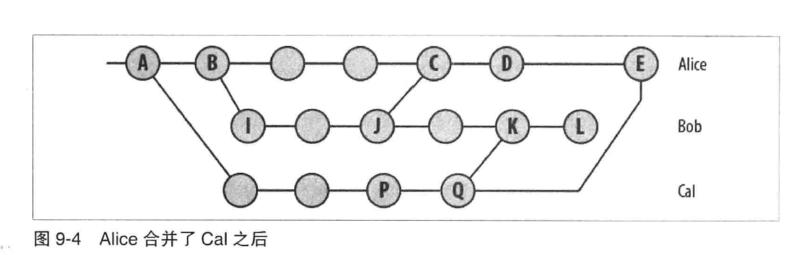
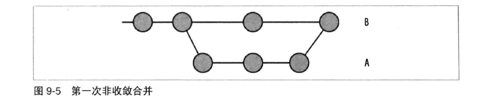
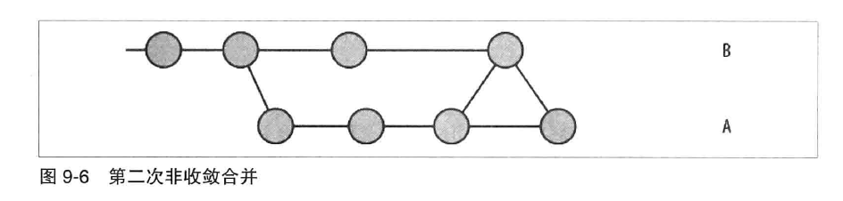
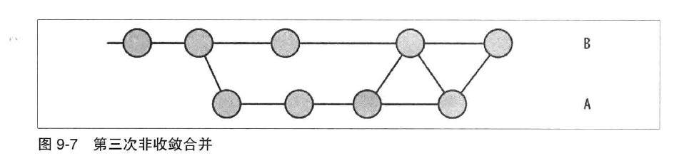

# git从0开始

## 零散知识点

### git维护了几个内置的特殊符号

#### HEAD

始终指向当前分支的最新提交

#### ORIG_HEAD

切换提交（比如reset）时，前一次所在的提交.
例如有提交 1 -> 2 -> 3，最新的是3

reset 2时，HEAD是2，ORIG_HEAD是3
再次reset 1时，ORIG_HEAD是2

#### FETCH_HEAD

### detached head

git自动创建的匿名分支。下面的情况下会自动创建：

- 检出的提交不是head
- 检出一个追踪分支
- 检出标签用的提交
- 启动一个bisect
- 使用git submodule update

### 退化合并

有两种常见情况会导致退化合并。此时不会引入新的合并提交。

1. 已经是最新的。当其他分支上的提交都已经存在于目标分支上，此时没有新的提交需要merge。
2. 快进的。目标分支上的提交都已经存在于其他分支上，此时会将其他分支上的新提交全部合并到目标分支上，然后移动head到最新的提交上。

快进的情况下，不引入新提交很重要，否则会出现合并不收敛的情况。例如

每次合并都会引入一个新的提交，而这些提交内容没有发生任何变化。

### 查看不同分支的共同祖先

git merge-base A B
