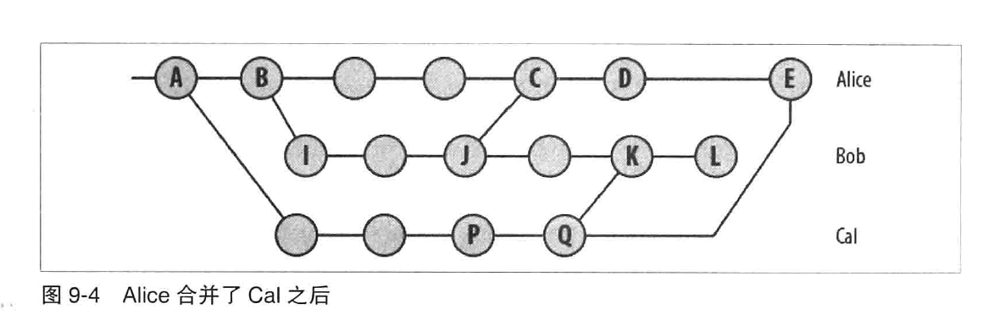

# git从0开始

## git clone

git clone --bare 是什么意思？有什么用？

--bare 表示创建一个裸仓库，没有项目源代码等文件，只保留提交历史。和普通仓库结构不一样，没有工作目录，只有如下文件：

HEAD        description     info        packed-refs
config      hooks           objects     refs

普通仓库用来编辑，bare仓库用来共享变更。比如有一个项目test，已经有了一个普通仓库。
可以建立一个bare仓库，git clone --bare test。（这个仓库可以理解为服务器上的代码仓库，没人能直接改。）
（下面的操作我就不知道是不是正确的了。。。）

```txt
在bare仓库中不能执行git pull等命令，不能主动拉取到新的提交，必须由人主动推送。
为了推送提交，需要将本地的代码remote设置成bare仓库。git remote add origin xxbarexx。
其他开发可以从bare上直接clone，git clone xxbarexx，也可以提交。
```

## git push

### 模式

#### matching

Git 1.x 的默认参数，也就是老的执行方式。其意是如果你执行 git push 但没有指定分支，它将 push 所有你本地的分支到远程仓库中对应匹配的分支。
simple（匹配单个分支）

#### simple

Git 2.x 默认参数，意思是执行 git push 没有指定分支时，只有当前分支会被 push 到远程仓库。

#### stream

git中存在upstream和downstream，简言之，当我们把仓库A中某分支x的代码push到仓库B分支y，此时仓库B的这个分支y就叫做A中x分支的upstream，而x则被称作y的downstream，这是一个相对关系，每一个本地分支都相对地可以有一个远程的upstream分支（注意这个upstream分支可以不同名，但通常我们都会使用同名分支作为upstream）。

## 零散知识点

### git维护了几个内置的特殊符号

#### HEAD

始终指向当前分支的最新提交

#### ORIG_HEAD

切换提交（比如reset）时，前一次所在的提交.
例如有提交 1 -> 2 -> 3，最新的是3

reset 2时，HEAD是2，ORIG_HEAD是3
再次reset 1时，ORIG_HEAD是2

#### FETCH_HEAD

### detached head

git自动创建的匿名分支。下面的情况下会自动创建：

- 检出的提交不是head
- 检出一个追踪分支
- 检出标签用的提交
- 启动一个bisect
- 使用git submodule update

### 退化合并



有两种常见情况会导致退化合并。此时不会引入新的合并提交。

1. 已经是最新的。当其他分支上的提交都已经存在于目标分支上，此时没有新的提交需要merge。
2. 快进的。目标分支上的提交都已经存在于其他分支上，此时会将其他分支上的新提交全部合并到目标分支上，然后移动head到最新的提交上。

快进的情况下，不引入新提交很重要，否则会出现合并不收敛的情况。例如


每次合并都会引入一个新的提交，而这些提交内容没有发生任何变化。

### 不常用的命令

#### git merge-base A B

查看不同分支的共同祖先

#### git rev-list

按时间顺序查看提交记录

git rev-list A 查看从可以到达A的所有提交。
git rev-list B 查看从可以到达A或者B的所有提交。
git rev-list A..B

#### git show-branch

查看提交记录，优势是能看到分支版本的特殊表示方法。例如：

[master] update
[master^] add
[master~2] clean commit log
[master~3] add new file
[master~4] Merge branch 'master' of github.com:humanbeingxx/notes
[master~4^2] add new files

#### git diff commit1 commit 2 --stat

加上 --stat，可以只看改动的文件列表。

#### git rm

用 git rm 来删除文件，同时还会将这个删除操作记录下来；
用 rm 来删除文件，仅仅是删除了物理文件，没有将其从 git 的记录中剔除。

git rm 删除已经提交的文件，并将删除操作提交到暂存区。不能删除只提交到暂存区的文件  ->  error: the following file has changes staged in the index

git rm --cached 从暂存区删除，但是工作区保留。

#### git cherry-pick

从已有的commit中引入修改。

git cherry-pick `commitId`

*如果pick时没有冲突，则会只引入commit引入的修改；如果pick有冲突，解决后，会将commit和之前的修改都引入。*
