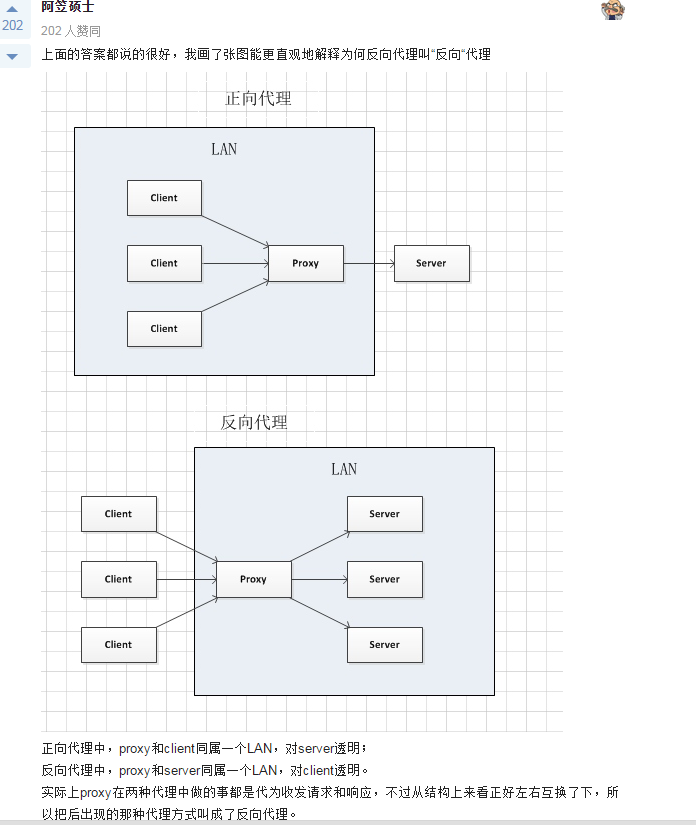
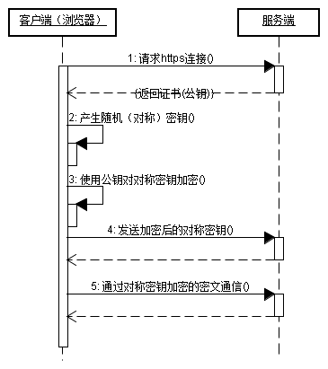

# 网络与http

## tcp

### 状态机


图中 SYN/SYN+ACK 表示“收到SYN，发送SYN+ACK”

### 三次握手

```sequence
client->server: syn=i
server->client: ack=i+1, syn=j
client->server: (established) ack=j+1 (established)
```

#### 为什么是三次？

##### 一次

肯定不行。漏洞太多。

##### 两次

情况一：server ack延迟，client没收到，但server回复ack时已经建立连接。此时client超时，重新发送syn，但server已经是建立状态，不再响应ack，无法建立连接。

情况二：client第一次syn延迟，重新发第二次syn，和server成功建立连接。传输完数据后关闭连接。此时第一次延迟syn到达，server认为是另一次连接，重新和client建立了连接。（但是第二次建立并不是client期望的。）

##### 四次

第三步

- 如果是server发syn给client，则可以和第二步server回复ack合并。
- 如果是client发syn给server，然后server回复ack时建立连接，这应该也可以，但是还是多出了一次网络传输，没有必要。不对，这样不可以，如果由server主动发起连接建立syn，会出现两次中的情况二，如果要避免重新建立，需要client再做额外判断和网络传输去取消server端的established状态，反而麻烦。如下图

```sequence
client->server: syn=i
server->client: ack=i+1
client->server: syn=j
server->client: (established)ack=j+1(established)
```

##### 三次怎么解决两次的问题

情况一下：client收不到ack，不会发起建立连接请求。

情况二下：server再次收到syn，会发ack给client，此时client有机会去判断是不是自己正常发出的syn，如果不是，不会发起建立连接请求。

#### 四次挥手


## 正向代理与反向代理



## https

### 介绍

HTTPS：是以安全为目标的HTTP通道，简单讲是HTTP的安全版，即HTTP下加入SSL层，HTTPS的安全基础是SSL，因此加密的详细内容就需要SSL。
HTTPS协议的主要作用可以分为两种：一种是建立一个信息安全通道，来保证数据传输的安全；另一种就是确认网站的真实性。

HTTPS和HTTP的区别主要如下：

1. https协议需要到ca申请证书，一般免费证书较少，因而需要一定费用。
2. http是超文本传输协议，信息是明文传输，https则是具有安全性的ssl加密传输协议。
3. http和https使用的是完全不同的连接方式，用的端口也不一样，前者是80，后者是443。
4. http的连接很简单，是无状态的；HTTPS协议是由SSL+HTTP协议构建的可进行加密传输、身份认证的网络协议，比http协议安全。

### https建立连接过程



在https中，不仅服务端会产生一个私钥，并发给客户端一个公钥。客户端也会产生一个随机的通讯密码（图中的对称密钥），用于通信过程的加密。

### 扩展

#### 公钥、私钥、数字签名

公钥加密，私钥解密，一般用于数据传输加密。
私钥加密，公钥解密，一般用于数字签名。

RSA签名的整个过程：

1. 发送方采用某种摘要算法从报文中生成一个128位的散列值（称为报文摘要）；
2. 发送方用RSA算法和自己的私钥对这个散列值进行加密，产生一个摘要密文，这就是发送方的数字签名；
3. 将这个加密后的数字签名作为报文的附件和报文一起发送给接收方：
4. 接收方从接收到的原始报文中采用相同的摘要算法计算出128位的散列值；
5. 报文的接收方用RSA算法和发送方的公钥对报文附加的数字签名进行解密；
6. 如果两个散列值相同，那么接收方就能确认报文是由发送方签名的。