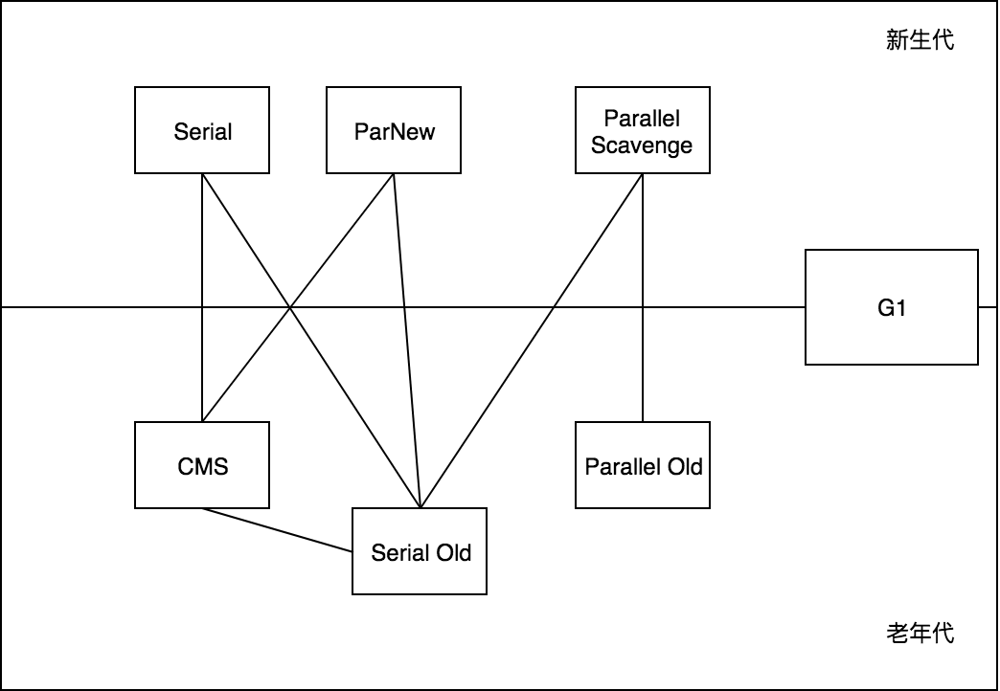
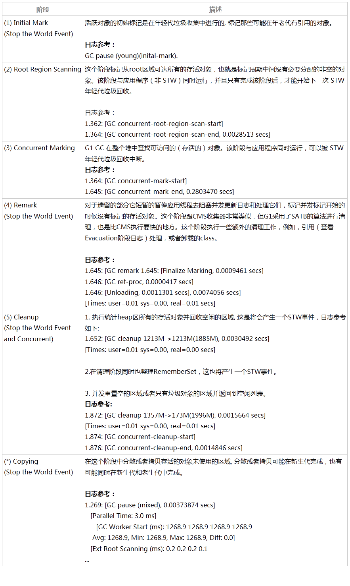
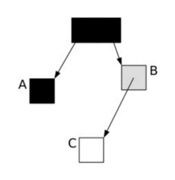

# GC

## 新生代回收策略

1. 新对象尝试栈上分配，不行再尝试TLAB分配，不行则考虑是否直接绕过eden区在年老代分配空间(-XX:PretenureSizeThreshold设置大对象直接进入年老代的阈值，当对象大小超过这个值时，将直接在年老代分配。)，不行则最后考虑在eden申请空间。
2. 向eden申请空间创建新对象，eden没有合适的空间，因此触发minor gc。
3. minor gc将eden区及from survivor区域的存活对象进行处理。
    1. 对象年龄达到阈值，则直接晋升到年老代。
    2. 拷贝的对象太大，直接进入年老代。
    3. 若to survivor区域空间不够/或者复制过程中出现不够，则发生survivor溢出，直接进入年老代。
    4. 若to survivor区域空间够，则存活对象拷贝到to survivor区域
4. eden区及from survivor区域的剩余对象为垃圾对象，直接抹掉回收，释放的空间成为新的可分配的空间。
5. minor gc之后，若eden空间足够，则新对象在eden分配空间；若eden空间仍然不够，则新对象直接在年老代分配空间。

## 判断对象是否存活

### 引用计数器

python使用。简单高效，但难以解决循环依赖问题。

## 可达性分析

从GC root对象出发遍历可达对象。常见的root对象有：虚拟机栈中引用的对象、静态变量引用的对象、方法区引用的对象、native方法引用的对象。

注意强引用、软引用、弱引用、虚引用的概念。

### oopMap

如果没有优化，GC时，需要遍历方法栈上的内存，判断哪些是Reference类型。对Reference类型的数据，引用的对象不能作为垃圾进行回收。
可以利用空间优化时间，使用oopmap保存栈上不同偏移量保存的数据类型。GC时无需扫描，直接读取oopmap就能知道有哪些引用。
每个方法可能会有好几个oopMap，就是根据safepoint把一个方法的代码分成几段，每一段代码一个oopMap，作用域自然也仅限于这一段代码。

#### 引申点 —— RememberSet

新生代GC非常频繁，有时只想做新生代的垃圾收集，但是可能被老年代的对象引用了，不想扫描老年代怎么办？

> jvm会在新生代开辟一块空间，即RememberSet，运行中会保存老年代对新生代对象的引用关系。所以新生代真正的GC root是“新生代GC root + RememberSet”。

特别是在G1收集器中，每个region都会有RememberSet保存其他region对本region中对象的引用关系。

### 安全点（safe point）

代码中可能每条语句都会造成引用关系的变化，如果每次都建立oopmap，代价太大。此时，选取最可能造成程序“长时间运行”的指令序列来构造oopmap。比如方法调用、循环跳转、异常跳转等。

如何让程序停下来，一般有两种方式。

- 抢断式。GC发生时，中断全部线程，对于没有达到safepoint的让其继续执行到safepoint。
- 主动式。GC发生时，仅设置标志位，每个线程主动轮询。这种方式下，生成代码时，会插入一些safepoint检查的操作。一般是这样 `0x01b6d62d: test   %eax,0x160100      ;   {poll}`。当JVM要停止所有的Java线程时会把一个特定内存页（代码中的0x160100）设置为不可读，那么当Java线程读到这个位置的时候就会被挂起。

#### 引申点 —— 安全区域(safe region)

safe point能解决运行中线程GC问题，但是线程可能没有在运行。此时引用了safe region概念。
safe region是指一段代码中引用关系不会发生变化。当线程进入safe region时，会标识自己进入safe region，GC时会直接跳过safe region中的线程。
必须等到GC root枚举完成或者整个GC完成，线程才能离开safe region。

## GC算法

### 标记-清除

最基础的算法。缺点是容易产生碎片。

### 复制算法

可用内存分为两块。GC时将存活的对象复制到另一块。每次回收都是以半个内存区域为单位。
复制算法多用于新生代。因为新生代的对象大概率是短生命周期。
将新生代分为一个Eden和两个survivor，GC时将eden和一个survivor中存活的对象复制到另一个survivor中。

#### 为什么要两个survivor

首先是为什么要survivor。如果只有eden和老年代，eden未GC的内存很快会占满老年代，容易触发FullGC(Major GC + Minor GC)。而eden中未GC的内存在一下次是可能被GC掉的，直接进老年代，浪费了机会。移入survivor给了一次等待GC的机会。

再次是为什么要两个。如果只有一个，会造成survivor中内存碎片。因为survivor中的内存也可能被GC掉，在多次接收eden的对象后，很容易形成碎片。除非对survivor进行内存整理。但这有悖复制算法初衷。有两个survivor后，每次youngGC，会将eden中存活和一个survivor钟存活的对象，整体拷贝到另一个survivor中，内存能保证连续使用。

### 标记-整理

## 常见的收集器

### Serial New（新生代）/Old（老年代）

基于标记-清除，最基础的收集器。用单线程标记，单线程清除。

Serial New一般用于client模式的java或者单核场景，因为此时要么内存分配很小，要么能省去线程切换。
Serial Old一般作为CMS的预备方案。

### ParNew（新生代）

多线程版本的Serial。使用ParNew的重要原因是，只有ParNew和Serial能和CMS配合使用。

### Parallel Scavenge（新生代）

基于复制算法，多线程收集。重点在于可以控制吞吐量。

通过 MaxGCPauseMillis 控制每次GC最大停顿事件 和 GCTimeRatio 控制GC时间占比（1:设置的值）。

### Parallel Old

和Parallel Scavenge组成“吞吐量优先”收集器。

### CMS(Concurrent Mark Sweep)

思路是用两次短暂停代替长暂停，耗时比较长的环节--并发标记和并发清除能够和用户线程一起执行。

基本流程如下：

- 初始标记，标记GC roots能直接关联的对象。需要STW。
- 并发标记:并发执行。
- 重新标记，修正并发标记期间，用户线程导致的标记变动。需要STW,多线程执行
- 并发清理:并发执行。

#### Promotion Failed && Concurrent Mode Failure

Promotion Failed 是在ygc中报的错误，原因是survival区放不下gc后要复制的对象，必须提升到老年代，但此时老年代没有足够的空间。

并发清理阶段是和用户线程同步进行，此时可能会产生新的垃圾。所以需要预留部分空间给可能存在的“浮动垃圾”使用。
当预留空间不足时（CMS过程中老年代被占满）会报错Concurrent Mode Failure，同时触发一次Serial Old的Full GC。

#### 优缺点

优点：并发收集，低停顿。
缺点：cpu资源敏感，浮动垃圾

### G1

G1命名的由来。G1的设计原则是“尽可能多的收集垃圾”，不会等内存快消耗完时才收集，而是用启发算法，在区块中找到回收价值高的进行回收。

初始标记中的GC ROOTS对象和参与gc的regions是什么关系？如果从全部的root出发，应该是会遍历到CSet之外的region的。

过程

#### 三色标记算法（CMS貌似也有）

- 黑色:根对象，或者该对象与它的子对象都被扫描。
- 灰色:对象本身被扫描,但还没扫描完该对象中的子对象。
- 白色:未被扫描对象，扫描完成所有对象之后，最终为白色的为不可达对象，即垃圾对象。

并发标记阶段，可能会有下面情况：

并发标记时，可能将关系修改成了

很明显会被错误回收。

在CMS中，是增量更新，在添加引用时记录。采用了“写栅栏”，只要发现有黑对象引用白对象，就将白对象改成灰对象。
将所有新插入的引用关系保存，在重新扫描阶段，以这些引用关系的引用方为root重新扫描。
例如新增 A = a，那么保存A，在remark时重新从A开始扫描。

在G1中使用了SATB（snapshot-at-the-beginning），在删除时记录。（据网上说比cms快）
将即将被删除的引用关系记录下来，最后以这些旧的引用关系的引用方为root重新扫描。
例如删除 A = a -> A = null，那么记录a，remark时重新从a开始扫描。

1. 标记前生成对象存活的快照。
2. 标记时，将被改变的对象在“写栅栏”中标记为非白，放入队列(card table)中，并在重新标记阶段继续处理。（card table也记录了哪块老年代区域引用了新生代区域。）
3. 浮动垃圾，将在下次GC回收。

***注意，浮动垃圾和第2步中发生变化的对象，不是一个概念***
GC过程中可能有的方法栈执行完了，此时原根区域的这部分对象应该也成为垃圾了，但是由于GC只有初始标记和重新标记会STW，这部分后执行完的栈中对象就成了浮动垃圾。

#### 关于SATB的一些疑问

1. 并发标记中，如果GC ROOTS中有新增的对象怎么办？这些对象应该是也不能回收的。
    > 解答：每个region都有top-at-mark-start（TAMS）指针，指针以上的就是新分配的对象，在SATB中默认是可达的。同样的，在CMS中，收集过程中新建的对象也是认为是可达的。
2. 按照网上说的漏标的条件之一是“给一个黑色对象的引用类型字段赋值了该白色对象”，但是如果是给一个灰色对象字段赋值白色对象会怎么样？有可能这个白色对象正在标记，且赋值字段已经标记过了，这样会不会不再标记导致漏标？
    > 解答：看了更令人信服的帖子，并没有提到黑色、灰色，而是用 write-barrier，当有删除引用操作时，就记录。

#### 关于CMS的一些疑问

cms的remark阶段，是从哪些区域开始的？网上有说：

> 而CMS的remark需要重新扫描mod-union table里的dirty card外加整个根集合，而此时整个young gen（不管对象死活）都会被当作根集合的一部分，因而CMS remark有可能会非常慢。

为什么要外加整个根？又或者说为什么在G1的remark阶段中不需要重新扫描整个根？

按照目前我的理解：

为什么CMS要加上整个根？因为是old gc，需要收集整个老年代。但是CMS的处理有个缺陷是无法观察到堆外根集合的引用变化。所以需要在remark阶段重新扫描整个根。

为什么G1中不需要重新扫描根？因为G1是基于快照的垃圾判断。
> Anything live at Initial Marking is considered live.
> Anything allocated since Initial Marking is considered live.
扫描出的垃圾，肯定都是mark开始那一刻产生的。而CMS没有这样的快照，导致需要重新扫描整个根。

*但是即使cms会重新扫描整个根，遇到黑色对象也是会直接跳过的，不会重新来一遍*

## 内存分配与回收策略

对象优先在eden中分配。遇到大对象，直接分配到老年代。长期存活的对象进入老年代，默认是在新生代中经历过15次youngGC。

### 动态年龄判断

如果survival中相同年龄的对象占总空间50%以上，这些对象可以直接进入老年代。

### 空间分配担保

youngGC会将部分对象移到老年代，所以需要判断老年代空间是否足够。
在youngGC前会判断老年代空余空间是否能容纳所有新生代对象。如果不满足，则此次youngGC是有风险的。
通过配置来开启“担保失败”。如果不允许或者开启后GC仍失败，则会启动一次FulGC。
“担保失败”的阈值，一般取之前新生代移到老年代数据量的平均值。

## 默认收集器

命令 `java -XX:+PrintCommandLineFlags -version`

jdk1.7 默认垃圾收集器Parallel Scavenge（新生代）+Parallel Old（老年代）。

jdk1.8 默认垃圾收集器Parallel Scavenge（新生代）+Parallel Old（老年代）。

jdk1.9 默认垃圾收集器G1。

### 为什么默认不是cms，不是很厉害的样子吗

1. 碎片问题。
2. cpu资源敏感，并发标记和并发清除过程会竞争cpu。
3. 不稳定。如果发生了Concurrent Mode Failure，会导致Serial，GC时间更长。
4. 由于浮动垃圾，需要预留空间。这个阈值不好设置，太大，容易发生3中的问题，太小，容易频繁FullGC，内存变相被压缩了。

但是对于大内存（大于8G？），必须使用cms，否则暂停时间可能过长。

### G1和CMS的优缺点

CMS优点：并发收集，低停顿。
CMS缺点：对CPU资源敏感；有浮动垃圾；内存碎片。

G1优点：基于复制，自带内存整理；可预测的停顿时间；算法使remark阶段更短。
G1缺点：当GC压力大、垃圾多时，可能需要全部region参与，此时效果不如更简单的收集器。所以一般在内存6~8G以上时使用。

## JVM参数调优
