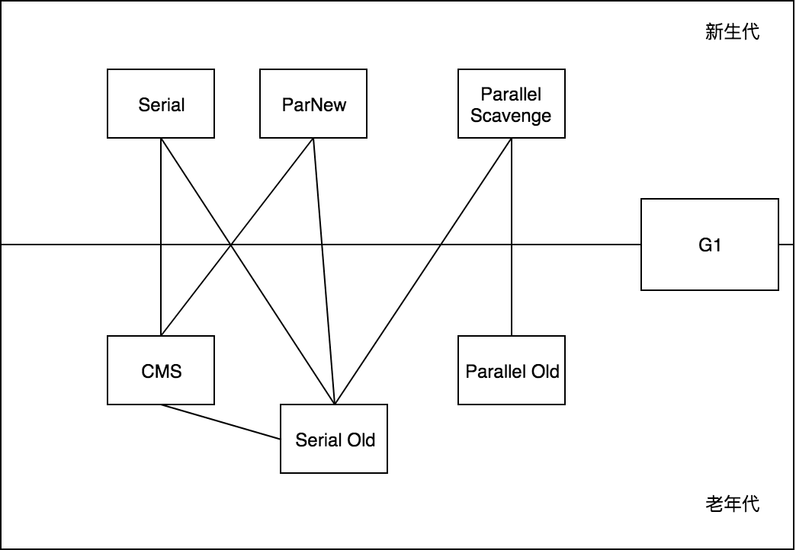
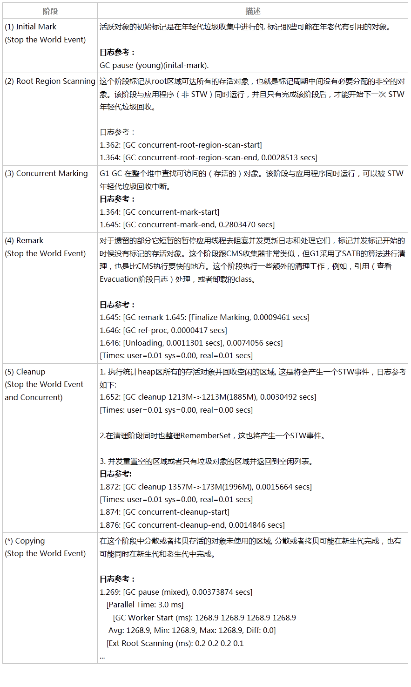
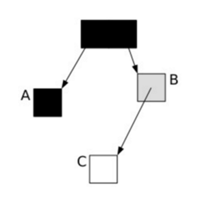

# GC

## 判断对象是否存活

### 引用计数器

python使用。简单高效，但难以解决循环依赖问题。

## 可达性分析

从GC root对象出发遍历可达对象。常见的root对象有：虚拟机栈中引用的对象、静态变量引用的对象、方法区引用的对象、native方法引用的对象。

注意强引用、软引用、弱引用、虚引用的概念。

### oopMap

如果没有优化，GC时，需要遍历方法栈上的内存，判断哪些是Reference类型。对Reference类型的数据，引用的对象不能作为垃圾进行回收。
可以利用空间优化时间，使用oopmap保存栈上不同偏移量保存的数据类型。GC时无需扫描，直接读取oopmap就能知道有哪些引用。
每个方法可能会有好几个oopMap，就是根据safepoint把一个方法的代码分成几段，每一段代码一个oopMap，作用域自然也仅限于这一段代码。

#### 引申点 —— RememberSet

新生代GC非常频繁，有时只想做新生代的垃圾收集，但是可能被老年代的对象引用了，不想扫描老年代怎么办？

> jvm会在新生代开辟一块空间，即RememberSet，运行中会保存老年代对新生代对象的引用关系。所以新生代真正的GC root是“新生代GC root + RememberSet”。

特别是在G1收集器中，每个region都会有RememberSet保存其他region对本region中对象的引用关系

### 安全点（safe point）

代码中可能每条语句都会造成引用关系的变化，如果每次都建立oopmap，代价太大。此时，选取最可能造成程序“长时间运行”的指令序列来构造oopmap。比如方法调用、循环跳转、异常跳转等。

如何让程序停下来，一般有两种方式。

- 抢断式。GC发生时，中断全部线程，对于没有达到safepoint的让其继续执行到safepoint。
- 主动式。GC发生时，仅设置标志位，每个线程主动轮询。这种方式下，生成代码时，会插入一些safepoint检查的操作。一般是这样 `0x01b6d62d: test   %eax,0x160100      ;   {poll}`。当JVM要停止所有的Java线程时会把一个特定内存页（代码中的0x160100）设置为不可读，那么当Java线程读到这个位置的时候就会被挂起。

#### 引申点 —— 安全区域(safe region)

safe point能解决运行中线程GC问题，但是线程可能没有在运行。此时引用了safe region概念。
safe region是指一段代码中引用关系不会发生变化。当线程进入safe region时，会标识自己进入safe region，GC时会直接跳过safe region中的线程。
必须等到GC root枚举完成或者整个GC完成，线程才能离开safe region。

## GC算法

### 标记-清除

最基础的算法。缺点是容易产生碎片。

### 复制算法

可用内存分为两块。GC时将存活的对象复制到另一块。每次回收都是以半个内存区域为单位。
复制算法多用于新生代。因为新生代的对象大概率是短生命周期。
将新生代分为一个Eden和两个survivor，GC时将eden和一个survivor中存活的对象复制到另一个survivor中。

#### 为什么要两个survivor？

首先是为什么要survivor。如果只有eden和老年代，eden未GC的内存很快会占满老年代，容易触发FullGC(Major GC + Minor GC)。而eden中未GC的内存在一下次是可能被GC掉的，直接进老年代，浪费了机会。移入survivor给了一次等待GC的机会。

再次是为什么要两个。如果只有一个，会造成survivor中内存碎片。因为survivor中的内存也可能被GC掉，在多次接收eden的对象后，很容易形成碎片。除非对survivor进行内存整理。但这有悖复制算法初衷。有两个survivor后，每次youngGC，会将eden中存活和一个survivor钟存活的对象，整体拷贝到另一个survivor中，内存能保证连续使用。

### 标记-整理

## 常见的收集器

### Serial New（新生代）/Old（老年代）

基于标记-清除，最基础的收集器。用单线程标记，单线程清除。

Serial New一般用于client模式的java或者单核场景，因为此时要么内存分配很小，要么能省去线程切换。
Serial Old一般作为CMS的预备方案。

### ParNew（新生代）

多线程版本的Serial。使用ParNew的重要原因是，只有ParNew和Serial能和CMS配合使用。

### Parallel Scavenge（新生代）

基于复制算法，多线程收集。重点在于可以控制吞吐量。

通过 MaxGCPauseMillis 控制每次GC最大停顿事件 和 GCTimeRatio 控制GC时间占比（1:设置的值）。

### Parallel Old

和Parallel Scavenge组成“吞吐量优先”收集器。

### CMS(Concurrent Mark Sweep)

思路是用两次短暂停代替长暂停，耗时比较长的环节--并发标记和并发清除能够和用户线程一起执行。

基本流程如下：

```mermaid
graph LR
初始标记-->并发标记
并发标记-->重新标记
重新标记-->并发清理
并发清理-->重置线程
```

- 初始标记，标记GC roots能直接关联的对象。需要STW。
- 并发标记:并发执行。
- 重新标记，修正并发标记期间，用户线程导致的标记变动。需要STW,多线程执行
- 并发清理:并发执行。

#### Concurrent Mode Failure

并发清理阶段是和用户线程同步进行，此时可能会产生新的垃圾。所以需要预留部分空间给可能存在的“浮动垃圾”使用。
当预留空间不足时（CMS过程中老年代被占满）会报错Concurrent Mode Failure，同时触发一次Serial Old的Full GC。

#### 优缺点

优点：并发收集，低停顿。
缺点：cpu资源敏感，浮动垃圾

### G1

过程

#### 三色标记算法（CMS貌似也有）

- 黑色:根对象，或者该对象与它的子对象都被扫描。
- 灰色:对象本身被扫描,但还没扫描完该对象中的子对象。
- 白色:未被扫描对象，扫描完成所有对象之后，最终为白色的为不可达对象，即垃圾对象。

并发标记阶段，可能会有下面情况：

并发标记时，可能将关系修改成了

很明显会被错误回收。

在CMS中，是增量更新，在添加引用时记录，。采用了“写栅栏”，只要发现有黑对象引用白对象，就将白对象改成灰对象。

在G1中使用了STAB（snapshot-at-the-beginning），在删除时记录。（据网上说比cms快）

1. 标记前生成对象存活的快照。
2. 标记时，将被改变的对象在“写栅栏”中标记为非白，放入队列中，并在重新标记阶段继续处理。
3. 游离垃圾，将在下次GC回收。

## 内存分配与回收策略

对象优先在eden中分配。遇到大对象，直接分配到老年代。长期存活的对象进入老年代，默认是在新生代中经历过15次youngGC。

### 动态年龄判断

如果survival中相同年龄的对象占总空间50%以上，这些对象可以直接进入老年代。

### 空间分配担保

youngGC会将部分对象移到老年代，所以需要判断老年代空间是否足够。
在youngGC前会判断老年代空余空间是否能容纳所有新生代对象。如果不满足，则此次youngGC是有风险的。
通过配置来开启“担保失败”。如果不允许或者开启后GC仍失败，则会启动一次FulGC。
“担保失败”的阈值，一般取之前新生代移到老年代数据量的平均值。

## 默认收集器

命令 `java -XX:+PrintCommandLineFlags -version`

jdk1.7 默认垃圾收集器Parallel Scavenge（新生代）+Parallel Old（老年代）。

jdk1.8 默认垃圾收集器Parallel Scavenge（新生代）+Parallel Old（老年代）。

jdk1.9 默认垃圾收集器G1。