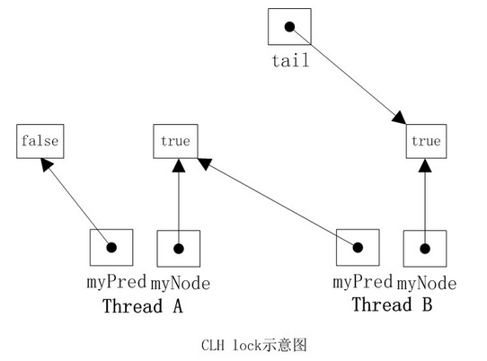
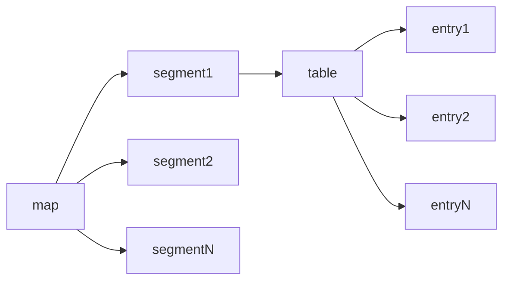
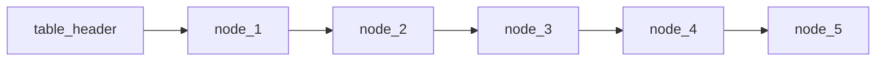
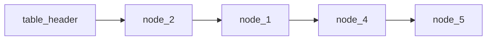

# 并发与锁

## 锁

### CLH(Craig, Landin, and Hagersten  locks)

是一个自旋锁，能确保无饥饿性，提供先来先服务的公平性。

CLH锁也是一种基于链表的可扩展、高性能、公平的自旋锁，申请线程只在本地变量上自旋，它不断轮询前驱的状态，如果发现前驱释放了锁就结束自旋。

#### 原理



重点是lock时，巧用了ThreadLocal。虽然lock中的myNode始终是一个变量，但是ThreadLocal的特性，会将当前thread当成key放到map中。
当map中没有当前线程时，会用initialValue初始化一个新的value。
实际上，真正标识上一个节点的是tail这个字段，它是所有线程共享的。
lock时，会将tail设置成当前线程的node，并将preNode设置成之前的tail，并自旋轮询之前tail的状态。
unlock时，会将当前线程的node设置成释放状态，同时将当前node设置成preNode。

#### 网上的示例代码

```java

public class CLHLock implements Lock {  
    AtomicReference<QNode> tail;  
    ThreadLocal<QNode> myPred;  
    ThreadLocal<QNode> myNode;  
  
    public CLHLock() {  

         tail = new AtomicReference<QNode>(new QNode());  
        myNode = new ThreadLocal<QNode>() {  
            protected QNode initialValue() {  
                return new QNode();  
            }  
        };  
        myPred = new ThreadLocal<QNode>() {  
            protected QNode initialValue() {  
                return null;  
            }  
        };  
    }  
  
    @Override  
    public void lock() {  
        QNode qnode = myNode.get();  
        qnode.locked = true;  
        QNode pred = tail.getAndSet(qnode);  
        myPred.set(pred);  
        while (pred.locked) {  
        }  
    }  
  
    @Override  
    public void unlock() {  
        QNode qnode = myNode.get();  
        qnode.locked = false;  
        myNode.set(myPred.get());  
    }  
}
```

这个代码运行了，当并发较多时，会出现都拿不到锁的情况。我觉得是每个线程都在自旋，疯狂抢占cpu时间片，而当前锁持有者并不保证一直占有cpu，导致锁无法及时释放。

#### 我的代码

```java

public void lockWithSleep() {
    CLHNode currentMyNode = myNode.get();
    currentMyNode.lock();
    CLHNode preTail = tail.getAndSet(currentMyNode);
    preNode.set(preTail);
    int tryCount = 0;
    while (preTail.isLocked()) {
        tryCount++;
        if (tryCount % 100000 == 0) {
            // System.out.println("have to stop " + Thread.currentThread().getName());
            try {
                Thread.sleep(1);
            } catch (InterruptedException e) {
                e.printStackTrace();
            }
        }
    }
}

```

给一定的机会来自旋，如果达到某个特定的点，就主动放弃cpu。随着阈值的增加，性能也越差。

#### 疑问

在V1中，preNode是什么用？网上说是能释放内存，但是根据我的推演，下一个节点仍会持有上一个节点。

#### 一个尴尬的错误

没有sleep的代码中，在100个线程就会出现卡死的情况。起初以为是时间片原因，但是这里有一个并发环境下严重的错误——可见性。
在我的Node中，lock这个标志位没有设置成volatile。设置了之后，200个线程还是能跑完的。
当然加上sleep之后，总体运行时间是有提升，但是这已经是优化的范畴，而不是解决bug的层面了。

### MCS

#### NUMA(Non-Uniform Memory Access)

非一致存储访问，将CPU分为CPU模块，每个CPU模块由多个CPU组成，并且具有独立的本地内存、I/O槽口等，模块之间可以通过互联模块相互访问，
访问本地内存的速度将远远高于访问远地内存(系统内其它节点的内存)的速度，这也是非一致存储访问的由来。NUMA较好地解决SMP的扩展问题，
当CPU数量增加时，因为访问远地内存的延时远远超过本地内存，系统性能无法线性增加。

#### MCS原理


MCS锁和CLH锁的不同是，每个节点在自己的lock标识上自旋，而不是前驱节点。前驱节点释放锁后，主动修改后置节点的lock标识。
MCS在解锁时需要考虑更多的并发因素。

#### 代码

```java

public class MCSLock {

    private static class MCSNode {
        volatile boolean locked = true;
        volatile MCSNode next;
    }

    private AtomicReference<MCSNode> tail = new AtomicReference<>();

    private ThreadLocal<MCSNode> currentNode = ThreadLocal.withInitial(MCSNode::new);

    public void lock() {
        MCSNode current = currentNode.get();
        // 这里由于是原子操作，下面的代码操作的是preTail，不会有并发问题
        MCSNode preTail = tail.getAndSet(current);
        if (preTail != null) {
            preTail.next = current;
            while (current.locked) {

            }
        }
    }

    public void unlock() {
        MCSNode current = currentNode.get();
        if (current.next == null) {
            // 如果后置为空，说明“可能”没有其他等待锁的线程，将tail设置为空
            if (tail.compareAndSet(current, null)) {
                return;
            }
            // 然而，先判断再操作是个经典的并发问题.在判断过程中，可能tail被其他线程设置了。
            // 再然而，为什么会有下面这个循环呢？因为设置了tail，但是next并不一定设置完成，需要稍等一段时间
            while (current.next == null) {
            }
        }
        current.next.locked = false;
    }
}

```

### AbstractQueuedSynchronizer

内部等待队列是一个双向链表。当获取锁失败时，新建一个node，插入到队尾；当获取锁成功，使用完释放时，唤醒head的下一个节点，并将head修改成下一个节点。插入队尾时需要做并发处理，使用cas更新tail，而修改head不需要，因为只有获取锁成功的才能修改。

公平性和非公平性的区别：lock时，非公平会用cas直接尝试一次加锁，失败时调用acquire，公平会直接调用acquire。而在acquire中，会首先tryAcquire一次，这里非公平也会用cas直接尝试一次加锁，失败后返回false；公平会判断队列中是否有前继节点，如果有，说明已经有线程在等待锁，此时获取锁失败。

## 另一个层面的锁概念

java中每个对象都可作为锁，锁有四种级别，按照量级从轻到重分为：无锁、偏向锁、轻量级锁、重量级锁。每个对象一开始都是无锁的，随着线程间争夺锁，越激烈，锁的级别越高，并且锁只能升级不能降级。

### 偏向锁

第一次被拥有的时候，记录下偏向线程ID。每次同步，检查锁的偏向线程ID与当前线程ID是否一致，如果一致直接进入同步，如果不一致意味着发生了竞争，这时候需要锁膨胀为轻量级锁。退出同步无需更新对象头信息。

### 轻量锁

争夺轻量级锁失败时，自旋尝试抢占锁，使用CAS更新对象头，如果自旋失败膨胀为重量锁。每次进入退出同步块都需要CAS更新对象头，解锁失败。

### 重量锁

和轻量锁最大的不同是，抢锁不用自旋，而是阻塞。

### synchronize执行过程

1. 检测Mark Word里面是不是当前线程的ID，如果是，表示当前线程处于偏向锁。
2. 如果不是，则使用CAS将当前线程的ID替换Mard Word，如果成功则表示当前线程获得偏向锁，置偏向标志位1。
3. 如果失败，则说明发生竞争，撤销偏向锁，进而升级为轻量级锁。
4. 当前线程使用CAS将对象头的Mark Word替换为锁记录指针，如果成功，当前线程获得锁。
5. 如果失败，表示其他线程竞争锁，当前线程便尝试使用自旋来获取锁。
6. 如果自旋成功则依然处于轻量级状态。
7. 如果自旋失败，则升级为重量级锁。

### wait为什么要和while配合使用

下面是一个消费者代码。

```java
public synchronized void take() {
    while (count <= 0) {
        this.wait();
    }
    Preconditions.checkState(count > 0);
    count--;
}
```

为什么要用 `while(count <= 0)` 而不是 `if(count <= 0)`。

如果使用的是notifyAll，每个消费者都会被唤醒并重新竞争锁。消费者A使用完后会释放锁，此时消费者B获得锁，但已不满足count>0的要求。

如果使用的是notify，如果每次都能按预期唤醒消费者，正常情况没有问题。但如果有多个生产者，如果用的是if判断，则可能导致队列溢出，如果用的是while判断，则可能导致死锁。因为生产者和消费者共用队列的锁，notify无法控制唤醒的是谁。

此外jvm中存在伪唤醒，导致不满足条件的进程也可能被唤醒，所以也需要防御性编程。

> A thread can also wake up without being notified, interrupted, or timing out, a so-called spurious wakeup

## 数据结构

### HashMap & ConcurrentHashMap (jdk1.8后实现完全变了)

#### ConcurrentHashMap基本结构



每个segment继承自ReentrantLock。分段锁。
另一个特点是每个entry大量使用了不变量和volatile。

```java
static final class HashEntry<K,V> {  
    final K key;  
    final int hash;  
    volatile V value;  
    final HashEntry<K,V> next;  
}
```

特别注意 next 也是final，所以在删除操作时，需要将table header节点到删除元素前的每个节点都复制一遍。

例如



需要删除node_3，结果如下（node_2在node_1前是实现上的原因）



put, remove, rehash操作都是会先加上segment锁再进行。

containsKey和size操作，进行了优化，先尝试3次对每个segment聚合运算，并通过判断操作前后modCount是否一致来验证计算过程中是否有修改。如果3次都不一致，则改成加锁运算。

get操作，基本没有加锁，代码如下。

```java

V get(Object key, int hash) {
    if (count != 0) { // read-volatile
        HashEntry<K,V> e = getFirst(hash);
        while (e != null) {
            if (e.hash == hash && key.equals(e.key)) {
                V v = e.value;
                if (v != null)
                    return v;
                return readValueUnderLock(e); // recheck
            }
            e = e.next;
        }
    }
    return null;
}

```

整个过程没有加锁，count由于是volatile，且值的修改是在同步块中操作的，所以没有并发问题。这个count一定程度上保证了get可以得到新值。
在返回前，却加了锁readValueUnderLock。因为put中的操作  tab[index] = new HashEntry<K,V>(key, hash, first, value) 可能由于指令重排，导致table[index]指向的对象中的value是null。加上锁后，能保证读取在put之后才进行。

#### jdk1.8

8里放弃了segment，数据用一个table保存，实际上是Node[]。同步策略是直接用synchronized锁定了table中的一行，因为并发主要问题还是在于后面连表的操作。
而8中hashmap在连表长度大于8时，会转成红黑树。

##### hashmap扩容过程

扩容的启动，是在put后，会addcount，此时会检查是否达到阈值，进行扩容。

扩容需要处理几个问题：

1. 当前正在扩容，有另一个线程也触发了扩容怎么办？
2. 当前正在扩容，另一个put。
3. 当前正在扩容，另一个get。

回答：

1. 通过sizeCtl变量控制，如果小于0，说明已经在transfer当中。此时其他线程也进入transfer，但是不会在new一个nextTab，而是在原有的nextTab上进行transfer。
2. 计算出当前的hash，如果是-1，说明当前entry已经被transfer过了，此时会进行helpTransfer。完成后再进行put。如果hash不是-1，那么直接进行正常的put。
3. 如果hash不是-1，直接get，如果是-1，那么通过当前的这个forwardingNode找到对应的新entry进行get。

这里再说下transfer的流程，helpTransfer也是走的这个流程。

transfer是可以多线程并行执行的，每个线程会领取一定量的entry处理，最小量是16个，transferIndex表示下一个要领取的开始位置，是从大到小递减的。每个线程通过cas修改index，表示自己获取了这一段任务，然后synchronize原tab的entry，再进行扩容，完成后将原entry修改为一个固定的forwardingNode。

- 为什么put和transfer可以同时进行，会不会put的node被遗漏？

不会，因为两个操作都会synchronize对应的entry。一个可能的问题是，put先进行，获取到的hash不是-1，此时transfer也同时进行，获取到了锁，完成了transfer，原entry被修改成forwarding，那么put此时看到的就不是原来的entry了。这里采用的是 循环 + 判断是否是原entry的方式，如果发生了改变，那就再来一遍put流程。

## java8 parallel

stream.parallel()和parallelStream是一样的吗？

不一样。对于ArrayList和其他简单的数据结构，可能是一样的，但是至少会受到以下两点影响：

1. 具体的Stream实现是否重写了parallel()方法，返回的是不可并发的流。
2. stream内部组件的实现机制。

对于第二点，举个🌰。

```java
Stream<Path> stream = Files.list(Paths.get("/Users/cxs")).parallel();
stream.forEach(path -> {
    System.out.println("测试！！！！！！！！");
    try {
        Thread.sleep(1000);
    } catch (InterruptedException e) {
        e.printStackTrace();
    }
});

Stream<Path> stream = Files.list(Paths.get("/Users/cxs")).collect(Collectors.toList()).parallelStream();
stream.forEach(path -> {
    System.out.println("测试！！！！！！！！");
    try {
        Thread.sleep(1000);
    } catch (InterruptedException e) {
        e.printStackTrace();
    }
});
Thread.sleep(1000);

```

上面代码，第一段不能并发，第二段可以。
从java框架代码上看，两段代码执行的路径是一致的。但是当判断如何切分任务时的差别，造成了并发行为上的不一致。

用Files.list.parallel()，切分时，最终调用的是java.util.Spliterators.IteratorSpliterator#trySplit。方法中以1024为一批，但数量小于这个unit时，只会建立一个任务顺序执行。

用ArrayList的parallelStream，每次获取Spliterator时，都是new ArrayListSpliterator，同时会用index记录之前切分的位置。同时每次切分时，用的是二分方式。

下面是foreach后的调用路径

1. java.util.stream.ReferencePipeline#forEach
2. java.util.stream.ForEachOps.ForEachOp#evaluateParallel
3. java.util.concurrent.ForkJoinTask#invoke
4. java.util.stream.ForEachOps.ForEachTask#compute
5. java.util.Spliterators.IteratorSpliterator#trySplit
