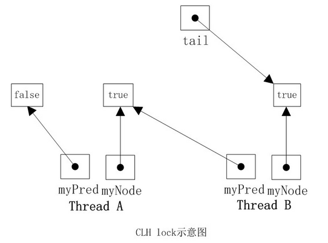
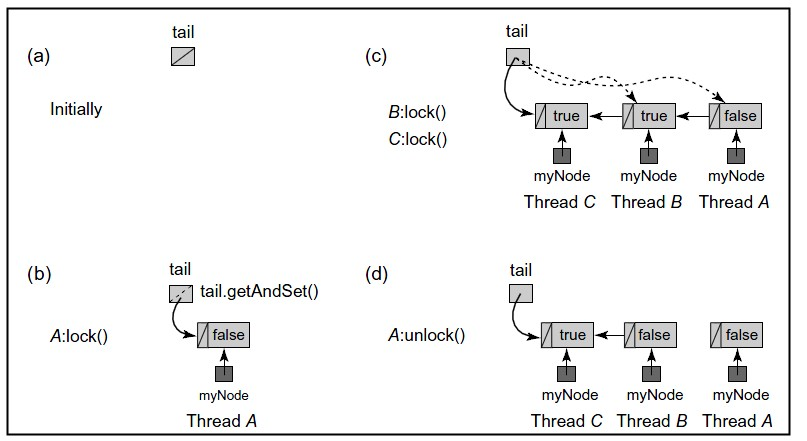

# 并发与锁

## 锁

### CLH(Craig, Landin, and Hagersten  locks)

是一个自旋锁，能确保无饥饿性，提供先来先服务的公平性。

CLH锁也是一种基于链表的可扩展、高性能、公平的自旋锁，申请线程只在本地变量上自旋，它不断轮询前驱的状态，如果发现前驱释放了锁就结束自旋。

#### 原理



重点是lock时，巧用了ThreadLocal。虽然lock中的myNode始终是一个变量，但是ThreadLocal的特性，会将当前thread当成key放到map中。
当map中没有当前线程时，会用initialValue初始化一个新的value。
实际上，真正标识上一个节点的是tail这个字段，它是所有线程共享的。
lock时，会将tail设置成当前线程的node，并将preNode设置成之前的tail，并自旋轮询之前tail的状态。
unlock时，会将当前线程的node设置成释放状态，同时将当前node设置成preNode。

#### 网上的示例代码

```java

public class CLHLock implements Lock {  
    AtomicReference<QNode> tail;  
    ThreadLocal<QNode> myPred;  
    ThreadLocal<QNode> myNode;  
  
    public CLHLock() {  

         tail = new AtomicReference<QNode>(new QNode());  
        myNode = new ThreadLocal<QNode>() {  
            protected QNode initialValue() {  
                return new QNode();  
            }  
        };  
        myPred = new ThreadLocal<QNode>() {  
            protected QNode initialValue() {  
                return null;  
            }  
        };  
    }  
  
    @Override  
    public void lock() {  
        QNode qnode = myNode.get();  
        qnode.locked = true;  
        QNode pred = tail.getAndSet(qnode);  
        myPred.set(pred);  
        while (pred.locked) {  
        }  
    }  
  
    @Override  
    public void unlock() {  
        QNode qnode = myNode.get();  
        qnode.locked = false;  
        myNode.set(myPred.get());  
    }  
}
```

这个代码运行了，当并发较多时，会出现都拿不到锁的情况。我觉得是每个线程都在自旋，疯狂抢占cpu时间片，而当前锁持有者并不保证一直占有cpu，导致锁无法及时释放。

#### 我的代码

```java

public void lockWithSleep() {
    CLHNode currentMyNode = myNode.get();
    currentMyNode.lock();
    CLHNode preTail = tail.getAndSet(currentMyNode);
    preNode.set(preTail);
    int tryCount = 0;
    while (preTail.isLocked()) {
        tryCount++;
        if (tryCount % 100000 == 0) {
            // System.out.println("have to stop " + Thread.currentThread().getName());
            try {
                Thread.sleep(1);
            } catch (InterruptedException e) {
                e.printStackTrace();
            }
        }
    }
}

```

给一定的机会来自旋，如果达到某个特定的点，就主动放弃cpu。随着阈值的增加，性能也越差。

#### 疑问

在V1中，preNode是什么用？网上说是能释放内存，但是根据我的推演，下一个节点仍会持有上一个节点。

#### 一个尴尬的错误

没有sleep的代码中，在100个线程就会出现卡死的情况。起初以为是时间片原因，但是这里有一个并发环境下严重的错误——可见性。
在我的Node中，lock这个标志位没有设置成volatile。设置了之后，200个线程还是能跑完的。
当然加上sleep之后，总体运行时间是有提升，但是这已经是优化的范畴，而不是解决bug的层面了。

### MCS

#### NUMA(Non-Uniform Memory Access)

非一致存储访问，将CPU分为CPU模块，每个CPU模块由多个CPU组成，并且具有独立的本地内存、I/O槽口等，模块之间可以通过互联模块相互访问，
访问本地内存的速度将远远高于访问远地内存(系统内其它节点的内存)的速度，这也是非一致存储访问的由来。NUMA较好地解决SMP的扩展问题，
当CPU数量增加时，因为访问远地内存的延时远远超过本地内存，系统性能无法线性增加。

#### MCS原理



MCS锁和CLH锁的不同是，每个节点在自己的lock标识上自旋，而不是前驱节点。前驱节点释放锁后，主动修改后置节点的lock标识。
MCS在解锁时需要考虑更多的并发因素。

#### 代码

```java

public class MCSLock {

    private static class MCSNode {
        volatile boolean locked = true;
        volatile MCSNode next;
    }

    private AtomicReference<MCSNode> tail = new AtomicReference<>();

    private ThreadLocal<MCSNode> currentNode = ThreadLocal.withInitial(MCSNode::new);

    public void lock() {
        MCSNode current = currentNode.get();
        // 这里由于是原子操作，下面的代码操作的是preTail，不会有并发问题
        MCSNode preTail = tail.getAndSet(current);
        if (preTail != null) {
            preTail.next = current;
            while (current.locked) {

            }
        }
    }

    public void unlock() {
        MCSNode current = currentNode.get();
        if (current.next == null) {
            // 如果后置为空，说明“可能”没有其他等待锁的线程，将tail设置为空
            if (tail.compareAndSet(current, null)) {
                return;
            }
            // 然而，先判断再操作是个经典的并发问题.在判断过程中，可能tail被其他线程设置了。
            // 再然而，为什么会有下面这个循环呢？因为设置了tail，但是next并不一定设置完成，需要稍等一段时间
            while (current.next == null) {
            }
        }
        current.next.locked = false;
    }
}

```

### AbstractQueuedSynchronizer
