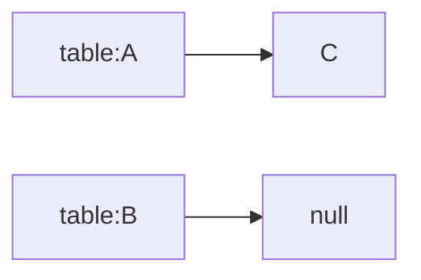

# 小知识点

## jdk排序

1.6以及以下，用的是归并排序，1.7开始用TimSort，1.8开始用优化的快速排序 DualPivotQuicksort。

对于byte[] char[] short[]，可以用计数排序优化。

### jdk双轴快排

todo

## Queue几种操作的区别

添加：

- `add`: 添加一个，如果没有空间，则抛出`IllegalStateException`
- `offer`: 添加一个，没有空间则返回false
- `带超时的offer`: 添加一个，没有空间则等待超时
- `BlockingQueue的put`: 添加一个，没有空间则无限等待

删除：

- `remove`: 删除一个，没有则抛出`NoSuchElementException`异常
- `poll`: 删除一个，没有则返回false
- `带超时的poll`: 删除一个，没有空间则等待超时
- `BlockingQueue的take`: 删除一个，没有空间则无限等待

## 自动装箱

```java

@Test
public void test() {
    Integer a = new Integer(1);
    Integer b = new Integer(1);
    Integer c = Integer.valueOf(1);
    Integer d = 1;

    System.out.println(a == b); // false，是不同对象
    System.out.println(a == c); // false，是不同对象
    System.out.println(c == d); // true，Integer对小整型有缓存
}

@Test
public void testBig() {
    Integer a = new Integer(12345678);
    Integer b = new Integer(12345678);
    Integer c = Integer.valueOf(12345678);
    Integer d = 12345678;

    System.out.println(a == b); // false，是不同对象
    System.out.println(a == c); // false，是不同对象
    System.out.println(c == d); // false，是不同对象
}

@Test
public void testWithCalculation() {
    Integer a = 1;
    Integer b = 2;
    Integer c = 3;

    System.out.println(c == (a + b)); // true，有运算，自动装箱
}

@Test
public void testLong() {
    Integer a = 1;
    Integer b = 2;
    Long c = 3L;

    System.out.println(c == (a + b)); // true，自动装箱
    System.out.println(c.equals(a + b)); // false，a+b先自动转成int，再转成Long，是不同对象
}
```

## sleep实现与中断

### sleep

sleep底层调用了 (windows) WaitForMultipleObjects(1, events, FALSE, (DWORD)ms) 或者 (linux) pthread_cond_timewait() 使线程中断并等待event（信号）。

### 中断

调用Thread.interrupt()是会调用native method -- interrupt0()。

jvm实现中，interrupt0

1. 会设置 `osthread->set_interrupted(true); //设置中断状态为true`

2. 同时获取Thread的sleep event `ParkEvent * const slp = thread->_SleepEvent;`

3. 并触发一个evnet `if (slp != NULL) slp->unpark() ;`

## hashmap的并发问题

jdk1.6扩容代码。将原entry复制到扩容后的table中。复制流程大致是，将原entry放到newTable[i]，然后再将entry的后续节点替换到newTable[i]上并将next设置为上一个entry。所以结果是将原entry的顺序反了过来。

```java
void transfer(Entry[] newTable) {
    Entry[] src = table;
    int newCapacity = newTable.length;
    for (int j = 0; j < src.length; j++) {
        Entry<K,V> e = src[j];
        if (e != null) {
            src[j] = null;
            do {
                Entry<K,V> next = e.next;
                int i = indexFor(e.hash, newCapacity);
                e.next = newTable[i];
                newTable[i] = e;
                e = next;
            } while (e != null);
        }
    }
}
```

### 死循环

出现在扩容重新hash后，原entry list还在一起的情况下。


变为


线程T1执行了一个循环，在第二次循环时T2执行并完成。
此时T1的情况：e=B, next=A（T2已经将关系改变了）。
继续执行，table[i]=B，e=A。
再次执行，e=A，next=B，`e.next = newTable[i];`将使A.next=B。table[i]=A。出现了


### 并发put丢失数据


变为



线程T1执行了一个循环，在第二次循环时T2执行并完成。
T1继续执行，e=B，next=null（T2修改了关系）。
第三次循环时，由于e==null，transfer结束。C丢失。

## 各种并发队列

### 什么是阻塞，什么是非阻塞

#### 算法层面

阻塞算法：用锁实现。可以给队列用一把锁，也可以出队、入队分别一把（LinkedBlockingQueue）。
非阻塞算法：用CAS。

#### 行为层面

当容器为空时，取数会阻塞（take会阻塞，poll直接返回，remove异常）；当容器满时，存数会阻塞（put会阻塞，add会异常，offer返回false）。

### 常见队列

LinkedBlockingQueue
ArrayBlockingQueue
PriorityBlockingQueue
SynchronousQueue
ConcurrentLinkedQueue（基于cas）

## return 和 finally 先后关系

```java

@Test
public void test() {
    String result = testReturn();
    System.out.println(result);
}

private String testReturn() {
    try {
        return beforeReturn();
    } finally {
        return beforeFinally();
    }
}

private String beforeReturn() {
    System.out.println("before return");
    return "by return";
}

private String beforeFinally() {
    System.out.println("before finally");
    return "by finally";
}

```

输出顺序

before return
before finally
by finally

## 为什么本地class能优先于jar

有个黑科技，想修改源代码，可以将源码copy出来，放到本地目录（包路径都必须一致）。但为什么本地class文件能优先于jar呢？

原因在于执行 java.net.URLClassLoader#findClass 时，会尝试获取Resource。
具体的执行在sun.misc.URLClassPath#getResource(java.lang.String, boolean)中。内部会有一个list，保存的是URLClassPath.Loader。执行getResource时遍历这个list，从中拿resource。而这个list的顺序是，jdk自带的 -> test-classes -> classes -> jar。完整实例如下:

- 最开始是java启动命令行中的
- file:/Applications/IntelliJ%20IDEA.app/Contents/lib/idea_rt.jar
- file:/Applications/IntelliJ%20IDEA.app/Contents/plugins/testng/lib/testng-plugin.jar
- 然后是jdk自带的
- file:/Library/Java/JavaVirtualMachines/jdk1.8.0_152.jdk/Contents/Home/jre/lib/charsets.jar
- file:/Library/Java/JavaVirtualMachines/jdk1.8.0_152.jdk/Contents/Home/jre/lib/deploy.jar
- file:/Library/Java/JavaVirtualMachines/jdk1.8.0_152.jdk/Contents/Home/jre/lib/ext/cldrdata.jar
- file:/Library/Java/JavaVirtualMachines/jdk1.8.0_152.jdk/Contents/Home/jre/lib/ext/dnsns.jar
- file:/Library/Java/JavaVirtualMachines/jdk1.8.0_152.jdk/Contents/Home/jre/lib/ext/jaccess.jar
- file:/Library/Java/JavaVirtualMachines/jdk1.8.0_152.jdk/Contents/Home/jre/lib/ext/jfxrt.jar
- file:/Library/Java/JavaVirtualMachines/jdk1.8.0_152.jdk/Contents/Home/jre/lib/ext/localedata.jar
- file:/Library/Java/JavaVirtualMachines/jdk1.8.0_152.jdk/Contents/Home/jre/lib/ext/nashorn.jar
- file:/Library/Java/JavaVirtualMachines/jdk1.8.0_152.jdk/Contents/Home/jre/lib/ext/sunec.jar
- file:/Library/Java/JavaVirtualMachines/jdk1.8.0_152.jdk/Contents/Home/jre/lib/ext/sunjce_provider.jar
- file:/Library/Java/JavaVirtualMachines/jdk1.8.0_152.jdk/Contents/Home/jre/lib/ext/sunpkcs11.jar
- file:/Library/Java/JavaVirtualMachines/jdk1.8.0_152.jdk/Contents/Home/jre/lib/ext/zipfs.jar
- file:/Library/Java/JavaVirtualMachines/jdk1.8.0_152.jdk/Contents/Home/jre/lib/javaws.jar
- file:/Library/Java/JavaVirtualMachines/jdk1.8.0_152.jdk/Contents/Home/jre/lib/jce.jar
- file:/Library/Java/JavaVirtualMachines/jdk1.8.0_152.jdk/Contents/Home/jre/lib/jfr.jar
- file:/Library/Java/JavaVirtualMachines/jdk1.8.0_152.jdk/Contents/Home/jre/lib/jfxswt.jar
- file:/Library/Java/JavaVirtualMachines/jdk1.8.0_152.jdk/Contents/Home/jre/lib/jsse.jar
- file:/Library/Java/JavaVirtualMachines/jdk1.8.0_152.jdk/Contents/Home/jre/lib/management-agent.jar
- file:/Library/Java/JavaVirtualMachines/jdk1.8.0_152.jdk/Contents/Home/jre/lib/plugin.jar
- file:/Library/Java/JavaVirtualMachines/jdk1.8.0_152.jdk/Contents/Home/jre/lib/resources.jar
- file:/Library/Java/JavaVirtualMachines/jdk1.8.0_152.jdk/Contents/Home/jre/lib/rt.jar
- file:/Library/Java/JavaVirtualMachines/jdk1.8.0_152.jdk/Contents/Home/lib/ant-javafx.jar
- file:/Library/Java/JavaVirtualMachines/jdk1.8.0_152.jdk/Contents/Home/lib/dt.jar
- file:/Library/Java/JavaVirtualMachines/jdk1.8.0_152.jdk/Contents/Home/lib/javafx-mx.jar
- file:/Library/Java/JavaVirtualMachines/jdk1.8.0_152.jdk/Contents/Home/lib/jconsole.jar
- file:/Library/Java/JavaVirtualMachines/jdk1.8.0_152.jdk/Contents/Home/lib/packager.jar
- file:/Library/Java/JavaVirtualMachines/jdk1.8.0_152.jdk/Contents/Home/lib/sa-jdi.jar
- file:/Library/Java/JavaVirtualMachines/jdk1.8.0_152.jdk/Contents/Home/lib/tools.jar
- 下面是本地路径
- file:/Users/xiaoshuang.cui/work/github/study/study/target/test-classes/
- file:/Users/xiaoshuang.cui/work/github/study/study/target/classes/
- 下面是仓库的
- file:/Users/xiaoshuang.cui/.m2/repository/org/testng/testng/6.14.3/testng-6.14.3.jar
- file:/Users/xiaoshuang.cui/.m2/repository/com/beust/jcommander/1.72/jcommander-1.72.jar
- file:/Users/xiaoshuang.cui/.m2/repository/org/apache-extras/beanshell/bsh/2.0b6/bsh-2.0b6.jar
- file:/Users/xiaoshuang.cui/.m2/repository/org/slf4j/slf4j-api/1.7.25/slf4j-api-1.7.25.jar
- file:/Users/xiaoshuang.cui/.m2/repository/ch/qos/logback/logback-core/1.2.3/logback-core-1.2.3.jar
- file:/Users/xiaoshuang.cui/.m2/repository/ch/qos/logback/logback-classic/1.2.3/logback-classic-1.2.3.jar
- file:/Users/xiaoshuang.cui/.m2/repository/com/google/guava/guava/23.0/guava-23.0.jar
- file:/Users/xiaoshuang.cui/.m2/repository/com/google/code/findbugs/jsr305/1.3.9/jsr305-1.3.9.jar
- file:/Users/xiaoshuang.cui/.m2/repository/com/google/errorprone/error_prone_annotations/2.0.18/error_prone_annotations-2.0.18.jar
- file:/Users/xiaoshuang.cui/.m2/repository/com/google/j2objc/j2objc-annotations/1.1/j2objc-annotations-1.1.jar
- file:/Users/xiaoshuang.cui/.m2/repository/org/codehaus/mojo/animal-sniffer-annotations/1.14/animal-sniffer-annotations-1.14.jar
- file:/Users/xiaoshuang.cui/.m2/repository/io/reactivex/rxjava/1.3.3/rxjava-1.3.3.jar
- file:/Users/xiaoshuang.cui/.m2/repository/com/netflix/hystrix/hystrix-core/1.5.12/hystrix-core-1.5.12.jar
- file:/Users/xiaoshuang.cui/.m2/repository/com/netflix/archaius/archaius-core/0.4.1/archaius-core-0.4.1.jar
- file:/Users/xiaoshuang.cui/.m2/repository/commons-configuration/commons-configuration/1.8/commons-configuration-1.8.jar
- file:/Users/xiaoshuang.cui/.m2/repository/commons-lang/commons-lang/2.6/commons-lang-2.6.jar
- file:/Users/xiaoshuang.cui/.m2/repository/org/hdrhistogram/HdrHistogram/2.1.9/HdrHistogram-2.1.9.jar
- file:/Users/xiaoshuang.cui/.m2/repository/io/vertx/vertx-core/3.5.0/vertx-core-3.5.0.jar
- file:/Users/xiaoshuang.cui/.m2/repository/io/netty/netty-common/4.1.15.Final/netty-common-4.1.15.Final.jar
- file:/Users/xiaoshuang.cui/.m2/repository/io/netty/netty-buffer/4.1.15.Final/netty-buffer-4.1.15.Final.jar
- file:/Users/xiaoshuang.cui/.m2/repository/io/netty/netty-transport/4.1.15.Final/netty-transport-4.1.15.Final.jar
- file:/Users/xiaoshuang.cui/.m2/repository/io/netty/netty-handler/4.1.15.Final/netty-handler-4.1.15.Final.jar
- file:/Users/xiaoshuang.cui/.m2/repository/io/netty/netty-codec/4.1.15.Final/netty-codec-4.1.15.Final.jar
- file:/Users/xiaoshuang.cui/.m2/repository/io/netty/netty-handler-proxy/4.1.15.Final/netty-handler-proxy-4.1.15.Final.jar
- file:/Users/xiaoshuang.cui/.m2/repository/io/netty/netty-codec-socks/4.1.15.Final/netty-codec-socks-4.1.15.Final.jar
- file:/Users/xiaoshuang.cui/.m2/repository/io/netty/netty-codec-http/4.1.15.Final/netty-codec-http-4.1.15.Final.jar
- file:/Users/xiaoshuang.cui/.m2/repository/io/netty/netty-codec-http2/4.1.15.Final/netty-codec-http2-4.1.15.Final.jar
- file:/Users/xiaoshuang.cui/.m2/repository/io/netty/netty-resolver/4.1.15.Final/netty-resolver-4.1.15.Final.jar
- file:/Users/xiaoshuang.cui/.m2/repository/io/netty/netty-resolver-dns/4.1.15.Final/netty-resolver-dns-4.1.15.Final.jar
- file:/Users/xiaoshuang.cui/.m2/repository/io/netty/netty-codec-dns/4.1.15.Final/netty-codec-dns-4.1.15.Final.jar
- file:/Users/xiaoshuang.cui/.m2/repository/com/fasterxml/jackson/core/jackson-core/2.9.0/jackson-core-2.9.0.jar
- file:/Users/xiaoshuang.cui/.m2/repository/com/fasterxml/jackson/core/jackson-databind/2.9.0/jackson-databind-2.9.0.jar
- file:/Users/xiaoshuang.cui/.m2/repository/com/fasterxml/jackson/core/jackson-annotations/2.9.0/jackson-annotations-2.9.0.jar
- file:/Users/xiaoshuang.cui/.m2/repository/com/intellij/forms_rt/7.0.3/forms_rt-7.0.3.jar
- file:/Users/xiaoshuang.cui/.m2/repository/asm/asm-commons/3.0/asm-commons-3.0.jar
- file:/Users/xiaoshuang.cui/.m2/repository/asm/asm-tree/3.0/asm-tree-3.0.jar
- file:/Users/xiaoshuang.cui/.m2/repository/asm/asm/3.0/asm-3.0.jar
- file:/Users/xiaoshuang.cui/.m2/repository/com/jgoodies/forms/1.1-preview/forms-1.1-preview.jar
- file:/Users/xiaoshuang.cui/.m2/repository/jdom/jdom/1.0/jdom-1.0.jar
- file:/Users/xiaoshuang.cui/.m2/repository/org/apache/commons/commons-lang3/3.5/commons-lang3-3.5.jar
- file:/Users/xiaoshuang.cui/.m2/repository/commons-collections/commons-collections/3.2.2/commons-collections-3.2.2.jar
- file:/Users/xiaoshuang.cui/.m2/repository/org/projectlombok/lombok/1.16.20/lombok-1.16.20.jar
- file:/Users/xiaoshuang.cui/.m2/repository/joda-time/joda-time/2.9.9/joda-time-2.9.9.jar
- file:/Users/xiaoshuang.cui/.m2/repository/org/apache/httpcomponents/httpclient/4.5.3/httpclient-4.5.3.jar
- file:/Users/xiaoshuang.cui/.m2/repository/org/apache/httpcomponents/httpcore/4.4.6/httpcore-4.4.6.jar
- file:/Users/xiaoshuang.cui/.m2/repository/commons-logging/commons-logging/1.2/commons-logging-1.2.jar
- file:/Users/xiaoshuang.cui/.m2/repository/commons-codec/commons-codec/1.9/commons-codec-1.9.jar
- file:/Users/xiaoshuang.cui/.m2/repository/log4j/log4j/1.2.17/log4j-1.2.17.jar
- file:/Users/xiaoshuang.cui/.m2/repository/commons-io/commons-io/2.5/commons-io-2.5.jar
- file:/Users/xiaoshuang.cui/.m2/repository/com/alibaba/fastjson/1.2.51/fastjson-1.2.51.jar
- 这下面有点看不懂了
- file:/Applications/IntelliJ%20IDEA.app/Contents/plugins/testng/lib/jcommander.jar
- file:/Users/xiaoshuang.cui/Library/Caches/IntelliJIdea2018.1/captureAgent/debugger-agent.jar
