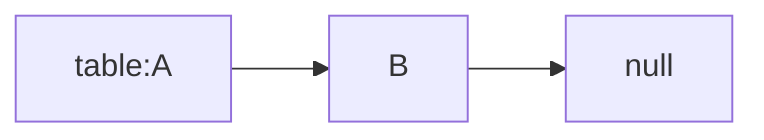
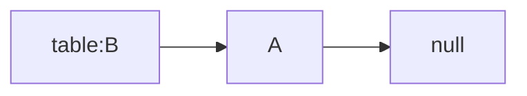
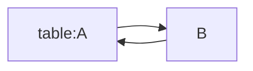
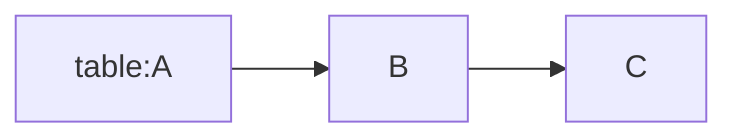
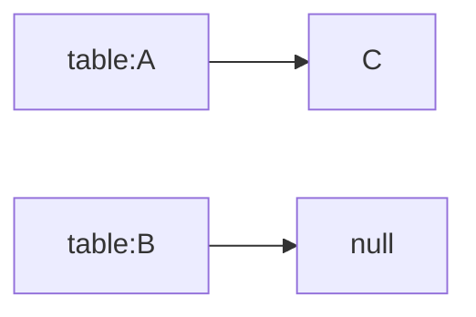

# 小知识点

## jdk排序

1.6以及以下，用的是归并排序，1.7开始用TimSort，1.8开始用优化的快速排序 DualPivotQuicksort。

对于byte[] char[] short[]，可以用计数排序优化。

### jdk双轴快排

todo

## 自动装箱

```java

@Test
public void test() {
    Integer a = new Integer(1);
    Integer b = new Integer(1);
    Integer c = Integer.valueOf(1);
    Integer d = 1;

    System.out.println(a == b); // false，是不同对象
    System.out.println(a == c); // false，是不同对象
    System.out.println(c == d); // true，Integer对小整型有缓存
}

@Test
public void testBig() {
    Integer a = new Integer(12345678);
    Integer b = new Integer(12345678);
    Integer c = Integer.valueOf(12345678);
    Integer d = 12345678;

    System.out.println(a == b); // false，是不同对象
    System.out.println(a == c); // false，是不同对象
    System.out.println(c == d); // false，是不同对象
}

@Test
public void testWithCalculation() {
    Integer a = 1;
    Integer b = 2;
    Integer c = 3;

    System.out.println(c == (a + b)); // true，有运算，自动装箱
}

@Test
public void testLong() {
    Integer a = 1;
    Integer b = 2;
    Long c = 3L;

    System.out.println(c == (a + b)); // true，自动装箱
    System.out.println(c.equals(a + b)); // false，a+b先自动转成int，再转成Long，是不同对象
}
```

## sleep实现与中断

### sleep

sleep底层调用了 (windows) WaitForMultipleObjects(1, events, FALSE, (DWORD)ms) 或者 (linux) pthread_cond_timewait() 使线程中断并等待event（信号）。

### 中断

调用Thread.interrupt()是会调用native method -- interrupt0()。

jvm实现中，interrupt0

1. 会设置 `osthread->set_interrupted(true); //设置中断状态为true`

2. 同时获取Thread的sleep event `ParkEvent * const slp = thread->_SleepEvent;`

3. 并触发一个evnet `if (slp != NULL) slp->unpark() ;`

## hashmap的并发问题

jdk1.6扩容代码。将原entry复制到扩容后的table中。复制流程大致是，将原entry放到newTable[i]，然后再将entry的后续节点替换到newTable[i]上并将next设置为上一个entry。所以结果是将原entry的顺序反了过来。

```java
void transfer(Entry[] newTable) {
    Entry[] src = table;
    int newCapacity = newTable.length;
    for (int j = 0; j < src.length; j++) {
        Entry<K,V> e = src[j];
        if (e != null) {
            src[j] = null;
            do {
                Entry<K,V> next = e.next;
                int i = indexFor(e.hash, newCapacity);
                e.next = newTable[i];
                newTable[i] = e;
                e = next;
            } while (e != null);
        }
    }
}
```

### 死循环

出现在扩容重新hash后，原entry list还在一起的情况下。


```mermaid
graph LR
table:A-->B
B-->null
```

变为


```mermaid
graph LR
table:B-->A
A-->null
```

线程T1执行了一个循环，在第二次循环时T2执行并完成。
此时T1的情况：e=B, next=A（T2已经将关系改变了）。
继续执行，table[i]=B，e=A。
再次执行，e=A，next=B，`e.next = newTable[i];`将使A.next=B。table[i]=A。出现了


```mermaid
graph LR
table:A-->B
B-->table:A
```

### 并发put丢失数据


```mermaid
graph LR
table:A-->B
B-->C
```

变为


```mermaid
graph LR
table:A-->C
table:B-->null
```

线程T1执行了一个循环，在第二次循环时T2执行并完成。
T1继续执行，e=B，next=null（T2修改了关系）。
第三次循环时，由于e==null，transfer结束。C丢失。

## 各种并发队列

### 什么是阻塞，什么是非阻塞

#### 算法层面

阻塞算法：用锁实现。可以给队列用一把锁，也可以出队、入队分别一把（LinkedBlockingQueue）。
非阻塞算法：用CAS。

#### 行为层面

当容器为空时，取数会阻塞（take会阻塞，poll直接返回，remove异常）；当容器满时，存数会阻塞（put会阻塞，add会异常，offer返回false）。

### 常见队列

LinkedBlockingQueue
ArrayBlockingQueue
PriorityBlockingQueue
SynchronousQueue
ConcurrentLinkedQueue（基于cas）

## return 和 finally 先后关系

```java

@Test
public void test() {
    String result = testReturn();
    System.out.println(result);
}

private String testReturn() {
    try {
        return beforeReturn();
    } finally {
        return beforeFinally();
    }
}

private String beforeReturn() {
    System.out.println("before return");
    return "by return";
}

private String beforeFinally() {
    System.out.println("before finally");
    return "by finally";
}

```

输出顺序

before return
before finally
by finally