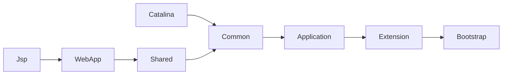

# 类加载机制

## 类加载流程

（图中的加载是类加载的一个步骤）
（图中各部分不是串行执行，而是交叉执行）

### 触发类加载的时机（当且仅当）

1. 遇到new, getstatic, putstatic, invokestatic指令时。一般对应代码中的new，读取静态变量，设置静态变量，调用静态方法。
2. 发射调用类时。
3. 初始化时，先初始化父类。
4. 虚拟机启动时，指定的要执行的主类（main方法）。
5. 使用java7的动态语言支持时，方法句柄对应的类没有初始化。

#### 一些被动引用的场景

- 只使用父类中的静态方法/成员，不会导致子类初始化。
- 通过数据定义引用类，不会导致类初始化。
- 使用类中的常量，且常量在编译期间已经放入常量池。

### 加载

主要行为：

1. 通过类全限定名获取类二进制字节流。
2. 将字节流转换成运行时数据结构，存储于方法区。
3. 生成Class对象，作为访问入口。

数组类型由虚拟机直接创建。

### 验证

文件格式验证 + 元数据验证 + 字节码验证（语法、语义、安全性） + 符号引号验证

### 准备

为内变量分配内存并初始化（零值）。

### 解析

将符号引用替换成直接引用。

### 初始化

类构造器\<cinit>，虚拟机保证多线程下同步执行。
接口也有cinit，但是不需要先执行父类的cinit方法。除非使用了父类中的变量。

## 类加载器

### 默认ClassLoader

#### Bootstrap

加载 JAVA_HOME\lib 且是虚拟机识别的类库。
应用一般无法直接使用Bootstrap ClassLoader，如果要把类加载委派给Bootstrap，则在getClassLoader()方法返回null。

#### Extension

加载JAVA_HOME\lib\ext

#### Application

加载用户类路径上类库。

### tomcat类加载器

tomcat6+中合并Catalina和Shared到Common中。只有指定配置才能生成分开的ClassLoader。

#### common

加载tomcat /common/* 类库，可以被Tomcat和所有应用使用。

#### Catalina

加载tomcat /server/* 类库，只能被tomcat使用。

#### Shared

加载tomcat /shared/* 类库，只能被所用应用使用。

#### WebApp

加载 /WebApp/WEB-INF/* 类库，只能被一个应用使用。

#### Jsp

仅仅加载某一个jsp文件。当检测到jsp文件有变化时，使用一个新的ClassLoader替换老的，实现HotSwap。

### 破坏双亲委派模型

使用线程上下文类加载器(Thread Context ClassLoader)。在ThreadLocal中保存线程ClassLoader，在父加载器中可以使用ThreadLocal来获取子加载器。
ThreadLocal为空时，会从父线程中继承，如果都没有，默认是ApplicationClassLoader。
