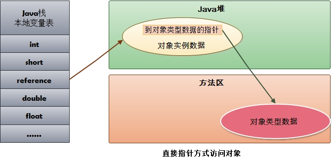

# jvm内存

## 运行时数据区

### 程序计数器

每个线程都有一个独立的程序计数器。通过修改计数器来选取下条指令。

### 虚拟机栈

每一条Java虚拟机线程都有自己私有的Java虚拟机栈。存放局部变量表、操作数栈、动态链接、方法出口等信息。
方法从调用到执行完成，对应一个栈帧在栈中入栈到出栈的过程。

如果线程请求分配的栈容量超过Java虚拟机栈允许的最大容量时，Java虚拟机将会抛出一个StackOverflowError异常。

如果Java虚拟机栈可以动态扩展，并且扩展的动作已经尝试过，但是目前无法申请到足够的内存去完成扩展，或者在建立新的线程时没有足够的内存去创建对应的虚拟机栈，那Java虚拟机将会抛出一个OutOfMemoryError异常。

### 本地方法栈

为本地方法服务的虚拟机栈。

### 虚拟机堆

在Java虚拟机中，堆（Heap）是可供各条线程共享的运行时内存区域，也是供所有类实例和数组对象分配内存的区域。

如果实际所需的堆超过了自动内存管理系统能提供的最大容量，那Java虚拟机将会抛出一个OutOfMemoryError异常。

### 方法区

存储了每一个类的结构信息，例如运行时常量池（Runtime Constant Pool）、字段和方法数据、构造函数和普通方法的字节码内容、还包括一些在类、实例、接口初始化时用到的特殊方法。

如果方法区的内存空间不能满足内存分配请求，那Java虚拟机将抛出一个OutOfMemoryError异常。

java7开始字符串常量池移出了永久代（方法区）。

### 直接内存

## 方法运行时基础数据结构——栈帧

存储数据和部分过程结果的数据结构，同时也被用来处理动态链接、方法返回值和异常分派。

栈帧随着方法调用而创建，随着方法结束而销毁——无论方法是正常完成还是异常完成。

栈帧是线程本地私有的数据，不可能在一个栈帧之中引用另外一条线程的栈帧。

方法正常调用完成，当前栈帧承担着回复调用者状态的责任，其状态包括调用者的局部变量表、操作数栈和被正确增加过来表示执行了该方法调用指令的程序计数器等。使得调用者的代码能在被调用的方法返回并且返回值被推入调用者栈帧的操作数栈后继续正常地执行。

### 对象

#### 一个面试题

static成员、static final成员、static {}块、普通成员、普通final成员、普通 {}块、构造方法的执行顺序。

1. static final成员如果是基本类型或者String类型的，编译这个字段的时候，会在对应的field_info结构体中增加一个ConstantValue类型的结构体，在赋值的时候使用这个ConstantValue进行赋值；如果不是基本类型或者String，则在类被实际引用时才会初始化。（**注意，AClass.class并不会触发实际引用**）
2. cinit : static final field > static field > static {}
3. init : final field > field > {} > construct

#### 创建过程

1. 遇到new指令时，检查是否在常量池中找到类的符号引用，并检查类是否加载、解析、初始化过。如果没有则执行类加载过程。
2. 为对象分配内存。
3. 将分配到的空间初始化为零值。
4. 对对象进行必要设置，比如元数据信息、对象hash值、GC分代年龄等。存放于object header中。
5. 执行init方法。

#### 内存分配方式

指针碰撞：内存使用时规整的，使用过的和未使用的各分一遍，通过一个指针隔离。指针碰撞分配只需要简单移动指针即可。常用于带有compact的收集器。

空闲列表：内存使用不规整，需记录内存使用情况。常用于基于mark-sweep的收集器。

多线程分配时，两种同步方案。CAS或者TLAB(本地线程分配缓冲)。
TLAB：每个线程预先分配一小块内存，仅当用完时才同步。

对象字段存储，hotspot默认分配策略是long/double, int, short/char, byte/boolean, oops(Ordinary Object Pointer)。相同宽度的字段被分配到一起。主要是利于内存对齐。

#### 对象的访问定位

- 通过句柄访问。句柄包含了对象实例数据和类型数据的具体地址。

- 通过直接指针访问。指针直接指向对象所在内存地址。

## jvm 遇到的问题

### unable to create a new native thread

项目在使用kafka过程中，进程异常退出，报错为`java.lang.OutOfMemoryError： unable to create new native thread`
查看hs_err_pid日志，发现系统中存在大量线程，顺着这个线索，发现Error是由于线程数超过了linux设置的线程数上线。

### Java heap space VS GC over head limit exceeded

两种oom异常，实际都是内存不足的警报。GC over head是内存不足的预警，通过统计GC的时长和回收的比率，来预测可能发生的内存不足。默认的报警阈值是"消耗了98%的CPU时间，但是回收了不到2%的堆内存"。

可以通过jvm参数 -XX:-UseGCOverheadLimit 来关闭GC预警，这样 GC over head limit exceeded 最终都会变成 Java heap space。

不同的收集器报出的异常可能不一样。

java8默认收集器(Parallel)下，报 GC over head limit exceeded
CMS下，报 Java heap space
G1下，报 Java heap space
Serial下，报 Java heap space

#### 延伸 —— ulimit

ulimit主要是用来限制进程对资源的使用情况。

常用参数:

-a 显示当前系统所有的limit资源信息。

-H 设置硬资源限制，一旦设置不能增加。

-S 设置软资源限制，设置后可以增加，但是不能超过硬资源设置。

-c 最大的core文件的大小，以 blocks 为单位。

-f 进程可以创建文件的最大值，以blocks 为单位.

-d 进程最大的数据段的大小，以Kbytes 为单位。

-m 最大内存大小，以Kbytes为单位。

-n 查看进程可以打开的最大文件描述符的数量。

-s 线程栈大小，以Kbytes为单位。

-p 管道缓冲区的大小，以Kbytes 为单位。

-u 用户最大可用的进程数。

-v 进程最大可用的虚拟内存，以Kbytes 为单位。

-t 最大CPU占用时间，以秒为单位。

-l 最大可加锁内存大小，以Kbytes 为单位。
