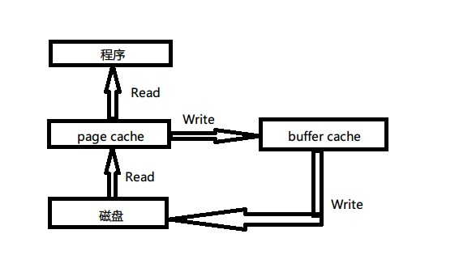

# 各种命令

## top

### cache和buffer的区别

从一般角度来说，cache是用来加速数据的下一次访问速度。例如L1 cache, L2cache, 将主内存数据缓存，提高cpu访问数据速度。
buffer保存数据直到数据被传输到其他地方，一般是解决不同设备处理数据速度差异的。

再举例，网页播放视频时，进度条提前缓冲，是为了解决下载和播放速度不一致的问题，将数据提前下载以供播放。当视频播放完，下一次再播放时，浏览器会将之前的视频保存起来，这就是缓存的功能。

top命令中的cache，buffer分别对应 Page cache, Buffer cache。

Page cache 文件系统层级的缓存，磁盘读取的文件数据存放到这里。修改之后标记为脏数据，等写时机到了，写回磁盘。
Buffer cache 磁盘等块设备的缓冲区。

下图是两个cache和磁盘的关系（新版系统貌似不是这样，写入时可以从Page cache直接写）

## sort

sort [-bcfMnrtk][源文件][-o 输出文件]
补充说明：sort可针对文本文件的内容，以行为单位来排序。
参数：
  -b   忽略每行前面开始出的空格字符。
  -c   检查文件是否已经按照顺序排序。
  -f   排序时，忽略大小写字母。
  -r   以相反的顺序来排序。
  -t<分隔字符>   指定排序时所用的栏位分隔字符。
  -M   将前面3个字母依照月份的缩写进行排序。
  -n   依照数值的大小排序。
  -o<输出文件>   将排序后的结果存入指定的文件。
  -r   以相反的顺序来排序。
  -t<分隔字符>   指定排序时所用的栏位分隔字符。
  -k  选择以哪个区间进行排序。-ka,b 表示[a,b]区间

文件按时间排序
ls -ltr

### 高级示例

按多字段排序。

sort temp -k1,1 -n -k2,2 排序temp文件，先按第一列字符串排序，在按第二列数字排序。

## rsync

rsync -rzcv --delete --chmod='a=rX,u+w' --rsync-path='sudo rsync' 项目目录/* 机器名:web应用目录/webapps/ROOT --exclude=.svn --exclude=.git --temp-dir=/tmp

## vim

1. 删除偶数行 g/^/+1 d
2. 删除奇数行 g/^/d|m.

## lsof(lists openfiles)

常用选项：

1. `-i [46][protocol][@hostname|hostaddr][:service|port]` 46表示IP4,IP6, protocol是TCP,UDP。例如 lsof -iTCP :8080
2. lsof -p PID 查看进程打开了哪些文件。
3. lsof -u uid 查看uid用户打开的文件。
4. lsof file 查看file被哪些进程打开。
5. lsof -c xxx 查看指定命令（包含指定字符xxx）打开的文件

## 解压与压缩

### 压缩

sudo tar -zcvf ~/tomcat.tar.gz --exclude=/home/q/www/xcd/logs  /home/q/www/xcd

注意事项：--exclude 命令排除打包的时候，不能加“/”，否则还是会把logs目录以及其下的文件打包进去

参数：
-c ：建立一个压缩文件的参数指令(create 的意思)；

-x ：解开一个压缩文件的参数指令！

-t ：查看 tarfile 里面的文件！

-z ：是否同时具有 gzip 的属性？亦即是否需要用 gzip 压缩？

-j ：是否同时具有 bzip2 的属性？亦即是否需要用 bzip2 压缩？

-v ：压缩的过程中显示文件！这个常用，但不建议用在背景执行过程！

-f ：使用档名，请留意，在 f 之后要立即接档名喔！不要再加参数！

-p ：使用原文件的原来属性（属性不会依据使用者而变）

-P ：可以使用绝对路径来压缩！

-N ：比后面接的日期(yyyy/mm/dd)还要新的才会被打包进新建的文件中！

--exclude FILE：在压缩的过程中，不要将 FILE 打包！

如果只是打包，则不用-z参数

### 解压

sudo tar -xzvf ~/tomcat.tar.gz

sudo tar -xvf ~/tomcat.tar

解压到当前目录下，如果在后面加上路径，不是指定解压到的目录，而是解压包里指定目录。

例如 sudo tar -xvf ~/tomcat.tar home/q/www/fuwu_xcd/cache 解压cache目录至当前目录

#### 如何解压至当前目录

需要用-P参数，压缩和解压时都需要。

例如

压缩时 sudo tar -cvPf ~/tomcat.tar --exclude=/home/q/www/xcd/logs  /home/q/www/xcd

解压时 sudo tar -xvPf ~/tomcat.tar 将会按照包内的绝对路径进行解压，覆盖原文件。

### 查看

tar -ztvf scripts.tar.gz

## 内核空间、用户空间

内核空间是内核代码运行的地方，可以调用系统的一切资源。
用户空间是运行用户代码的地方，需要调用系统资源时，必须通过系统接口调用。

time xxx 可以看到执行命令时的各个空间时间消耗。
