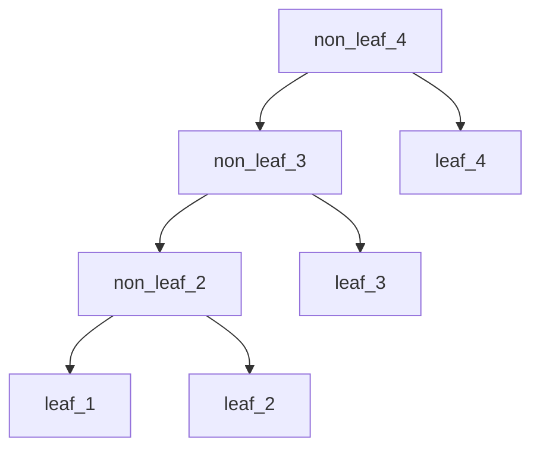

# 索引

## 索引和排序

必须order by顺序和索引顺序完全一致，且所有排序顺序都一致。
且排序也需要索引满足最左前缀，但是下面一些情况也能用到索引。

- 前导字段条件是常量值，和order by字段可以组成最左前缀，例如 select * from table where col1 = 1 order by col2
- where条件字段包含于order by字段，且order by字段组成最左前缀，列入 select * from table where col1 > value order by col1, col2

### using index 和 using index; using where

### 分析：为什么下面两个sql一个可以用索引，一个不能

可：`select * from table where col1 > 1 order by col1, col2`
不可：`select * from table where col1 > 1 order by col2`

因为第二条中只按照col2，而取出来的数据是col1 > 1的，是优先按照col1排序，而col2字段的值没有排序。

## 聚簇索引

聚簇索引的顺序就是数据的物理存储顺序，而对非聚簇索引的索引顺序与数据物理排列顺序无关。

## 建索引应该注意的

区分度高的字段不一定就是索引号的字段。比如用户访问页面可以匿名，那么用户名这个字段就有比较明显的性能漏洞。（可以修改应用程序，避免对这种特殊值进行搜索）

## 自增主键的跳跃

## 使用索引优化排序

来个案例： select * from profiles where sex = 'M' order by rating limit 10;

此时可以创建索引(`sex`,`rating`)，虽然sex区分度很低，但是可以用来排序。
但这个sql在翻页到很靠后时，仍会有性能问题。此时可考虑用延迟关联来减少mysql扫描那些需要丢弃的行数。

```sql
select * from profiles inner join
    (select id from profiles where x.sex = 'M' order by rating limit 100000,10) as x using(id);
```

## mysql子查询陷阱

```sql
select * from table1 where no in (select no from table2 where create_time > '2018-09-18')
```

抱歉，线上的工单库，执行不出来。显示超时。
实际上mysql(5.5)会转换成下面的sql：

```sql
select * from table1
where exists (
    select * from table2 where create_time > '2018-09-18'
    and table1.no = table2.no
)
```

执行时，会首先全表扫描table1，再每条执行内部子查询。

## 索引长度

所有索引，如果没有not null，需要新增一个字节。

字段类型 | 索引长度
---------|----------
char | 字段长度n*3/4（utf8 3字节，utf8mb4 4字节）
varchar | 字段长度n*3/4（utf8 3字节，utf8mb4 4字节） + 2（变长字段）
int | 4
bigint | 8
decimal | 5
date | 3
timestamp | 4
datetime | 5

## B+树相关

### 为什么选择B+树

1. 不用平衡树、红黑树。
   - 需要在节点中保存数据（或者至少是主键id，但是就不能满足聚簇索引），因此数据块中能存放的节点更少，需要更多的io。
   - 树的高度更高，逻辑上的父子节点，物理位置上并不一定相邻。会需要更多的io。

### 为什么innodb保证每个页上至少有两条记录

考虑顺序插入 1, 2, 3, 4, 5...

插入2时，由于1的空间不足以存放两个节点，需要分裂。插入3时，也需要分裂，且新节点需要往上层复制，此时也需要分裂，最终每个叶子节点都在非叶子节点上存在，形成了链表。

