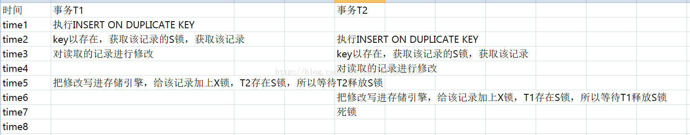

# mysql锁

## 各种类型的锁

### 观察锁日志

`set GLOBAL innodb_status_output_locks=ON;`

打开后可以在 log_err 日志中看到每次事务加的锁。

### record lock

单条索引记录上加锁，record lock锁住的永远是索引，而非记录本身，即使该表上没有任何索引，那么innodb会在后台创建一个隐藏的聚集主键索引，那么锁住的就是这个隐藏的聚集主键索引。所以说当一条sql没有走任何索引时，那么将会在每一条聚集索引后面加X锁，这个类似于表锁，但原理上和表锁应该是完全不同的。

### gap锁

在RR下普通索引和无索引时，会在记录（的索引）上加gap锁。

*从网上来的一张图。比较诡异的是，图中的主键是name，id只是个普通索引。*


当执行 delete * from table where id = 10 时，这是可能在b和d之间插入数据，此时将b-d区间锁住，防止插入新数据。

### 插入意向锁

插入意向锁是Innodb gap锁的一种类型，这种锁表示要以这样一种方式插入:如果多个事务插入到相同的索引间隙中，如果它们不在间隙中的相同位置插入，则无需等待其他事务。

在事务插入数据过程中，为防止其他事务向索引上该位置插入数据，会在插入之前先申请插入意向范围锁，而如果申请插入意向范围锁被阻塞，则事务处于gap before rec insert intention waiting的等待状态。

### MVCC和gap锁

怎么处理MVCC和gap锁的关系？两个不是都能放幻读吗？

目前的结论：select使用了mvcc来提高读并发读，在update, delete, insert操作时使用了gap锁。简单的select操作，没有lock in share mode或for update，快照读不会加任何的锁，而且由于mysql的一致性非锁定读的机制存在，任何快照读也不会被阻塞。

### 不同锁兼容矩阵

兼容             | Gap  | Insert Intention | Record | Next-Key
-----------------|------|------------------|--------|---------
Gap              | 兼容 | 兼容             | 兼容   | 兼容
Insert Intention | 冲突 | 兼容             | 兼容   | 冲突
Record           | 兼容 | 兼容             | 冲突   | 冲突
Next-Key         | 兼容 | 兼容             | 冲突   | 冲突


-  | X        | IX         | S          | IS
---|----------|------------|------------|-----------
X  | Conflict | Conflict   | Conflict   | Conflict
IX | Conflict | Compatible | Conflict   | Compatible
S  | Conflict | Conflict   | Compatible | Compatible
IS | Conflict | Compatible | Compatible | Compatible

## 各种高并发下的死锁

经过长时间的探索，发现一点：***mysql的死锁不仅是已经持有锁的情况下会发生，排队申请锁也属于循环等待。***

### gap锁和Insert Intention锁

```sequence
A->B: select * from t where b = 6 for update;
B->A: select * from t where b = 8 for update;
A->B: insert into t values (4,5);
B->A: insert into t values (4,5);
```

B的insert之前的锁情况

trx_id | lock_mode | lock_type | lock_space | lock_page | lock_rec | lock_data
-------|-----------|-----------|------------|-----------|----------|----------
36831  | X,GAP     | RECORD    | 25         | 4         | 5        | 22, 11
36832  | X,GAP     | RECORD    | 25         | 4         | 5        | 22, 11

gap锁可以兼容，所以AB都能获取gap锁。当分别获取Insert Intention时，和gap锁冲突，需要等待对方释放gap锁。

### on duplicate key update (仅仅出现在5.7的部分版本)

insert ... on duplicate key 在执行时，innodb引擎会先判断插入的行是否产生重复key错误，如果存在，则将申请S锁，如果返回该行数据给mysql,然后mysql执行完duplicate后的update操作，此时申请对该记录加上X锁，最后进行update写入。

时序图如下：



- 死锁日志

```txt

------------------------
LATEST DETECTED DEADLOCK
------------------------
2018-09-21 22:03:40 7f99a1d9e700
*** (1) TRANSACTION:
TRANSACTION 21073371, ACTIVE 0 sec inserting
mysql tables in use 1, locked 1
LOCK WAIT 2 lock struct(s), heap size 360, 1 row lock(s), undo log entries 1
MySQL thread id 8788595, OS thread handle 0x7f99a21ae700, query id 127124031 100.81.129.60 betamagic update
insert into test3 (value) values ('15') on duplicate key update value=floor(rand())
*** (1) WAITING FOR THIS LOCK TO BE GRANTED:
RECORD LOCKS space id 24462 page no 4 n bits 72 index `uniq` of table `f_fuwu_kie`.`test3` trx id 21073371 lock_mode X waiting
*** (2) TRANSACTION:
TRANSACTION 21073368, ACTIVE 0 sec updating or deleting, thread declared inside InnoDB 5000
mysql tables in use 1, locked 1
4 lock struct(s), heap size 1184, 3 row lock(s), undo log entries 1
MySQL thread id 8788596, OS thread handle 0x7f99a1d9e700, query id 127124028 100.81.129.60 betamagic update
insert into test3 (value) values ('15') on duplicate key update value=floor(rand())
*** (2) HOLDS THE LOCK(S):
RECORD LOCKS space id 24462 page no 4 n bits 72 index `uniq` of table `f_fuwu_kie`.`test3` trx id 21073368 lock_mode X
*** (2) WAITING FOR THIS LOCK TO BE GRANTED:
RECORD LOCKS space id 24462 page no 4 n bits 72 index `uniq` of table `f_fuwu_kie`.`test3` trx id 21073368 lock_mode X locks gap before rec insert intention waiting
*** WE ROLL BACK TRANSACTION (1)

```

上面给出的解释，在老版本的mysql中适用，在5.6貌似就没有这个问题。
还有另外一种原因，在5.7的部分版本中，为了解决多唯一键时binlog不一致问题，给唯一键也加上了gap lock，此时就是先获取的gap lock和后续的record lock冲突导致的。

### insert into + rollback

insert into table (id) values 1;

即使只有一个主键字段，高并发下也会死锁。

这个case主要是检测重复时的S锁和插入时的意向gap锁的循环等到导致的。

简单的insert会在insert的行对应的索引记录上加一个排它锁，这是一个record lock，并没有gap，所以并不会阻塞其他session在gap间隙里插入记录。不过在insert操作之前，还会加一种锁，官方文档称它为insertion intention gap lock，也就是意向的gap锁。这个意向gap锁防止了gap内的其他需要排他锁的操作，同时，当多事务并发插入相同的gap空隙时，只要插入的记录不是gap间隙中的相同位置，则无需等待其他session就可完成，这样就使得insert操作无须加真正的gap lock。

insertion intention gap lock，虽然是gap lock，但是与其他gap lock是不兼容的。

例如：当前有数据 id = 1, id = 5, id = 9

事务1:

insert into t values (2);

事务2:

select * from t where id > 1 for update;

事务3:

insert into t values (3);

此时1、3能并发执行，2被blocked。

同样的，如果是 unique key，也会有类似dead lock情况。

*注意，这个deadlock仅仅在rollback时才会发生，如果是commit，不会发生，而是 duplicate key*

#### 获得插入机会的事务回滚前的锁情况

trx_id   | lock_mode | lock_type
---------|-----------|----------
21068263 | S         | RECORD
21068260 | X         | RECORD
21068262 | S         | RECORD
21068261 | S         | RECORD

可见，在rollback之前其他事务都检测到duplicate，申请到了S锁。

*这里虽然和普通的锁等待不同，例如 lockA->lockB, lockB->lockA，但是由于S锁是共享锁，仍然构成循环等待*

- 死锁日志

```txt

2021-01-09 14:28:49 0x70000523c000
*** (1) TRANSACTION:
TRANSACTION 15981, ACTIVE 0 sec inserting
mysql tables in use 1, locked 1
LOCK WAIT 4 lock struct(s), heap size 1136, 2 row lock(s)
MySQL thread id 100, OS thread handle 123145398226944, query id 966 localhost 127.0.0.1 root update
insert into temp2 (id) values (7)

*** (1) HOLDS THE LOCK(S):
RECORD LOCKS space id 13 page no 4 n bits 72 index PRIMARY of table `local`.`temp2` trx id 15981 lock mode S locks gap before rec
Record lock, heap no 4 PHYSICAL RECORD: n_fields 3; compact format; info bits 0

*** (1) WAITING FOR THIS LOCK TO BE GRANTED:
RECORD LOCKS space id 13 page no 4 n bits 72 index PRIMARY of table `local`.`temp2` trx id 15981 lock_mode X locks gap before rec insert intention waiting
Record lock, heap no 4 PHYSICAL RECORD: n_fields 3; compact format; info bits 0

*** (2) TRANSACTION:
TRANSACTION 15982, ACTIVE 0 sec inserting
mysql tables in use 1, locked 1
LOCK WAIT 4 lock struct(s), heap size 1136, 2 row lock(s)
MySQL thread id 101, OS thread handle 123145398530048, query id 968 localhost 127.0.0.1 root update
insert into temp2 (id) values (7)

*** (2) HOLDS THE LOCK(S):
RECORD LOCKS space id 13 page no 4 n bits 72 index PRIMARY of table `local`.`temp2` trx id 15982 lock mode S locks gap before rec
Record lock, heap no 4 PHYSICAL RECORD: n_fields 3; compact format; info bits 0

*** (2) WAITING FOR THIS LOCK TO BE GRANTED:
RECORD LOCKS space id 13 page no 4 n bits 72 index PRIMARY of table `local`.`temp2` trx id 15982 lock_mode X locks gap before rec insert intention waiting
Record lock, heap no 4 PHYSICAL RECORD: n_fields 3; compact format; info bits 0

```

### delete from（唯一键）

delete from table where value = #{value}（value是唯一键）

根据博客的说法，mysql中有个页面锁。其重量级在表锁和行锁之间。
事务时序图


实际上，在本地的mysql8，并没有复现这个deadlock。

按照另一种解释，如果被删除的二级索引，删除标识为空时，首先加上的是notgap锁。如果block后唤醒，需要升级成nextkey锁。

- [x] 但是在下面的日志中，第一个transaction并没有持有任何锁，为什么会发生死锁？

- 死锁日志

```txt

------------------------
LATEST DETECTED DEADLOCK
------------------------
2018-09-21 22:18:24 7f99a2dde700
*** (1) TRANSACTION:
TRANSACTION 21074536, ACTIVE 0 sec starting index read
mysql tables in use 1, locked 1
LOCK WAIT 2 lock struct(s), heap size 360, 1 row lock(s)
MySQL thread id 8790120, OS thread handle 0x7f99a316c700, query id 127143007 100.81.129.60 betamagic updating
delete from test3 where value = '2'
*** (1) WAITING FOR THIS LOCK TO BE GRANTED:
RECORD LOCKS space id 24462 page no 4 n bits 80 index `uniq` of table `f_fuwu_kie`.`test3` trx id 21074536 lock_mode X waiting
*** (2) TRANSACTION:
TRANSACTION 21074532, ACTIVE 0 sec starting index read, thread declared inside InnoDB 1
mysql tables in use 1, locked 1
3 lock struct(s), heap size 360, 2 row lock(s)
MySQL thread id 8790118, OS thread handle 0x7f99a2dde700, query id 127143002 100.81.129.60 betamagic updating
delete from test3 where value = '2'
*** (2) HOLDS THE LOCK(S):
RECORD LOCKS space id 24462 page no 4 n bits 80 index `uniq` of table `f_fuwu_kie`.`test3` trx id 21074532 lock_mode X locks rec but not gap
*** (2) WAITING FOR THIS LOCK TO BE GRANTED:
RECORD LOCKS space id 24462 page no 4 n bits 80 index `uniq` of table `f_fuwu_kie`.`test3` trx id 21074532 lock_mode X waiting
*** WE ROLL BACK TRANSACTION (1)

```

这个案例最诡异的地方在于，trx2既持有了record lock，又在等待next-key lock。但实际上，这两种锁完全是不同的锁，不能因为持有了record，就一定能持有next-key，需要重新申请锁。

下面的时序图能大致解释这个死锁：

session1                 | session2                              | sesson3
-------------------------|---------------------------------------|-------------------------------
delete, hold record lock | -                                     | -
-                        | delete, record lock waiting           | -
mark deleted, commit     | -                                     | -
-                        | delete, hold record lock              |
-                        | -                                     | deleted, request next-key lock
-                        | record changed, request next-key lock | -
-                        | dead lock, rollback                   |

***这里最关键的是 `record changed, request next-key lock`，当检测到记录发生变动时，需要重新申请锁，且并不会释放之前已经申请到的记录锁***
所以 trx3等待trx2的record，trx2排队等待trx3的next-key。

### update唯一键

死锁日志

```txt

------------------------
LATEST DETECTED DEADLOCK
------------------------
2018-09-21 21:36:33 7f99a294c700
*** (1) TRANSACTION:
TRANSACTION 21071230, ACTIVE 0 sec starting index read
mysql tables in use 1, locked 1
LOCK WAIT 2 lock struct(s), heap size 360, 1 row lock(s)
MySQL thread id 8785868, OS thread handle 0x7f99a2a0f700, query id 127089977 100.81.129.60 betamagic updating
update test3 set value = 'kkk' where value = 'kk'
*** (1) WAITING FOR THIS LOCK TO BE GRANTED:
RECORD LOCKS space id 24462 page no 4 n bits 72 index `uniq` of table `f_fuwu_kie`.`test3` trx id 21071230 lock_mode X waiting
*** (2) TRANSACTION:
TRANSACTION 21071223, ACTIVE 0 sec starting index read, thread declared inside InnoDB 1
mysql tables in use 1, locked 1
3 lock struct(s), heap size 360, 2 row lock(s)
MySQL thread id 8785866, OS thread handle 0x7f99a294c700, query id 127089973 100.81.129.60 betamagic updating
update test3 set value = 'kkk' where value = 'kk'
*** (2) HOLDS THE LOCK(S):
RECORD LOCKS space id 24462 page no 4 n bits 72 index `uniq` of table `f_fuwu_kie`.`test3` trx id 21071223 lock_mode X locks rec but not gap
*** (2) WAITING FOR THIS LOCK TO BE GRANTED:
RECORD LOCKS space id 24462 page no 4 n bits 72 index `uniq` of table `f_fuwu_kie`.`test3` trx id 21071223 lock_mode X waiting

```

这个日志我没有看懂，但是update唯一键和delete唯一键有异曲同工之妙？目前的解释只能按照上面delete的博客的说法。

2021-09-24的新想法：

update时，需要先给where条件记录加锁，即 value = 'kk' 加锁，是 record-lock。更新时，原记录的`info bits`变成32，即已发生修改。
下一个update时，由于更新的是已修改的记录，会申请一个 next-key-lock。那么这个死锁的场景应该和delete是一致的，如下

session1                 | session2                              | sesson3
-------------------------|---------------------------------------|------------------------------
update, hold record lock | -                                     | -
-                        | update, record lock waiting           | -
mark deleted, commit     | -                                     | -
-                        | update, hold record lock              |
-                        | -                                     | update, request next-key lock
-                        | record changed, request next-key lock | -
-                        | dead lock, rollback                   |

也就是说，session1和session2必须非常靠近，同时抢 record-lock，才会发生这个死锁。目前很难复现的原因也是很难模拟出同时申请record-lock，一般都是直接申请next-key-lock

### :star::star::star: update 唯一键（涉及主键）

#### update 更新主键

**这个案例需要在高并发下才能复现**

```sql
CREATE TABLE `tt` (
  `id` int(11) NOT NULL DEFAULT '0',
  `fileid` int(11) DEFAULT NULL,
  `value` int(11) DEFAULT '0',
  PRIMARY KEY (`id`),
  UNIQUE KEY `fileid` (`fileid`)
) ENGINE=InnoDB DEFAULT CHARSET=utf8
```

session1                              | session2
--------------------------------------|--------------------------------------
update tt set id = 1 where fileid = 1 | update tt set id = 2 where fileid = 1

死锁日志

```txt
update tt set id = 1 where fileid = 1
*** (1) WAITING FOR THIS LOCK TO BE GRANTED:
RECORD LOCKS space id 34 page no 4 n bits 80 index fileid of table `deadlock`.`tt` trx id 22660 lock_mode X locks rec but not gap waiting
Record lock, heap no 2 PHYSICAL RECORD: n_fields 2; compact format; info bits 32
 0: len 4; hex 80000001; asc     ;;
 1: len 4; hex 80000001; asc     ;;

*** (2) TRANSACTION:
TRANSACTION 22661, ACTIVE 0 sec updating or deleting
mysql tables in use 1, locked 1
5 lock struct(s), heap size 1136, 4 row lock(s), undo log entries 2
MySQL thread id 91, OS thread handle 123145376555008, query id 1678 localhost 127.0.0.1 root updating
update tt set id = 2 where fileid = 1
*** (2) HOLDS THE LOCK(S):
RECORD LOCKS space id 34 page no 4 n bits 80 index fileid of table `deadlock`.`tt` trx id 22661 lock_mode X locks rec but not gap
Record lock, heap no 2 PHYSICAL RECORD: n_fields 2; compact format; info bits 32
 0: len 4; hex 80000001; asc     ;;
 1: len 4; hex 80000001; asc     ;;

*** (2) WAITING FOR THIS LOCK TO BE GRANTED:
RECORD LOCKS space id 34 page no 4 n bits 80 index fileid of table `deadlock`.`tt` trx id 22661 lock mode S waiting
Record lock, heap no 2 PHYSICAL RECORD: n_fields 2; compact format; info bits 32
 0: len 4; hex 80000001; asc     ;;
 1: len 4; hex 80000001; asc     ;;

```

通过查看加锁日志，完成更新的事务加锁如下：

```txt
5 lock struct(s), heap size 1136, 6 row lock(s), undo log entries 2
MySQL thread id 58, OS thread handle 123145376833536, query id 1321 localhost root
TABLE LOCK table `deadlock`.`tt` trx id 22560 lock mode IX
RECORD LOCKS space id 34 page no 4 n bits 80 index fileid of table `deadlock`.`tt` trx id 22560 lock_mode X locks rec but not gap
Record lock, heap no 2 PHYSICAL RECORD: n_fields 2; compact format; info bits 0
 0: len 4; hex 80000001; asc     ;;
 1: len 4; hex 80000002; asc     ;;

Record lock, heap no 3 PHYSICAL RECORD: n_fields 2; compact format; info bits 32
 0: len 4; hex 80000001; asc     ;;
 1: len 4; hex 8000000a; asc     ;;

RECORD LOCKS space id 34 page no 3 n bits 80 index PRIMARY of table `deadlock`.`tt` trx id 22560 lock_mode X locks rec but not gap
Record lock, heap no 2 PHYSICAL RECORD: n_fields 4; compact format; info bits 32
 0: len 4; hex 8000000a; asc     ;;
 1: len 6; hex 000000005820; asc     X ;;
 2: len 7; hex 34000001470701; asc 4   G  ;;
 3: len 4; hex 80000001; asc     ;;

RECORD LOCKS space id 34 page no 4 n bits 80 index fileid of table `deadlock`.`tt` trx id 22560 lock mode S
Record lock, heap no 1 PHYSICAL RECORD: n_fields 1; compact format; info bits 0
 0: len 8; hex 73757072656d756d; asc supremum;;

Record lock, heap no 3 PHYSICAL RECORD: n_fields 2; compact format; info bits 32
 0: len 4; hex 80000001; asc     ;;
 1: len 4; hex 8000000a; asc     ;;

RECORD LOCKS space id 34 page no 4 n bits 80 index fileid of table `deadlock`.`tt` trx id 22560 lock mode S locks gap before rec
Record lock, heap no 2 PHYSICAL RECORD: n_fields 2; compact format; info bits 0
 0: len 4; hex 80000001; asc     ;;
 1: len 4; hex 80000002; asc     ;;
```

一共持有了5个锁，分别是

- TABLE LOCK table `deadlock`.`tt` trx id 22560 lock mode IX
- index fileid of table `deadlock`.`tt` trx id 22560 lock_mode X locks rec but not gap
- index PRIMARY of table `deadlock`.`tt` trx id 22560 lock_mode X locks rec but not gap
- index fileid of table `deadlock`.`tt` trx id 22560 lock mode S
- index fileid of table `deadlock`.`tt` trx id 22560 lock mode S locks gap before rec

_____

而下面的update语句

session1                          | session2
----------------------------------|----------------------------------
update tt set id = 2 where id = 1 | update tt set id = 3 where id = 1

并不会引发死锁。

加锁过程如下：

```txt
---TRANSACTION 23163, ACTIVE 7 sec
5 lock struct(s), heap size 1136, 5 row lock(s), undo log entries 2
MySQL thread id 100, OS thread handle 123145376833536, query id 2810 localhost root
TABLE LOCK table `deadlock`.`tt` trx id 23163 lock mode IX
RECORD LOCKS space id 36 page no 3 n bits 72 index PRIMARY of table `deadlock`.`tt` trx id 23163 lock_mode X locks rec but not gap
Record lock, heap no 3 PHYSICAL RECORD: n_fields 5; compact format; info bits 32
 0: len 4; hex 80000001; asc     ;;
 1: len 6; hex 000000005a7b; asc     Z{;;
 2: len 7; hex 7400000194087b; asc t     {;;
 3: len 4; hex 80000001; asc     ;;
 4: len 4; hex 80000001; asc     ;;

RECORD LOCKS space id 36 page no 4 n bits 72 index fileid of table `deadlock`.`tt` trx id 23163 lock_mode X locks rec but not gap
Record lock, heap no 2 PHYSICAL RECORD: n_fields 2; compact format; info bits 32
 0: len 4; hex 80000001; asc     ;;
 1: len 4; hex 80000001; asc     ;;

RECORD LOCKS space id 36 page no 4 n bits 72 index fileid of table `deadlock`.`tt` trx id 23163 lock mode S
Record lock, heap no 1 PHYSICAL RECORD: n_fields 1; compact format; info bits 0
 0: len 8; hex 73757072656d756d; asc supremum;;

Record lock, heap no 2 PHYSICAL RECORD: n_fields 2; compact format; info bits 32
 0: len 4; hex 80000001; asc     ;;
 1: len 4; hex 80000001; asc     ;;

RECORD LOCKS space id 36 page no 4 n bits 72 index fileid of table `deadlock`.`tt` trx id 23163 lock mode S locks gap before rec
Record lock, heap no 3 PHYSICAL RECORD: n_fields 2; compact format; info bits 0
 0: len 4; hex 80000001; asc     ;;
 1: len 4; hex 80000002; asc     ;;
```

一共持有了5个锁，分别是

- TABLE LOCK table `deadlock`.`tt` trx id 23163 lock mode IX
- index PRIMARY of table `deadlock`.`tt` trx id 23163 lock_mode X locks rec but not gap
- index fileid of table `deadlock`.`tt` trx id 23163 lock_mode X locks rec but not gap
- index fileid of table `deadlock`.`tt` trx id 23163 lock mode S
- index fileid of table `deadlock`.`tt` trx id 23163 lock mode S locks gap before rec

而按uk更新非索引字段时，例如`update tt set value = 3 where fileid = 1`，只会`index fileid of table `deadlock`.`tt` trx id 23163 lock mode S locks gap before rec`

//TODO 原因还待考虑

### update非唯一键

```sql
CREATE TABLE `t16` (
  `id` int(11) NOT NULL AUTO_INCREMENT,
  `xid` int(11) DEFAULT NULL,
  `valid` int(11) DEFAULT NULL,
  PRIMARY KEY (`id`),
  KEY `xid_valid` (`xid`,`valid`)
) ENGINE=InnoDB DEFAULT CHARSET=utf8;

INSERT INTO t16(id, xid, valid) VALUES(1, 1, 0);
INSERT INTO t16(id, xid, valid) VALUES(2, 2, 1);
INSERT INTO t16(id, xid, valid) VALUES(3, 3, 1);
INSERT INTO t16(id, xid, valid) VALUES(4, 1, 0);
INSERT INTO t16(id, xid, valid) VALUES(5, 2, 0);
INSERT INTO t16(id, xid, valid) VALUES(6, 3, 1);
INSERT INTO t16(id, xid, valid) VALUES(7, 1, 1);
INSERT INTO t16(id, xid, valid) VALUES(8, 2, 1);
INSERT INTO t16(id, xid, valid) VALUES(9, 3, 0);
INSERT INTO t16(id, xid, valid) VALUES(10, 1, 1);
```

换个角度看数据

| id | xid | valid | value |
|----|-----|-------|-------|
| 1  | 1   | 0     | 0     |
| 4  | 1   | 0     | 0     |
| 7  | 1   | 1     | 0     |
| 10 | 1   | 1     | 0     |
| 5  | 2   | 0     | 0     |
| 2  | 2   | 1     | 0     |
| 8  | 2   | 1     | 0     |
| 9  | 3   | 0     | 0     |
| 3  | 3   | 1     | 0     |
| 6  | 3   | 1     | 0     |

| Session 1                                        | Session 2                                        |
|--------------------------------------------------|--------------------------------------------------|
| update t16 set xid = 3, valid = 0 where xid = 3; | update t16 set xid = 3, valid = 1 where xid = 2; |

这个死锁，可能会有不同的表现。

家里电脑，mysql版本 8.0.21，公司电脑 5.7.35

#### 第一种死锁日志（简化版）

sql的执行方式：

```java
connection.setAutocommit(true);
connection.createStatement().execute("update t16 set xid = 3, valid = 0 where xid = 3");
```

-       | session1                                        | session2
--------|-------------------------------------------------|------------------------------------------------
sql     | update t16 set xid = 3, valid = 0 where xid = 3 | update t16 set xid = 3, valid = 1 where xid = 2
status  | Searching rows for update                       | updating
holding | 3-3-1, 2-3-1, 9-3-0, mode X                     | 5-3-1, mode X not gap
waiting | 5-3-1, mode X                                   | 2-3-1, mode X not gap

解释之前，先看几个知识点：

1. mysql update加锁过程大致是 给where条件的二级索引加上next-key-lock，防止查找记录期间的其它插入/删除记录。然后通过二级索引找到主键，并加上record-lock。之后更新记录，如果更新字段中有其他索引，通过旧值到索引上删除旧entry，此时会加上record-lock。
2. 更新多条数据时，mysql和innodb交互是按条进行的，也就是说根据where条件查一条数据，加锁处理后，再查下一条进行处理。
3. update是where条件的查询是当前读，其他事务还未提交的更新，此时是能读到的。

解释：

T1: session2先执行，并将5-2-0更新成了5-3-1。此时拿到了5-3-1的record-lock。
T2: session2再执行，准备将2-2-0更新成2-3-1，此时将数据写成了2-3-1，准备获取2-3-1的record-lock。（注意，此时session1还没开始，所以没有插入意向锁的问题）
T3: session1执行，where条件是当前读，读到了session2刚更新的两条数据5-3-1和2-3-1，并在3-3-1, 2-3-1, 9-3-0三条数据上顺利加上了next-key-lock，但是在申请5-3-1的next-key-lock时，发现session2已经获取到了record-lock，进入等待。
T4: 由于session也在等待session1在2-3-1上的next-key-lock，形成循环等待。

关于T3，也能侧面反映出mysql是一条一条加锁的，按照数据的顺序，应该是 9-3-0, 2-3-1, 3-3-1, 5-3-1, 6-3-1，由于5-3-1的锁获取失败，也就没有6-3-1的锁。

#### 第二种死锁日志（简化版）

sql的执行方式：

```java
connection.setAutocommit(true);
connection.createStatement().execute("update t16 set xid = 3, valid = 0 where xid = 3");
```

-       | session1                                        | session2
--------|-------------------------------------------------|------------------------------------------------
sql     | update t16 set xid = 3, valid = 0 where xid = 3 | update t16 set xid = 3, valid = 1 where xid = 2
status  | Searching rows for update                       | updating
holding | 3-3-1, 9-3-0, mode X                            | 5-3-1, mode X not gap
waiting | 5-3-1, mode X                                   | 3-3-1, mode X gap before rec insert intention

这个场景，session2执行完了5-3-1的修改后，session1执行并读到了5-3-1。此时session2开始修改2-2-0，改成2-3-1。由于需要向二级索引中插入新数据，所以要申请插入意向锁，这里需要在9-3-0和3-3-1之间插入2-3-1，和session1持有的3-3-1的next-key-lock冲突，形成循环等待。

#### 第三种死锁日志（简化版）

sql的执行方式：

```java
jdbcTemplate.update("update t16 set xid = 3, valid = 1 where xid = 2");
```


-       | session1                                              | session2
--------|-------------------------------------------------------|------------------------------------------------------
sql     | update t16 set xid = 3, valid = 0 where xid = 3       | update t16 set xid = 3, valid = 1 where xid = 2
status  | updating                                              | updating
holding | 3-3-1, 6-3-1, 9-3-0, mode X                           | -
waiting | 9-3-0, mode X gap before rec insert intention waiting | 6-3-1, mode X gap before rec insert intention waiting

这个场景可以看到双方都处于updating，session此时正准备修改3-3-1为3-3-0，需要在9-3-0之前插入新数据；session2此时正在修改5-2-0为5-3-1，需要在6-3-1之前插入新数据。
而where条件读到的数据都会加上next-key-lock，session1锁定了(3-3-1, 6-3-1)区间，session2锁定了(8-2-1, 9-3-0)区间。形成循环等待。

#### 第四种死锁日志（简化版）

sql的执行方式：

```java
jdbcTemplate.update("update t16 set xid = 3, valid = 1 where xid = 2");
```

-       | session1                                                                   | session2
--------|----------------------------------------------------------------------------|------------------------------------------------------------------------------------
sql     | update t16 set xid = 3, valid = 0 where xid = 3                            | update t16 set xid = 3, valid = 1 where xid = 2
status  | updating                                                                   | updating
holding | 0: len 8; hex 73757072656d756d; asc supremum;, 9-3-0, 3-3-1, 6-3-0, mode X | -
waiting | 6-3-0, mode X gap before rec insert intention waiting                      | 0: len 8; hex 73757072656d756d; asc supremum;, lock_mode X insert intention waiting

这个场景session1正在更新6-3-1为6-3-0，需要在9-3-0之前插入数据。而此时session2执行，当前读读取到了6-3-0，锁定了(8-2-1，6-3-0)区间，导致session1等待。
同时session2准备更新5-2-0为5-3-1，同样需要在3-3-1之后插入一条数据。此时6-3-1已经被更新成了6-3-0，所以session2等待的区间是(3-3-1, supremum)。

`hex 73757072656d756d; asc supremum`这个是每个数据页中的最大值，所以在网上看到的日志，每个最大值的地址都是`73757072656d756d`，应该是只和页面的大小有关。

疑问：从加锁情况来看，session是先更新6-3-1而不是3-3-1，为什么是这个顺序？难道mysql是用的递归查询加锁？先不同索引值之间递归，内部再不同id之间递归。

#### 第五种死锁日志（完整版）

sql的执行方式：

```java
jdbcTemplate.update("update t16 set xid = 3, valid = 1 where xid = 2");
```

这里需要贴出完整版的日志，因为事务过程中有第三者参与。

```txt
*** (1) TRANSACTION:
TRANSACTION 25527, ACTIVE 0 sec fetching rows
mysql tables in use 1, locked 1
LOCK WAIT 4 lock struct(s), heap size 1136, 4 row lock(s)
MySQL thread id 453, OS thread handle 123145375162368, query id 7212 localhost 127.0.0.1 root Searching rows for update
update t16 set xid = 3, valid = 1 where xid = 2
*** (1) WAITING FOR THIS LOCK TO BE GRANTED:
RECORD LOCKS space id 41 page no 3 n bits 80 index PRIMARY of table `deadlock`.`t16` trx id 25527 lock_mode X locks rec but not gap waiting
Record lock, heap no 10 PHYSICAL RECORD: n_fields 6; compact format; info bits 0
 0: len 4; hex 80000002; asc     ;;
 1: len 6; hex 0000000063a4; asc     c ;;
 2: len 7; hex 5b000001b61244; asc [     D;;
 3: len 4; hex 80000002; asc     ;;
 4: len 4; hex 80000001; asc     ;;
 5: len 4; hex 80000000; asc     ;;

*** (2) TRANSACTION:
TRANSACTION 25526, ACTIVE 0 sec fetching rows
mysql tables in use 1, locked 1
3 lock struct(s), heap size 1136, 5 row lock(s), undo log entries 1
MySQL thread id 454, OS thread handle 123145377112064, query id 7211 localhost 127.0.0.1 root updating
update t16 set xid = 3, valid = 0 where xid = 3
*** (2) HOLDS THE LOCK(S):
RECORD LOCKS space id 41 page no 3 n bits 80 index PRIMARY of table `deadlock`.`t16` trx id 25526 lock_mode X
Record lock, heap no 8 PHYSICAL RECORD: n_fields 6; compact format; info bits 0
 0: len 4; hex 80000004; asc     ;;
 1: len 6; hex 0000000063a8; asc     c ;;
 2: len 7; hex 5d000001b90f4d; asc ]     M;;
 3: len 4; hex 80000001; asc     ;;
 4: len 4; hex 80000000; asc     ;;
 5: len 4; hex 80000000; asc     ;;

Record lock, heap no 9 PHYSICAL RECORD: n_fields 6; compact format; info bits 0
 0: len 4; hex 80000003; asc     ;;
 1: len 6; hex 0000000063b6; asc     c ;;
 2: len 7; hex 64000001ed1efb; asc d      ;;
 3: len 4; hex 80000003; asc     ;;
 4: len 4; hex 80000000; asc     ;;
 5: len 4; hex 80000000; asc     ;;

Record lock, heap no 10 PHYSICAL RECORD: n_fields 6; compact format; info bits 0
 0: len 4; hex 80000002; asc     ;;
 1: len 6; hex 0000000063a4; asc     c ;;
 2: len 7; hex 5b000001b61244; asc [     D;;
 3: len 4; hex 80000002; asc     ;;
 4: len 4; hex 80000001; asc     ;;
 5: len 4; hex 80000000; asc     ;;

Record lock, heap no 11 PHYSICAL RECORD: n_fields 6; compact format; info bits 0
 0: len 4; hex 80000001; asc     ;;
 1: len 6; hex 0000000063a2; asc     c ;;
 2: len 7; hex 5a000001b50ad4; asc Z      ;;
 3: len 4; hex 80000001; asc     ;;
 4: len 4; hex 80000000; asc     ;;
 5: len 4; hex 80000000; asc     ;;

*** (2) WAITING FOR THIS LOCK TO BE GRANTED:
RECORD LOCKS space id 41 page no 3 n bits 80 index PRIMARY of table `deadlock`.`t16` trx id 25526 lock_mode X waiting
Record lock, heap no 7 PHYSICAL RECORD: n_fields 6; compact format; info bits 0
 0: len 4; hex 80000005; asc     ;;
 1: len 6; hex 0000000063aa; asc     c ;;
 2: len 7; hex 5e000001f413e6; asc ^      ;;
 3: len 4; hex 80000002; asc     ;;
 4: len 4; hex 80000000; asc     ;;
 5: len 4; hex 80000000; asc     ;;
```

//TODO
注意到第二个事务日志中，第二行是`1: len 6; hex 0000000063a8; asc     c ;;`, `1: len 6; hex 0000000063b6; asc     c ;;`等。这个字段的含义是当前数据被最近一次修改的事务号。
事务1的事务号是25527（63b7），不在事务二日志中，所以必然有其他事务的影响。

在执行过程中了，为了还原数据，我使用了一批删除和插入操作。推测是这里的sql影响。

```java
  jdbcTemplate.update("delete from t16");
  jdbcTemplate.update("INSERT INTO t16(id, xid, valid) VALUES(1, 1, 0)");
  jdbcTemplate.update("INSERT INTO t16(id, xid, valid) VALUES(2, 2, 1)");
  jdbcTemplate.update("INSERT INTO t16(id, xid, valid) VALUES(3, 3, 1)");
  jdbcTemplate.update("INSERT INTO t16(id, xid, valid) VALUES(4, 1, 0)");
  jdbcTemplate.update("INSERT INTO t16(id, xid, valid) VALUES(5, 2, 0)");
  jdbcTemplate.update("INSERT INTO t16(id, xid, valid) VALUES(6, 3, 1)");
  jdbcTemplate.update("INSERT INTO t16(id, xid, valid) VALUES(7, 1, 1)");
  jdbcTemplate.update("INSERT INTO t16(id, xid, valid) VALUES(8, 2, 1)");
  jdbcTemplate.update("INSERT INTO t16(id, xid, valid) VALUES(9, 3, 0)");
  jdbcTemplate.update("INSERT INTO t16(id, xid, valid) VALUES(10, 1, 1)");
```

### delete insert 唯一键

```sql
create table t (
    `id` int primary key,
    `a` int,
    unique key `uniq_a`(`a`)
)

```

trx_1                        | trx2
-----------------------------|--------------------------
delete from t where a = 3    | -
-                            | delete from t where a = 3
insert into t values (11, 3) | -

```txt

*** (1) TRANSACTION:
TRANSACTION 21966, ACTIVE 75 sec starting index read
mysql tables in use 1, locked 1
LOCK WAIT 2 lock struct(s), heap size 1136, 1 row lock(s)
MySQL thread id 19, OS thread handle 123145574436864, query id 60400 localhost root updating
delete from delete_test where a = 2
*** (1) WAITING FOR THIS LOCK TO BE GRANTED:
RECORD LOCKS space id 29 page no 4 n bits 80 index a of table `deadlock`.`delete_test` trx id 21966 lock_mode X waiting
Record lock, heap no 3 PHYSICAL RECORD: n_fields 2; compact format; info bits 32
 0: len 4; hex 00000002; asc     ;;
 1: len 4; hex 00000002; asc     ;;

*** (2) TRANSACTION:
TRANSACTION 21965, ACTIVE 77 sec inserting
mysql tables in use 1, locked 1
4 lock struct(s), heap size 1136, 3 row lock(s), undo log entries 2
MySQL thread id 18, OS thread handle 123145573879808, query id 60404 localhost root update
insert into delete_test (id, a) values (10,2)
*** (2) HOLDS THE LOCK(S):
RECORD LOCKS space id 29 page no 4 n bits 80 index a of table `deadlock`.`delete_test` trx id 21965 lock_mode X locks rec but not gap
Record lock, heap no 3 PHYSICAL RECORD: n_fields 2; compact format; info bits 32
 0: len 4; hex 00000002; asc     ;;
 1: len 4; hex 00000002; asc     ;;

*** (2) WAITING FOR THIS LOCK TO BE GRANTED:
RECORD LOCKS space id 29 page no 4 n bits 80 index a of table `deadlock`.`delete_test` trx id 21965 lock mode S waiting
Record lock, heap no 3 PHYSICAL RECORD: n_fields 2; compact format; info bits 32
 0: len 4; hex 00000002; asc     ;;
 1: len 4; hex 00000002; asc     ;;

*** WE ROLL BACK TRANSACTION (1)
```

日志中的事务（2）对应表格中的trx_1。

首先看一段mysql的代码注释。

`/* In a search where at most one record in the index may match, we
	can use a LOCK_REC_NOT_GAP type record lock when locking a
	non-delete-marked matching record.
	Note that in a unique secondary index there may be different
	delete-marked versions of a record where only the primary key
	values differ: thus in a secondary index we must use next-key
	locks when locking delete-marked records. */`

根据这个注释，判断delete的加锁逻辑是：

1. 找到满足条件的记录，并且记录有效，则对记录加X锁，No Gap锁(lock_mode X locks rec but not gap);
2. 找到满足条件的记录，但是记录无效(标识为删除的记录)，则对记录加next key锁(同时锁住记录本身，以及记录之前的Gap：lock_mode X);
3. 未找到满足条件的记录，则对第一个不满足条件的记录加Gap锁，保证没有满足条件的记录插入(locks gap before rec)

trx1首先获取到了记录锁，并将数据标记为已删除。trx2发现记录已经标记成已删除，需要获取next-key，但是由于record被trx1获取，trx2需要排队。
此时trx1尝试insert，由于是唯一键，需要先申请一次S锁，判断是否重复并防止其他事务进行插入。
*此时会发生循环等待，trx2等待trx1的record，trx1等待trx2的next-key。*

问题是，为什么trx2并没有获取到锁，而trx1已经获取到了锁，还是会发送循环等待呢？我的理解是mysql对同一记录的加锁需要排队，而trx1和trx2持有的、申请的类型都不相同，是不同的锁，不满足常见的可重入的逻辑，所以判断为循环等待。

**另一个问题是，为什么当delete标识已删除的数据时，需要获取next-key-lock呢？**

:point_right: 可以想想为什么删除不存在的记录，会加gap-lock，因为需要防止幻读。update时是当前读模式，如果两个事务不加gap-lock锁住区间，会导致另一个事务删除当前事务操作的数据。

### delete insert 唯一键 情况2

```sql
create table t (
    `id` int primary key,
    `a` int,
    unique key `uniq_a`(`a`)
)

```

trx_1                        | trx2
-----------------------------|--------------------------
delete from t where a = 3    | -
insert into t values (11, 3) | -
-                            | delete from t where a = 3

这个场景并不是百分百复现，或者说很难复现。

```txt
*** (1) TRANSACTION:
TRANSACTION 2A8BD, ACTIVE 11 sec starting index read
mysql tables in use 1, locked 1
LOCK WAIT 2 lock struct(s), heap size 376, 1 row lock(s)
MySQL thread id 448218, OS thread handle 0x2abe5fb5d700, query id 18923238 renjun.fangcloud.net 121.41.41.92 root updating
delete from test where a = 2
*** (1) WAITING FOR THIS LOCK TO BE GRANTED:
RECORD LOCKS space id 0 page no 923 n bits 80 index `a` of table `oauthdemo`.`test` trx id 2A8BD lock_mode X waiting
Record lock, heap no 3 PHYSICAL RECORD: n_fields 2; compact format; info bits 32
 0: len 4; hex 00000002; asc     ;;
 1: len 4; hex 00000002; asc     ;;
*** (2) TRANSACTION:
TRANSACTION 2A8BC, ACTIVE 18 sec inserting
mysql tables in use 1, locked 1
4 lock struct(s), heap size 1248, 3 row lock(s), undo log entries 2
MySQL thread id 448217, OS thread handle 0x2abe5fd65700, query id 18923239 renjun.fangcloud.net 121.41.41.92 root update
insert into test (id,a) values (10,2)
*** (2) HOLDS THE LOCK(S):
RECORD LOCKS space id 0 page no 923 n bits 80 index `a` of table `oauthdemo`.`test` trx id 2A8BC lock_mode X locks rec but not gap
Record lock, heap no 3 PHYSICAL RECORD: n_fields 2; compact format; info bits 32
 0: len 4; hex 00000002; asc     ;;
 1: len 4; hex 00000002; asc     ;;
*** (2) WAITING FOR THIS LOCK TO BE GRANTED:
RECORD LOCKS space id 0 page no 923 n bits 80 index `a` of table `oauthdemo`.`test` trx id 2A8BC lock_mode X locks gap before rec insert intention waiting
Record lock, heap no 3 PHYSICAL RECORD: n_fields 2; compact format; info bits 32
 0: len 4; hex 00000002; asc     ;;
 1: len 4; hex 00000002; asc     ;;
*** WE ROLL BACK TRANSACTION (1)

```

和上一节的死锁不同在于，此时insert是"lock_mode X locks gap before rec insert intention waiting"，在等待insert intension锁。

有唯一键的insert加锁过程大致如下：

1. 唯一性约束检查发生冲突时，会加 S Lock，带 gap 属性，会锁住记录以及与前1条记录之前的间隙；
2. 如果插入的位置有带 gap 属性的 S/X Lock，则插入意向锁（LOCK_INSERT_INTENTION）被阻塞，进入等待状态；
3. 如果新数据顺利插入，最后对记录加 X Lock but not gap

案例中，trx1等待trx2的next，trx2等待trx1的record，循环等待。

### delete insert 唯一键 情况3

```sql
create table t (
    `id` int auto_increment primary key,
    `a` int,
    unique key `uniq_a`(`a`)
)

insert into t values (1,3), (5, 6), (10,9)

```

trx1                      | trx2
--------------------------|-----------------------------
delete from t where a = 7 | insert into t (a) values (8)

**这个案例需要在高并发下才能复现**

死锁信息：lock_mode X locks gap before rec insert intention waiting

加锁时序图

trx1         | trx2
-------------|----------------------------------
-            | insert检测重复，获取S锁 gap
申请X锁，等待 | -
-            | 开始插入记录，升级X锁，insert intention，循环等待

### 补充一个 delete insert 主键（没有复现）

本地环境 5.7.35 没有复现。以下是其他文章给出的案例。

```sql
CREATE TABLE `t18` (
  `id` int(11) unsigned NOT NULL AUTO_INCREMENT,
  PRIMARY KEY (`id`)
) ENGINE=InnoDB DEFAULT CHARSET=utf8;

INSERT  INTO `t18`(`id`) VALUES (1);
INSERT  INTO `t18`(`id`) VALUES (2);
INSERT  INTO `t18`(`id`) VALUES (3);
INSERT  INTO `t18`(`id`) VALUES (4);
INSERT  INTO `t18`(`id`) VALUES (5);
INSERT  INTO `t18`(`id`) VALUES (6);
INSERT  INTO `t18`(`id`) VALUES (7);
INSERT  INTO `t18`(`id`) VALUES (8);
```

trx1                          | trx2
------------------------------|------------------------------
delete from t18 where id = 4; | -
-                             | delete from t18 where id = 4;
insert into t18 values(4);    | -

死锁日志和 [情况一](#delete-insert-唯一键) 基本相同，只是锁加在了主键上。

### delete 涉及多个索引

```mysql
CREATE TABLE `t` (
  `id` INT(11) NOT NULL AUTO_INCREMENT,
  `a` INT(11) DEFAULT NULL,
  `b` INT(11) DEFAULT NULL,
  `c` INT(11) DEFAULT NULL,
  PRIMARY KEY (`id`),
  KEY `idx_a_b` (`a`,`b`),
  KEY `idx_b` (`b`)
) ENGINE=INNODB

insert into t (a,b,c) values (4,5,6);
```

trx1                      | trx2
--------------------------|--------------------------
delete from t where a = 4 | delete from t where b = 5

**注意，这里的sql必须高并发才可能复现。**

加锁时序图

trx1                            | trx2
--------------------------------|----------------------
-                               | 申请加锁 idx_b, 锁定记录 id=1
申请加锁 idx_a_b，等待 id=1 的锁 | -
-                               | 申请加锁idx_a_b，循环等待

这里死锁的原因是：`通过二级索引删除记录的加锁顺序为：二级索引（WHERE使用到二级索引）–> 主键索引 –> 所有其它二级索引；如果是 update 语句，加锁顺序也类似，通过二级索引更新记录的加锁顺序为：二级索引（WHERE条件使用二级索引）–> 主键索引 –> 包含更新字段的其它二级索引。`

## 为什么mysql的主键会跳跃

[auto_increment的处理](https://dev.mysql.com/doc/refman/8.0/en/innodb-auto-increment-handling.html)

1. 调整步长 auto_increment_offset。一般用于数据备份、汇总等，避免主键冲突。
2. mysql自增主键锁机制。

### autoinc_lock

三种模式: 0 traditional, 1 consecutive, 2 interleaved

无论哪种模式，回滚都会造成主键间隙。

#### traditional

对所有插入都会加锁，分配值时也是连续的。

#### consecutive

对于能事先确定行数的语句(simple insert)，采用轻量互斥锁，对于无法事先确定行数的语句(bulk insert)，需要加锁。且如果当前加锁了，simple insert也需要等待。

此种模式下，不同语句之间可能出现gap。因为插入时，由于无法确定需要的行数，mysql使用了递增的预分配主键方式。

```sql
CREATE TABLE t (a bigint unsigned auto_increment primary key) ENGINE=InnoDB SELECT NULL AS a; -- 此时有1行
INSERT INTO t SELECT NULL FROM t; -- 此时有2行
INSERT INTO t SELECT NULL FROM t; -- 此时有4行
INSERT INTO t SELECT NULL FROM t; -- 此时有8行
INSERT INTO t SELECT NULL FROM t; -- 此时有16行

SELECT * FROM t;

+----+
| a |
+----+
| 1 |
| 2 |
| 3 |
| 4 |
| 6 |
| 7 |
| 8 |
| 9 |
| 13 |
| 14 |
| 15 |
| 16 |
| 17 |
| 18 |
| 19 |
| 20 |
+----+
```

表中缺失了多个id。以第3次插入为例，应该插入 6、7、8、9 四条数据。

1. mysql首先获取1个预分配主键，插入6。
2. 此时还有数据未插入，获取2个预分配主键，插入7、8。
3. 此时还有数据未插入，获取4个预分配主键，插入9，但是已经申请到的10、11、12不会退还。

每次预分配都是上次的2倍(不确定上限是多少)

#### interleaved

不会加锁，一条sql获取到的主键可能是不连续的。会和其他session的sql交叉获取主键。