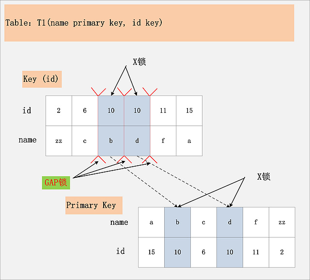
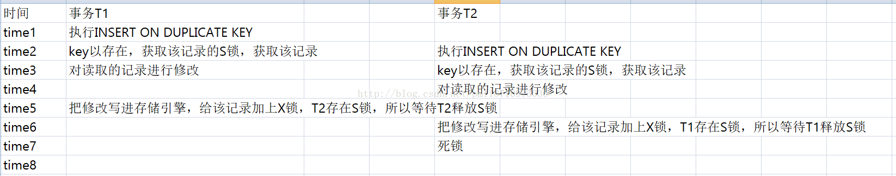

# mysql锁

## record lock

单条索引记录上加锁，record lock锁住的永远是索引，而非记录本身，即使该表上没有任何索引，那么innodb会在后台创建一个隐藏的聚集主键索引，那么锁住的就是这个隐藏的聚集主键索引。所以说当一条sql没有走任何索引时，那么将会在每一条聚集索引后面加X锁，这个类似于表锁，但原理上和表锁应该是完全不同的。

## gap锁

在RR下普通索引和无索引时，会在记录（的索引）上加gap锁。

*从网上来的一张图。比较诡异的是，图中的主键是name，id只是个普通索引。*



当执行 delete * from table where id = 10 时，这是可能在b和d之间插入数据，此时将b-d区间锁住，防止插入新数据。

### MVCC和gap锁

怎么处理MVCC和gap锁的关系？两个不是都能放幻读吗？

目前的结论：select使用了mvcc来提高读并发读，在update, delete, insert操作时使用了gap锁。简单的select操作，没有lock in share mode或for update，快照读不会加任何的锁，而且由于mysql的一致性非锁定读的机制存在，任何快照读也不会被阻塞。

## 不同锁兼容矩阵

兼容 | Gap | Insert Intention | Record | Next-Key
---------|----------|---------|---------|---------
Gap | 兼容 | 兼容 | 兼容 | 兼容
Insert Intention | 冲突 | 兼容 | 兼容 | 冲突
Record | 兼容 | 兼容 | 冲突 | 冲突
Next-Key | 兼容 | 兼容 | 冲突 | 冲突

## 各种高并发下的死锁

### gap锁和Insert Intention锁

```sequence
A->B: select * from t where b = 6 for update;
B->A: select * from t where b = 8 for update;
A->B: insert into t values (4,5);
B->A: insert into t values (4,5);
```

B的insert之前的锁情况

trx_id | lock_mode | lock_type | lock_space | lock_page | lock_rec | lock_data
---------|----------|---------|---------|---------|---------|---------
36831 | X,GAP | RECORD | 25 | 4 | 5 | 22, 11 |
36832 | X,GAP | RECORD | 25 | 4 | 5 | 22, 11 |

gap锁可以兼容，所以AB都能获取gap锁。当分别获取Insert Intention时，和gap锁冲突，需要等待对方释放gap锁。

### on duplicate key update (仅仅出现在5.7的部分版本)

insert ... on duplicate key 在执行时，innodb引擎会先判断插入的行是否产生重复key错误，如果存在，则将申请S锁，如果返回该行数据给mysql,然后mysql执行完duplicate后的update操作，此时申请对该记录加上X锁，最后进行update写入。

时序图如下：



- 死锁日志

```txt

------------------------
LATEST DETECTED DEADLOCK
------------------------
2018-09-21 22:03:40 7f99a1d9e700
*** (1) TRANSACTION:
TRANSACTION 21073371, ACTIVE 0 sec inserting
mysql tables in use 1, locked 1
LOCK WAIT 2 lock struct(s), heap size 360, 1 row lock(s), undo log entries 1
MySQL thread id 8788595, OS thread handle 0x7f99a21ae700, query id 127124031 100.81.129.60 betamagic update
insert into test3 (value) values ('15') on duplicate key update value=floor(rand())
*** (1) WAITING FOR THIS LOCK TO BE GRANTED:
RECORD LOCKS space id 24462 page no 4 n bits 72 index `uniq` of table `f_fuwu_kie`.`test3` trx id 21073371 lock_mode X waiting
*** (2) TRANSACTION:
TRANSACTION 21073368, ACTIVE 0 sec updating or deleting, thread declared inside InnoDB 5000
mysql tables in use 1, locked 1
4 lock struct(s), heap size 1184, 3 row lock(s), undo log entries 1
MySQL thread id 8788596, OS thread handle 0x7f99a1d9e700, query id 127124028 100.81.129.60 betamagic update
insert into test3 (value) values ('15') on duplicate key update value=floor(rand())
*** (2) HOLDS THE LOCK(S):
RECORD LOCKS space id 24462 page no 4 n bits 72 index `uniq` of table `f_fuwu_kie`.`test3` trx id 21073368 lock_mode X
*** (2) WAITING FOR THIS LOCK TO BE GRANTED:
RECORD LOCKS space id 24462 page no 4 n bits 72 index `uniq` of table `f_fuwu_kie`.`test3` trx id 21073368 lock_mode X locks gap before rec insert intention waiting
*** WE ROLL BACK TRANSACTION (1)

```

上面给出的解释，在老版本的mysql中适用，在5.6貌似就没有这个问题。
还有另外一种原因，在5.7的部分版本中，为了解决多唯一键时binlog不一致问题，给唯一键也加上了gap lock，此时就是先获取的gap lock和后续的record lock冲突导致的。

### insert into + rollback

insert into table (id) values 1;

即使只有一个主键字段，高并发下也会死锁。

简单的insert会在insert的行对应的索引记录上加一个排它锁，这是一个record lock，并没有gap，所以并不会阻塞其他session在gap间隙里插入记录。不过在insert操作之前，还会加一种锁，官方文档称它为insertion intention gap lock，也就是意向的gap锁。这个意向gap锁防止了gap内的其他需要排他锁的操作，同时，当多事务并发插入相同的gap空隙时，只要插入的记录不是gap间隙中的相同位置，则无需等待其他session就可完成，这样就使得insert操作无须加真正的gap lock。

insertion intention gap lock，虽然是gap lock，但是与其他gap lock是不兼容的。

例如：当前有数据 id = 1, id = 5, id = 9

事务1:

insert into t values (2);

事务2:

select * from t where id > 1 for update;

事务3:

insert into t values (3);

此时1、3能并发执行，2被blocked。

同样的，如果是 unique key，也会有类似dead lock情况。

*注意，这个deadlock仅仅在rollback时才会发生，如果是commit，不会发生，而是 duplicate key*

#### 获得插入机会的事务回滚前的锁情况

trx_id | lock_mode | lock_type
---------|----------|---------
21068263    | S         | RECORD
21068260    | X         | RECORD
21068262    | S         | RECORD
21068261    | S         | RECORD

可见，在rollback之前其他事务都检测到duplicate，申请到了S锁。

*这里虽然和普通的锁等待不同，例如 lockA->lockB, lockB->lockA，但是由于S锁是共享锁，仍然构成循环等待*

- 死锁日志

```txt

2021-01-09 14:28:49 0x70000523c000
*** (1) TRANSACTION:
TRANSACTION 15981, ACTIVE 0 sec inserting
mysql tables in use 1, locked 1
LOCK WAIT 4 lock struct(s), heap size 1136, 2 row lock(s)
MySQL thread id 100, OS thread handle 123145398226944, query id 966 localhost 127.0.0.1 root update
insert into temp2 (id) values (7)

*** (1) HOLDS THE LOCK(S):
RECORD LOCKS space id 13 page no 4 n bits 72 index PRIMARY of table `local`.`temp2` trx id 15981 lock mode S locks gap before rec
Record lock, heap no 4 PHYSICAL RECORD: n_fields 3; compact format; info bits 0

*** (1) WAITING FOR THIS LOCK TO BE GRANTED:
RECORD LOCKS space id 13 page no 4 n bits 72 index PRIMARY of table `local`.`temp2` trx id 15981 lock_mode X locks gap before rec insert intention waiting
Record lock, heap no 4 PHYSICAL RECORD: n_fields 3; compact format; info bits 0

*** (2) TRANSACTION:
TRANSACTION 15982, ACTIVE 0 sec inserting
mysql tables in use 1, locked 1
LOCK WAIT 4 lock struct(s), heap size 1136, 2 row lock(s)
MySQL thread id 101, OS thread handle 123145398530048, query id 968 localhost 127.0.0.1 root update
insert into temp2 (id) values (7)

*** (2) HOLDS THE LOCK(S):
RECORD LOCKS space id 13 page no 4 n bits 72 index PRIMARY of table `local`.`temp2` trx id 15982 lock mode S locks gap before rec
Record lock, heap no 4 PHYSICAL RECORD: n_fields 3; compact format; info bits 0

*** (2) WAITING FOR THIS LOCK TO BE GRANTED:
RECORD LOCKS space id 13 page no 4 n bits 72 index PRIMARY of table `local`.`temp2` trx id 15982 lock_mode X locks gap before rec insert intention waiting
Record lock, heap no 4 PHYSICAL RECORD: n_fields 3; compact format; info bits 0

```

### delete from（唯一键）

delete from table where value = #{value}（value是唯一键）

根据博客的说法，mysql中有个页面锁。其重量级在表锁和行锁之间。
事务时序图


实际上，在本地的mysql8，并没有复现这个deadlock。

按照另一种解释，如果被删除的二级索引，删除标识为空时，首先加上的是notgap锁。如果block后唤醒，需要升级成nextkey锁。

- [x] 但是在下面的日志中，第一个transaction并没有持有任何锁，为什么会发生死锁？

- 死锁日志

```txt

------------------------
LATEST DETECTED DEADLOCK
------------------------
2018-09-21 22:18:24 7f99a2dde700
*** (1) TRANSACTION:
TRANSACTION 21074536, ACTIVE 0 sec starting index read
mysql tables in use 1, locked 1
LOCK WAIT 2 lock struct(s), heap size 360, 1 row lock(s)
MySQL thread id 8790120, OS thread handle 0x7f99a316c700, query id 127143007 100.81.129.60 betamagic updating
delete from test3 where value = '2'
*** (1) WAITING FOR THIS LOCK TO BE GRANTED:
RECORD LOCKS space id 24462 page no 4 n bits 80 index `uniq` of table `f_fuwu_kie`.`test3` trx id 21074536 lock_mode X waiting
*** (2) TRANSACTION:
TRANSACTION 21074532, ACTIVE 0 sec starting index read, thread declared inside InnoDB 1
mysql tables in use 1, locked 1
3 lock struct(s), heap size 360, 2 row lock(s)
MySQL thread id 8790118, OS thread handle 0x7f99a2dde700, query id 127143002 100.81.129.60 betamagic updating
delete from test3 where value = '2'
*** (2) HOLDS THE LOCK(S):
RECORD LOCKS space id 24462 page no 4 n bits 80 index `uniq` of table `f_fuwu_kie`.`test3` trx id 21074532 lock_mode X locks rec but not gap
*** (2) WAITING FOR THIS LOCK TO BE GRANTED:
RECORD LOCKS space id 24462 page no 4 n bits 80 index `uniq` of table `f_fuwu_kie`.`test3` trx id 21074532 lock_mode X waiting
*** WE ROLL BACK TRANSACTION (1)

```

### update唯一键 (todo)

死锁日志

```txt

------------------------
LATEST DETECTED DEADLOCK
------------------------
2018-09-21 21:36:33 7f99a294c700
*** (1) TRANSACTION:
TRANSACTION 21071230, ACTIVE 0 sec starting index read
mysql tables in use 1, locked 1
LOCK WAIT 2 lock struct(s), heap size 360, 1 row lock(s)
MySQL thread id 8785868, OS thread handle 0x7f99a2a0f700, query id 127089977 100.81.129.60 betamagic updating
update test3 set value = 'kkk' where value = 'kk'
*** (1) WAITING FOR THIS LOCK TO BE GRANTED:
RECORD LOCKS space id 24462 page no 4 n bits 72 index `uniq` of table `f_fuwu_kie`.`test3` trx id 21071230 lock_mode X waiting
*** (2) TRANSACTION:
TRANSACTION 21071223, ACTIVE 0 sec starting index read, thread declared inside InnoDB 1
mysql tables in use 1, locked 1
3 lock struct(s), heap size 360, 2 row lock(s)
MySQL thread id 8785866, OS thread handle 0x7f99a294c700, query id 127089973 100.81.129.60 betamagic updating
update test3 set value = 'kkk' where value = 'kk'
*** (2) HOLDS THE LOCK(S):
RECORD LOCKS space id 24462 page no 4 n bits 72 index `uniq` of table `f_fuwu_kie`.`test3` trx id 21071223 lock_mode X locks rec but not gap
*** (2) WAITING FOR THIS LOCK TO BE GRANTED:
RECORD LOCKS space id 24462 page no 4 n bits 72 index `uniq` of table `f_fuwu_kie`.`test3` trx id 21071223 lock_mode X waiting

```

这个日志我没有看懂，但是update唯一键和delete唯一键有异曲同工之妙？目前的解释只能按照上面delete的博客的说法。

## 为什么mysql的主键会跳跃

[auto_increment的处理](https://dev.mysql.com/doc/refman/8.0/en/innodb-auto-increment-handling.html)