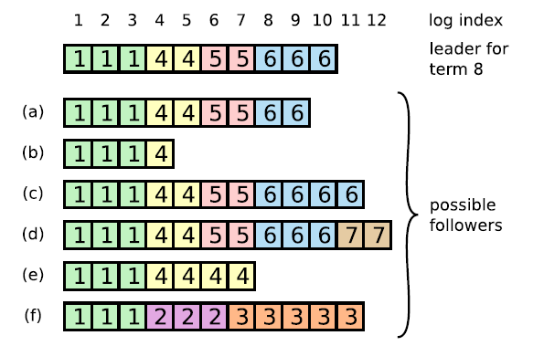

# raft

## 算法描述层面的一些东西

最终一致性协议。将多节点一致性分解成若干子问题

- leader election
- log replication
- safety
- membership changes

### 选举

raft的选举比zab简单：

1. 增加本地term，进入candidate状态。
2. 投自己一票，并行要求其他节点投票。(VoteRequest)
3. 等待其他节点投票结果，获得major票后切换成leader，如果发现其他节点已经是leader，切换成follower。如果超时没有结果，重新发起投票。

同一term内，只能投出一票。投票规则：(request.term > local.term) || (request.term == local.term && request.lastLogIndex >= local.lastLogIndex)

也就是说只能投给数据比本地更新更全的候选人。

如果所有候选同时发送请求，可能会形成同票。raft一般使用奇数节点，且引入了随机选举延迟，每个节点会随机一个延迟时间发送投票申请。

### 日志复制

log匹配特性：如果两个节点上的某个log entry的log index相同且term相同，那么在该index之前的所有log entry应该都是相同的。

为了保证匹配性，在append log时，request中会带上最新log之前的一个log信息（preLogIndex, preLogTerm）。follower收到请求后，会检查

1. request.preLogIndex <= local.lastLogIndex
2. request.term == local[request.preLogIndex].term

如果检查失败会返回err，leader收到后会按照日志同步策略强制follower更新本地日志。

raft始终保证leade包含最新的已提交的日志。

#### 一幅图的解释

在论文中指出了follower可能包含不同日志的多种情况。其中最特别的是f。

论文中的解释是：在`term=2`时 f 成为了leader，写入了3条日志，但是在commit前又发生了重新选举，此时 f 又当选，写入了多条`term=3`的日志。此后 f 一直宕机。

但在看完raft协议后，并不会发生 f 这种情况，这里的图只是在没有引入`日志强制同步`和`State Machine Safety`前可能发生的日志情况。

#### 日志同步

leader和follower从最后一条日志往前找，找到第一条index相同且term相同的日志，根据日志匹配特性，在此之前的日志都是匹配的。

找到后，follower截断本地日志，并追加leader在此之后的日志。

#### State Machine Safety

如果节点将某一位置的log entry应用到了状态机，那么其他节点在同一位置不能应用不同的日志。

***Raft never commits log entries from previous terms by counting replicas***

raft不会提交上一个term的日志，但是会在提交当前term日志时捎带之前term的日志。

如果允许提交之前term的日志。上图的d时刻，可能会造成已经提交的日志被覆盖。具体场景如下：

1. a时刻S1是leader，写入了term=2的日志，并复制给了S2。但此后crash，重新选举，S5当选。
2. b时刻S5写入一条term=5的日志，此后crash，重新选举，S1当选。
3. b时刻，S1的term=4（term=3时没有当选），**并开始提交term=2的日志**，复制到S2,S3，已经过半，可以应用到状态机。
4. c时刻，S1宕机重新选举，S5当选，按照之前的日志同步，S1,S2,S3上已经提交的term=2的日志会被截断，违反了安全性。

不允许提交之前term的日志，而是在提交term=4的日志时，捎带term=2的日志，那么如果term=2的日志过半，则term=4的日志也复制过半，此时S5不会当选，避免了日志非法覆盖问题。

（捎带的实现其实就是日志复制步骤，会带上前一条日志信息，如果follower和leader不一致，会强制更新为leader的日志）

如果leader长时间没有新日志写入，可能follower日志长时间不会更新。论文中的方案是当选后leader立即发送一个空的append请求。

***raft保证已经提交的日志不会被覆盖，但是为提交的日志可能丢失也可能保留。***

## 保证一致性的证明 //TODO

raft保证的是最终一致性，且只需要过半复制即为提交。

最重要的是保证已经提交过的日志不会丢失。

假设集群中最新的已提交日志`Lx`，对应的term是`Lx.ter`，那么重新选举是有过半的节点term将大于等于`Lx.term + 1`，且term相同是logIndex大于等于本地。由于raft投票只能投给term大于等于自身的节点，那么新leader的term必然大于等于`Lx.term + 1`。