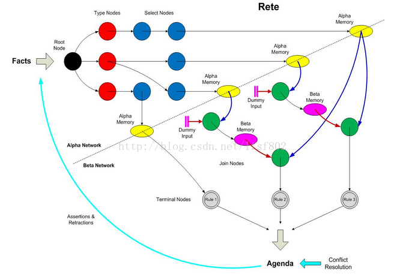

# NOTES

## session

global是session级别的，一个session中修改global不会影响另一个session中global的值。

kmodule文件中如果有两个session的default=true，则使用时拿不到default session。

### StatelessSession

## 语法

基本形式

rule "the name of rule"

when
    condition
then
    action
end

使用 $ 绑定一个变量 例如 $con : Condition(value > 10)
可以用绑定变量表示两个条件关联，例如 Fire($room:room) Sprinkler(room == $room)

关联和不关联的区别：
关联 Fire($room:room) Sprinkler(room == $room) -> select * from Fire, Sprinkler
不关联 Fire() Sprinkler() -> select * from Fire, Sprinkler where Fire.room = Sprinkler.room

可以直接调用变量的set方法修改值，也可以使用modify方法。区别是引擎能检查到modify导致的数据变化，重新计算规则。
modify(fact-expression){
<修改Fact 属性的表达式>[,<修改Fact 属性的表达式>*]
}

## rule

### methods vs rules

- 方法可以直接调用；一次执行只调用一次
- 只要插入到引擎，就会执行规则，无论数据是什么格式；不能直接调用；根据匹配的情况，一个规则可能会执行多次，或者一次不执行

### marshall？

### Inference

🌰：公安部制定规则，给什么样的人发身份证

用一个决策表表示

| RuleTableIdCard | RuleTableIdCard | RuleTableIdCard | RuleTableIdCard |
| --------------- | --------------- | --------------- | --------------- |
| -----           | condition       | condition       | action          |
| -----           | p:person        | p:person        | p:person        |
| -----           | location        | age >= $1       | issueIdCard($1) |
| -----           | select person   | select adults   | issue id card   |
| issue id card   | beijing         | 18              | p               |

问题是如果《民法》规定成年从18变成19，公安部需要同步修改规则。
这里可以使用inference将18岁的规则抽离。

- 立法部门维护年龄规则

| RuleTableAge  | RuleTableAge  | RuleTableAge   |
| ------------- | ------------- | -------------- |
| -----         | condition     | action         |
| -----         | p:person      | -----          |
| -----         | age >= $1     | insert($1)     |
| -----         | select adults | adult relation |
| issue id card | 18            | newIsAdult(p)  |

- 公安部维护身份证发放规则

| RuleTableIdCard | RuleTableIdCard | RuleTableIdCard | RuleTableIdCard |
| --------------- | --------------- | --------------- | --------------- |
| -----           | condition       | condition       | action          |
| -----           | p:person        | isAdult         | -----           |
| -----           | location        | person == $1    | issueIdCard($1) |
| -----           | select person   | select adults   | issue id card   |
| issue id card   | beijing         | p               | p               |

### TMS(Truth Maintenanace System)

- [ ] 这个章节确实没看懂

### 使用决策表

*如果同时使用决策表和drl文件，kmodule中需要指定决策表的packages，否则用drls时会报NPE*

#### 决策表的几个关键概念

总体分为两个部分，RuleSet部分和RuleTable部分。

**其实所谓的决策表，也就是直接通过语法对应，拼成了一个drl文件**

##### RuleSet区域

| 关键词     | 可用值                  | 作用（未标明的都是非必填）   |
| ---------- | ----------------------- | ---------------------------- |
| RuleSet    | 生成的drl文件的package  | 必须是第一行（必填）         |
| Sequential | true/false              | 和salience配合，决定执行顺序 |
| Import     | 同drl的                 | -                            |
| Variables  | 同drl重的globals        | -                            |
| Functions  | 定义方法，语法和drl相同 | -                            |

*注意，在RuleSet中设置的属性会影响整个package中的规则。*

##### 决策表翻译成drls BY org.drools.decisiontable.SpreadsheetCompiler

##### CONDITION

CONDITION关键词下的第一行是规则条件的“模式”。合并单元格表示，同时满足这些模式。
CONDITION关键词下的第一行可以为空，但是第二行必须能单独成为一个条件表达式。

在condition中，可以用逗号分隔参数，引用时使用$1 $2...

##### 什么是forall？在决策表中怎么用？

- [ ] 实际的含义需要等看完语法才能补充

我在excel里面写了个🌰
CONDITION中有一列是 forall(,){key2 != "$"}，翻译成drls之后是

```drl
rule "ComplicatedTables_9"
    salience 65527
    when
        $com:ComplicatedUse(key1 == "1", key2 != "a" , key2 != "A")
    then
        $com.setResult(1);
end
```

其中a和A是配置在excel条件中的，用逗号分隔  a,A

在这个例子中表示的是，key2要同时满足一个单元格中的所有条件。

#### 使用决策表遇到的问题

##### 配置了xls，怎么加载为规则？

drools会自动加载classpath下的xls作为规则，需要在xml中配置package（不配置则是默认）。

##### kmodule.xml中配置了session，为什么规则加载不进去？

和session配置中的package有关。package要写成文件所在路径。比如在resources下的rules中，则写成"rules"。
xls中的RuleSet也是package，但是和xml中的package没有关系。
RuleSet的package，是这个规则运行时所在的java package。可以直接使用该package下的class。
RuleSet可以为空，需要用到的类全部可用import加载进来。

##### 最初加载报各种异常的问题

看的UserGuide是6.x版本的，但是drools引用的是RELEASE，是7.x。不兼容。
换成6.x的drools后，ClassNotFound，原因是需要手动引入decisionTable这个依赖。

##### 决策表格式问题

下面的表是我测试用的

| CONDITION     | CONDITION     | ACTION                     |
| ------------- | ------------- | -------------------------- |
| person:Person | person:Person | person:Person              |
| age           | gender        | person.setColor("$param"); |
| 17            | male          | red                        |
| 17            | female        | pink                       |
| 19            | male          | black                      |
| 19            | female        | purle                      |

- 遇到的第一个问题：person.setColor("$param")不加分号，提示这里必须是一个boolean类型的表达式。加上分号，提示找不到@positional field。各种尝试后，发现需要将前两行的person:Person合并成一个单元格。。。**具体原理还不知道**
- 遇到的第二个问题：规则第一行不生效。xls的格式可能是固定的。age这个下面必须是注释。变成了

| age        | gender     | person.setColor("$param"); |
| ---------- | ---------- | -------------------------- |
| 必须是注释 | 必须是注释 | 必须是注释                 |
| 17         | male       | red                        |

## KieRuntime相关

### insert

*为什么用insert这个关键词？ 因为assert这个是大多数语言的关键词*

插入Working Memory时，有两种断言模式：
Identity 使用IdentityHashMap，对象比较使用 ==
Equality 使用HashMap，对象使用equal和hashcode

### update

对应excel中的modify，能通知WorkingMemory感知到fact的变化。

### query

一种是静态query，一种是动态query(LiveQuery)。
静态的只要在session中insert或者其他操作，就可以查询；动态query需要执行fireAllRules，才能生效。

### 冲突解决

默认提供两种方式：优先级和LIFO

#### 疑问

drools的冲突是怎么定义的。
我定义了一个规则，两个相同的条件，不同的action，结果都执行了。
定义了salience，确实先执行了值大的规则，但是剩下的还是会继续执行。这是应该有的行为吗？能不能只命中一条规则？只命中一条是合理的行为吗？

#### AgendaGroup && ActivationGroup

- 不显式配置AgendaGroup的rule，默认都在MAIN group中，这个group会默认放在执行栈中。
- 配置了AgendaGroup的rule，默认是没有focus的，需要代码中调用，或者配置成auto-focus。
- AgendaGroup的优先级高于salience，同group内salience生效。

同一次insert，fire多次，一个rule只会生效一次。

```java
session.insert(Person.builder().age(20).build());
session.fireAllRules();

session.getAgenda().getAgendaGroup("first").setFocus();
session.fireAllRules();

session.getAgenda().getAgendaGroup("second").setFocus();
session.fireAllRules();

这段代码，fire了3次，单每次都只有一个rule命中（由于group的控制）
```

```java

session.insert(Person.builder().age(20).build());
session.getAgenda().getAgendaGroup("first").setFocus();
session.getAgenda().getAgendaGroup("second").setFocus();

session.fireAllRules();

使用AgendaGroup时，确实是入栈操作，上面的规则，匹配顺序是second -> first -> MAIN
```

和AgendaGroup不同，同一ActivationGroup中的规则只会有一个命中。

### Event

```java
session.addEventListener(new DefaultAgendaEventListener() {
    @Override
    public void matchCreated(MatchCreatedEvent event) {
        System.out.println(event.getMatch().getRule().getName());
    }
});

session.fireAllRules(new RuleNameMatchesAgendaFilter("Test Event.*"));
```

这段代码，虽然fire的结果，是只有Test Event 这样的rule才会被匹配，但是在创建match时，其他规则如果能匹配上，事件也会发生。
也就是说，filter只是对结果做了过滤，对执行过程并没有。

- [] 会不会存在“随着规则的增多，执行效率下降”的问题？

### Propagation modes

举个🌰

drools中允许在rule中使用query

```drls
// 存在一个string和给定的int的字符串值相等
query Q (Integer i)
    String( this == i.toString() )
end

rule "propagation_mode_immediate" @Propagation(IMMEDIATE)

// 对一个int i，存在一个string和i的字符串值相等
when
    $i : Integer()
    ?Q ($i;)
then
    System.out.println("propagation_mode_immediate rule firing");
end
```

下面是使用方式

```java
session.insert(1);
session.insert("1");
session.fireAllRules();
```

在passive mode中，无法感知到后插入的"1"，因而，按照理解这个规则是不应该命中的。
但由于PHREAK算法的lazy模式，导致无法区分两个fact的插入顺序，规则会命中（调整int和string的插入顺序，仍然会命中）。

通过在rule上加@Propagation解决。
有三种模式（还是来原文吧）

<table border="1px">
    <tr>
      <th bgcolor="0099FF">key</th>
      <th bgcolor="0099FF">effect</th>
    </tr>
    <tr bgcolor="#d4e3e5" onmouseover="this.style.backgroundColor='#ffff66';" onmouseout="this.style.backgroundColor='#d4e3e5';">
      <td>IMMEDIATE</td>
      <td>the propagation is pevrformed immediately </td>
    </tr>
<tr bgcolor="#d4e3e5" onmouseover="this.style.backgroundColor='#ffff66';" onmouseout="this.style.backgroundColor='#d4e3e5';">
      <td>EAGER</td>
      <td>the propagation is performed lazily but eagerly evaluated before scheduled evaluations</td>
    </tr>
    </tr>
<tr bgcolor="#d4e3e5" onmouseover="this.style.backgroundColor='#ffff66';" onmouseout="this.style.backgroundColor='#d4e3e5';">
      <td>LAZY</td>
      <td>the propagation is totally lazy and this is default PHREAK behaviour/td>
    </tr>
</table>

加上了@Propagation(IMMEDIATE)或者EAGER后，先int再string，不会命中规则，先string再int会命中规则。

## 语法

### package

package本身是一个命名空间，和文件/目录没有直接关系。drools会自动import相同package中的类。（也会自动导入java.lang）

A common structure is to have all the rules for a package in the same file as the package declaration (so that is it entirely self-contained)

对rule的属性，也可以写在package这一层，会对package下的所有rule生效。可以在rule中再配置，来覆盖package级别的属性。

### global

全局变量不会insert 到 WorkingMemory，不要将global放在condition中。
规则引擎无法感知global变量的变化。
不要用global来作为rule之间共享数据的方式。

### declare type

声明类型是在知识库编译时生成的，应用程序只能在运行时访问它们。
使用org.drools.definition.type.FactType来引用声明的类型。

```java
KieSession session = SessionUtil.getStatefulSession();

org.kie.api.definition.type.FactType factType = session.getKieBase().getFactType(
        "priv.cxs.drools.usetest.drls.declaration",
        "Something");
Object sth = factType.newInstance();

factType.set(sth, "type", "person");
factType.set(sth, "name", "type_declare_position");
factType.set(sth, "value", "no position for me");

session.insert(sth);

session.fireAllRules(new RuleNameEqualsAgendaFilter("type_declare_position"));
```

### meta data

#### @key

将属性声明为关键属性对生成的类型有两个主要影响：

1. 该属性将用作类型的关键标识符，因此，在比较此类型的实例时，生成的类将实现equals（）和hashCode（）方法，并考虑该属性。
2. 生成一个以@key为参数的构造函数。（编译器将隐含地生成3个构造函数：一个不带参数，一个带有@key字段，另一个带有所有字段。）

#### @position

不指定字段名时，可以使用位置参数。@position规定了参数位置。

使用;来标识之前的全部是位置参数。当处于位置参数模式中时，指定字段会导致匹配失败。

```drl
declare Something
    name : String @position(5)
    type : String @position(1)
    value : String @position(6)
end

rule "type_declare_position"

when
    $sth : Something("person", "type_declare_position", "no position for me";)
    // 或者 $sth : Something("person", "type_declare_position"; value == "no position for me")
    // 或者 $sth : Something("person"; value == "no position for me", name =="type_declare_position")
then
    System.out.println("type_declare_position fired");
end
```

尚未绑定的位置中使用的任何变量都将绑定到映射到该位置的字段。
如果部分字段绑定位置，部分字段没有绑定，则绑定位置之外的位置，按照声明顺序用其他字段填充，🌰

```drl
declare Something
    name : String
    type : String
    value : String @position(1)
end
顺序是 name, value, type
```

对于相同的position，按照继承（父类优先）和声明的顺序来排列。🌰

```drl
declare Cheese
    name : String
    shop : String @position(2)
    price : int @position(0)
end

declare SeasonedCheese extends Cheese
    year : Date @position(0)
    origin : String @position(6)
    country : String
end

顺序是 price, year, name, shop, county, origin
```

***尴尬，我写代码试了下，不能重复。而且origin这个位置6，会报out of range，因为是从0开始的***

### rule语法

#### When vs If

if通常是在一个过程中的某个特定的点，来做一些校验。
when则不会绑定到某个时序的特定点，而是持续性的观察。

#### 重名的危害

相同文件中重名的rule，会抛异常。
书中说相同package中，后面的rule会覆盖前面重名的rule。但我测试时，即使在不同文件中，仍会跑duplicate错误。

#### salience(默认 0)

可以是负数。
支持动态传入，例如

```drl
salience($rank)

when
    $rank : rank
then
    ...
```

#### agenda-group

参考这一章节 AgendaGroup && ActivationGroup

ActivationGroup中，每次fire，只有至多一条规则会命中。

#### no-loop(默认 false)

当修改了一个fact时，会再次激活rule，可能会导致死循环。no-loop = true时，会听过当前fact集再次触发本rule。

```drl
rule "Many Rule 2.1"
no-loop

when
    $p : Policy(approved == false)
then
    System.out.println("approved == false");
    $p.setApproved(false);
    update($p)
end
```

但是no-loop只能避免再次触发当前的rule，如果是因为其他rule导致的互相触发循环，则控制不住。需要使用lock-on-active true

#### when

##### Do NOT do this

Person( incrementAndGetAge() == 10 );
Person( System.currentTimeMillis() % 1000 == 0 );

需要让drools感知到的变化，都需要显示的update。

##### == !=

Objects.equals(a, b)
!Objects.equals(a, b)

##### $var($可有可无)

绑定变量

// Not recommended
Person( $age : age * 2 < 100 )

// Recommended (separates bindings and constraint expressions)
Person( age * 2 < 100, $age : age )

##### :=

drools中不允许同一个变量绑定两次。
但是有的场景确实需要这儿用（还没搞懂什么场景）

Person( $age := age)
Person( $age := age)

:= 允许变量出现两次，同时变量会绑定到第一次出现的值，同时会用相同的值来约束后面的条件。

$a1 : Applicant($age := age)
$a2 : Applicant2($age := (age * 2))

这么写功能上等价于

$a1 : Applicant($age := age)
$a2 : Applicant2((age * 2) == $age)

##### 类型转换

在变量后使用#做转换。转换失败时，条件为false。在使用了instanceof后，如果为true，则后续可以直接当成其他类型使用。

Person( name == "mark", address#LongAddress.country == "uk" )
Person( name == "mark", address instanceof LongAddress, address.country == "uk" )

##### or 操作符

当or的多个条件都满足时，会发生什么？ -> 最好是当成多个rule来理解。每匹配一个会fire一次。

```drl
rule "or_fire"

when
    Applicant(age > 1)
    or
    Applicant(age > 2)
then
    System.out.println("or fired");
end
```

##### exist

和or不同，exist发现满足时，一个rule只会激活一次。

##### from

from 允许从非working memory中的数据集上进行推断。
但是每次计算使用的from时都会触发一个新的fact。

文档中给的例子实在是看不懂

```drl
rule "Assign people in North Carolina (NC) to sales region 1"
ruleflow-group "test"
lock-on-active true
when
    $p : Person( ) 
    $a : Address( state == "NC") from $p.address 
then
    modify ($p) {} // Assign person to sales region 1 in a modify block
end

rule "Apply a discount to people in the city of Raleigh"
ruleflow-group "test"
lock-on-active true
when
    $p : Person( )
    $a : Address( city == "Raleigh") from $p.address
then
    modify ($p) {} // Apply discount to person in a modify block
end
```

说是只有第二个规则会被激活，但是实际执行，两个都会激活。当然，为了让规则能执行，我加上了auto-focus true。

- [ ] 对ruleflow，lock-on-active这几个东西的作用还是不太理解。

作者给出的意见是，尽可能将实时插入到working memory中，而不是使用from。

注意，from子句后面不能跟一个括号表达式。因为会被解析成 from $list (xxxx) 这样一个整体。

### LHS中的难点 from collect accumulate eval

### then

## examples

### fibonaci

尝试着写了一个

```drl

package priv.cxs.drools.usetest.official.fibo;
dialect  "mvel"

rule "my_fibonacci"
when
    $second : Fibonacci(sequence > 1)
    $first : Fibonacci(sequence == $second.sequence - 1)
    $result : Fibonacci(sequence == -99)
then
    System.out.println("result" + $result);
    delete($first);
    delete($second);
    insert(new Fibonacci($second.sequence - 1, $first.value))
    insert(new Fibonacci($first.sequence - 1, $first.value + $second.value))
    modify($result){setValue($first.value + $second.value)}
end

```

#### todo

- [ ] 用一个result接收结果，能不能不要这个？
- [ ] delete不保留会死循环。又必须放在insert前，否则不会递归调用。但是delete后，insert还能继续引用数据，奇怪？
- [ ] insert也会通知working memory，有数据变化。
- [ ] 用drl写这种东西，很累。。

## Event && Complex Event Processing(CEP)

### CLOUD && STREAM

cloud模式中，没有时间概念。

#### 尝试stream的第一发

终于有点效果了。

我的演示代码

```java
@Data
@Role(Role.Type.EVENT)
public class Fire {
}

@Data
@Role(Role.Type.EVENT)
public class SprinklerActivated {
}

//测试代码
public class StreamTest {

    @Test
    public void testWait() throws InterruptedException {
        KieSession session = SessionUtil.getStreamSession();
        session.insert(new Fire());
        Thread.sleep(4000);
        session.insert(new SprinklerActivated());
        session.fireAllRules(new RuleNameStartsWithAgendaFilter("stream :"));
    }
}
```

```drl
package priv.cxs.drools.usetest.drls.stream;

// 不判断时间间隔
rule "stream : not wait"
when
    $f : Fire()
    not( SprinklerActivated())
then
    System.out.println(System.currentTimeMillis() + " alarming when not wait");
end

// 判断时间间隔
rule "stream : wait"
when
    $f : Fire()
    not( SprinklerActivated(this after [0s, 3s] $f))
then
    System.out.println(System.currentTimeMillis() + " alarming when wait");
end

```

##### 第一坑：ClassCastException

java.lang.ClassCastException: org.drools.core.common.DefaultFactHandle cannot be cast to org.drools.core.common.EventFactHandle

在这一段规则中 not( SprinklerActivated(this after [0s, 3s] $f))，涉及到了时序关系，需要在标识fact会产生一个event。具体的是在class上加上注解@Role(Role.Type.EVENT)，或者在drl中declare一下，@role(event)
只是涉及到时序关系的才需要declare，如果一个fact和时间没关系，不需要。

##### 第二坑：怎么设置mode

各种方式都行，我用的是在kmodule文件中。
但尴尬的是，无论改成stream还是cloud，上面的测试都是生效的。。why？

```xml
<kbase name="StreamBase" equalsBehavior="equality" declarativeAgenda="enabled" eventProcessingMode="stream">
        <ksession name="streamSession" type="stateful" default="true"/>
</kbase>
```

##### 我写的例子和文档说的不是一回事

文档中想说明的是，stream模式下，规则需要等待3s才会生效。而我的例子只是说明了after这个功能生效了。
为了防止eventProcessMode这个不生效的问题，我修改了drools源码中的test，发现和我的现象一致，并不会等待一段时间才会生效。

- [ ] 暂且放弃

#### length window需要注意的

alpha网络中，所有限制都会在window前计算，beta网络的计算会延后。
所以，StockTick(company == "RHT") over window:length(10) 定义的是10个满足条件的对象的集合，而StockTick(company == $s) over window:length(10)定义的是10个无论是否满足条件对象、再按条件过滤的集合。

原文：

> When using a sliding window, alpha constraints are evaluated before the window is considered, but beta (join) constraints are evaluated afterwards. This usually doesn't make a difference when time windows are concerned, but it's important when using a length window. For example this pattern:

```xml
StockTick( company == "RHT" ) over window:length( 10 )
```

> defines a window of (at most) 10 StockTicks all having company equal to "RHT", while the following one:

```xml
$s : String()
StockTick( company == $s ) over window:length( 10 )
```

> first creates a window of (at most) 10 StockTicks regardless of the value of their company attribute and then filters among them only the ones having the company equal to the String selected from the working memory.

#### 时间推理量词

##### after

```
$eventA : EventA( this after[ 3m, 4m ] $eventB )

$eventB.endTimeStamp + 3m <= $eventA.startTimestamp <= $eventB.endTimeStamp + 4m
```

##### before

```
$eventA : EventA( this before[ 3m, 4m ] $eventB )

$eventB.startTimestamp - 4m <= $eventA.endTimeStamp <= $eventB.startTimestamp - 3m
```

##### coincides

```
$eventA : EventA( this coincides $eventB )

$eventA : EventA( this coincides[15s, 10s] $eventB )

abs( $eventA.startTimestamp - $eventB.startTimestamp ) <= 15s
&&
abs( $eventA.endTimestamp - $eventB.endTimestamp ) <= 10s

等于
$eventB.startTimestamp - 15 <= $eventA.startTimestamp <= $eventB.startTimestamp + 15s
&&
$eventB.endTimestamp - 10 <= eventA.endTimestamp <= $eventB.endTimestamp + 10
```

##### during

```
$eventA : EventA( this during $eventB )

$eventB.startTimestamp < $eventA.startTimestamp <= $eventA.endTimestamp < $eventB.endTimestamp

复杂的表达式

$eventA : EventA( this during[ 5s ] $eventB )

$eventB.startTimestamp < $eventA.startTimestamp <= $eventB.startTimestamp + 5s
&&
$eventB.endTimestamp - 5s <= $eventA.endTimestamp < $eventB.endTimestamp


更复杂的表达式

$eventA : EventA( this during[ 5s, 10s ] $eventB )

$eventB.startTimestamp + 5s <= $eventA.startTimestamp <= $eventB.startTimestamp + 10s
&&
$eventB.endTimestamp - 10s <= $eventA.endTimestamp <= $eventB.endTimestamp - 5s

最复杂的表达式

$eventA : EventA( this during[ 2s, 6s, 4s, 10s ] $eventB )

$eventB.startTimestamp + 2s <= $eventA.startTimestamp <= $eventB.startTimestamp + 6s
&&
$eventB.endTimestamp - 10s <= $eventA.endTimestamp <= $eventB.endTimestamp - 4s
```

##### finishes

```
$eventA : EventA( this finishes $eventB )

$eventB.startTimestamp < $eventA.startTimestamp
&&
$eventA.endTimestamp == $eventB.endTimestamp

复杂的表达式

$eventA : EventA( this finishes[ 5s ] $eventB )

$eventB.startTimestamp < $eventA.startTimestamp
&&
abs( $eventA.endTimestamp - $eventB.endTimestamp ) <= 5s

等于
$eventB.startTimestamp < $eventA.startTimestamp
&&
$eventB.endTimestamp - 5s <= $eventA.endTimestamp <= $eventB.endTimestamp + 5s
```

finished by和finished正好相反，start的关系反过来。

##### includes

```
$eventA : EventA( this includes[ 5s ] $eventB )

$eventB.startTimestamp - 5s <= $eventA.startTimestamp < $eventB.startTimestamp
&&
$eventB.endTimestamp < $eventA.endTimestamp <= $eventB.endTimestamp + 5s

$eventA : EventA( this includes[ 2s, 6s, 4s, 10s ] $eventB )

$eventB.startTimestamp - 6s <= $eventA.startTimestamp < $eventB.startTimestamp - 2s
&&
$eventB.endTimestamp + 4s < $eventA.endTimestamp <= $eventB.endTimestamp + 10s
```

##### meets

```
$eventA : EventA( this meets[ 5s ] $eventB )

abs( $eventB.startTimestamp - $eventA.endTimestamp) <= 5s

等于
$eventB.startTimestamp - 5s <= $eventA.endTimestamp <= $eventB.startTimestamp + 5s
```

##### metby

```
$eventA : EventA( this meets[ 5s ] $eventB )

abs( $eventA.startTimestamp - $eventB.endTimestamp) <= 5s

等于
$eventB.endTimestamp - 5s <= $eventA.startTimestamp <= $eventB.endTimestamp + 5s
```

##### overlap && overlapby

```
$eventA : EventA( this overlaps $eventB )

$eventA.startTimestamp < $eventB.startTimestamp < $eventA.endTimestamp < $eventB.endTimestamp

复杂的表达式

$eventA : EventA( this overlaps[ 5s, 10s ] $eventB )

$eventA.startTimestamp < $eventB.startTimestamp < $eventA.endTimestamp < $eventB.endTimestamp
&&
$eventB.startTimestamp + 5s <= $eventA.endTimestamp <= $eventB.startTimestamp + 10s

overlap by

$eventA : EventA( this overlappedby[ 5s, 10s ] $eventB )

$eventB.startTimestamp < $eventA.startTimestamp < $eventB.endTimestamp < $eventA.endTimestamp
&&
5s <= $eventB.endTimestamp - $eventA.startTimestamp <= 10s
```

##### starts

```
$eventA : EventA( this starts $eventB )

$eventA.startTimestamp == $eventB.startTimestamp
&&
$eventA.endTimestamp < $eventB.endTimestamp

复杂的表达式
$eventA : EventA( this starts[ 5s ] $eventB )

abs( $eventA.startTimestamp - $eventB.startTimestamp ) <= 5s
&&
$eventA.endTimestamp < $eventB.endTimestamp

等于
$eventB.startTimestamp - 5s <= $eventA.startTimestamp <= $eventB.startTimestamp + 5s
$eventA.endTimestamp < $eventB.endTimestamp

started by 和 starts 相反

$eventA : EventA( this starts[ 5s ] $eventB )

abs( $eventA.startTimestamp - $eventB.startTimestamp ) <= 5s
&&
$eventA.endTimestamp > $eventB.endTimestamp

等于
$eventB.startTimestamp - 5s <= $eventA.startTimestamp <= $eventB.startTimestamp + 5s
$eventA.endTimestamp > $eventB.endTimestamp
```

## 其他相关概念

### OptaPlanner

#### NP NPC

#### 禁忌搜索

#### 模拟退火

#### 延迟接受

#### LHS RHS

### 什么是event和fact？

### forward chaining && backward chaining

*From Baidu*

> 正向推理又称数据驱动推理、演绎推理（相对于逆向推理、归纳推理），是按照由条件推出结论的方向进行的推理方式，它从一组事实出发，使用一定的推理规则，来证明目标事实或命题的成立。一般的推理过程是先向综合数据库提供一些初始已知事实，控制系统利用这些数据与知识库中的知识进行匹配，被触发的知识，将其结论作为新的事实添加到综合数据库中。重复上述过程，用更新过的综合数据库中的事实再与知识库中另一条知识匹配，将其结论更新至综合数据库中，直到没有可匹配的新知识和不再有新的事实加入到综合数据库中为止。然后测试是否得到解，有解则返回解，无解则提示运行失败。

### KRR (knowledge representation and reasoning)

### rete算法(drools5.x)

### First Order Logic

一阶逻辑是通过允许在给定论域的个体上的量化而扩展命题逻辑的演绎系统。
命题逻辑处理简单的陈述性命题，一阶逻辑补充覆盖了谓词和量化。

 [找了一篇稍微靠谱点的文章](https://blog.csdn.net/dragonszy/article/details/6939782)

#### RETE算法(drools5以下)



- 匹配过程描述

1. 导入需要处理的事实到facts集合中。
2. 如果facts不为空，选择一个fact进行处理。否则停止匹配过程。
3. 选择alpha网的第一个节点运行（建立网络的时候设定的），通过该节点则进入alpha网的下一个节点，直到进入alpha memory。否则跳转到下一条判断路径
4. 将alpha memory的结果加入到beta memory中，如果不为Terminal节点，则检测另一个输入集合中是否存在满足条件的事实，满足则执行join，进入到下一个beta memory重复执行3。若另一个输入集合无满足条件的事实，返回到2。如果该节点为Terminal节点，执行ACT并添加到facts中。

- Rete网络的建立

1. 创建根
2. 加入规则1(Alpha节点从1开始，Beta节点从2开始)
     1. 取出模式1，检查模式中的参数类型，如果是新类型，则加入一个类型节点
     2. 检查模式1对应的Alpha节点是否已存在，如果存在则记录下节点位置，如果没有则将模式1作为一个Alpha节点加入到网络中，同时根据Alpha节点的模式建立Alpha内存表
     3. 重复b直到所有的模式处理完毕
     4. 组合Beta节点，按照如下方式： 　Beta(2)左输入节点为Alpha(1)，右输入节点为Alpha(2) 　Beta(i)左输入节点为Beta(i-1)，右输入节点为Alpha(i) i>2 并将两个父节点的内存表内联成为自己的内存表
     5. 重复d直到所有的Beta节点处理完毕
     6. 将动作（Then部分）封装成叶节点（Action节点）作为Beta(n)的输出节点
3. 重复2)直到所有规则处理完毕；

##### RETEOO

#### PHREAK算法(droos6)

##### LEAPS

##### RETE/UL

##### Collection-Oriented Match

### First-class Citizen

## 杂记 待整理 //TODO

### session跑的慢

为什么 StatefulSession 和 StatelessSession 第一次fire/execute时都很慢？

耗时的环节是 `StatelessKnowledgeSessionImpl#newWorkingMemory` 和 `StatefulKnowledgeSessionImpl#fireAllRules`

运行一次后就都很快。
