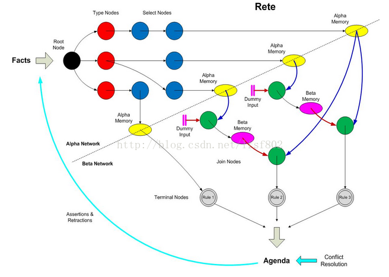

# NOTES

## session

global是session级别的，一个session中修改global不会影响另一个session中global的值。

kmodule文件中如果有两个session的default=true，则使用时拿不到default session。

### marshall？

### StatelessSession

## 相关概念

### OptaPlanner

#### NP NPC

#### 禁忌搜索

#### 模拟退火

#### 延迟接受

#### LHS RHS

#### 什么是event和fact？

#### forward chaining && backward chaining

#### KRR (knowledge representation and reasoning)

#### RETE算法(drools5以下)

- 匹配过程描述

1. 导入需要处理的事实到facts集合中。
2. 如果facts不为空，选择一个fact进行处理。否则停止匹配过程。
3. 选择alpha网的第一个节点运行（建立网络的时候设定的），通过该节点则进入alpha网的下一个节点，直到进入alpha memory。否则跳转到下一条判断路径
4. 将alpha memory的结果加入到beta memory中，如果不为Terminal节点，则检测另一个输入集合中是否存在满足条件的事实，满足则执行join，进入到下一个beta memory重复执行3。若另一个输入集合无满足条件的事实，返回到2。如果该节点为Terminal节点，执行ACT并添加到facts中。

- Rete网络的建立

1. 创建根
2. 加入规则1(Alpha节点从1开始，Beta节点从2开始)
     1. 取出模式1，检查模式中的参数类型，如果是新类型，则加入一个类型节点
     2. 检查模式1对应的Alpha节点是否已存在，如果存在则记录下节点位置，如果没有则将模式1作为一个Alpha节点加入到网络中，同时根据Alpha节点的模式建立Alpha内存表
     3. 重复b直到所有的模式处理完毕
     4. 组合Beta节点，按照如下方式： 　Beta(2)左输入节点为Alpha(1)，右输入节点为Alpha(2) 　Beta(i)左输入节点为Beta(i-1)，右输入节点为Alpha(i) i>2 并将两个父节点的内存表内联成为自己的内存表
     5. 重复d直到所有的Beta节点处理完毕
     6. 将动作（Then部分）封装成叶节点（Action节点）作为Beta(n)的输出节点
3. 重复2)直到所有规则处理完毕；

##### RETEOO

#### PHREAK算法(droos6)

##### LEAPS

##### RETE/UL

##### Collection-Oriented Match