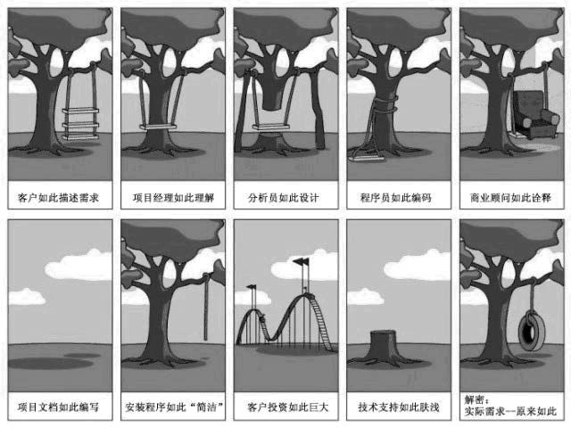

# 大道至简笔记

***这个作者太能扯***

## 团队和管理

### 如果员工在工作中出了纰漏

- 没有制度，你没有办法和依据来惩戒员工，因此是管理者的过失。
- 有了制度而没有惩戒他，是执行者和监督者的过失。
- 一而再、再而三地犯错，又一而再、再而三地被惩戒，那就是教而不改，就真正是员工的品性和素质的问题了。

#### 包括

- 员工已经接受过相关的培训，这至少包括员工规范和技术技能的学习。
- 在该员工之前，相同的或者相关的错误没有被枉纵。

### 在工程开始“做”之前就得先把“角色”确定好

### 团队成员

温伯格(Gerald M. Weinberg)在“给软件开发经理的建议”中提到了这样一个问题：开发经理如何面对一个并非由他亲自雇佣成员的团队。温伯格的回答是：

- 与成员面谈，让他们签约受雇于你。
- 或者，解聘他们。
- 再或者，放弃这个职位。

如果有一群开发人员象蚂蚁一样辛勒地工作着，那么，先不要打扰他们。你应该跟随他们，看看他们是如何做的。发现规律，分析这个规律的价值，最后再尝试改变它们(的一些负面价值的规律)。

**尽管你是团队中的角色，但千万记得离蚂蚁洞远点。你在洞外张望，可以发现问题；你在洞内，就只有做“循规蹈矩”的蚂蚁。**

### 分工

被优先考虑的是弹性分工。
更好的选择是明确分工，而不是弹性分工。你应该明白，重要角色的更替通常是极具风险的。
明确分工是你的管理职责。做管理≠做伯乐。

## 流于形式的沟通

程序员不能要求客户会C Language，难道需求分析师们就能要求客户会Modeling Language吗？！

愚公——这个伟大的项目经理——所使用的“聚室而谋曰”，就是很好的沟通方式。
保障每一次沟通的有效性都是最重要的事。

历史记录(History)与注释(Comment)不是一回事。代码中的注释是为阅读代码而留备的，而History是为整个项目而记录的。一些参考的记录内容有：

- 需求阶段：与谁联系，联系方式、过程、结果以及由此引发的需求或变更。
- 设计阶段：如何进行设计、最初的构架、各个阶段的框架变化、因需求变更导致项目结构上的变化(有助于了解构架的可扩充性)。
- 开发阶段：每一种技术选型的过程、每一种开发技巧的细节和相关文档、算法、开发包、组件库的出处和评测；程序单元的测试框架；每一个设计和构架变更所导致的影响。
- 测试阶段：还记得测试用例和测试报告吗？那是最好的history之一。

***如果不明确要求项目组员写下详细的History，那么他们可能在每一次版本签入时都只写下两个字的备注：“完成”。（貌似现在我们组更恶劣）***

## 失败的过程也是过程

### 做过程不是做工程（一幅有意思的图）

工程被当成了借口，掩盖了我们做事的真正目的：“实现”。因此，我们在一个项目中常常听到说“工程要这样做”，或者“工程要那样做”，而绝少听到“项目要求这样做”或者“客户的本意是那样的”。做完了工程(的每一个过程)，却没有完成项目。

> 乱入（软件产业发展模式：美国模式,日本模式, 爱尔兰模式和印度模式）

### 工程不是做的，是组织的

## 从编程到工程

站在“组织者”这个角色上，你现在要考虑的内容可能会是：

- 为项目的各个阶段建立计划，并逐渐地细化计划的内容，以及确立项目过程中每一个环节、每一个计划阶段的优先级和复杂度；
- 确立项目或者产品阶段目标，成果的准确描述、定位，以及整个项目的质量目标及其评核办法；
- 对团队中的不同角色展开培训，以指导并协调角色间的工作，从而消除因为工作习惯的差异带来的影响；
- 为每一个人准备他所需要的资源，这不单单是把一套shareware变成正式版或者把512M内存变成2G，还包括准确地评估他的工作量，以及决定是否为他增加一个(能协同工作的)副手；
 决定在哪些环节上反复审核和回顾，而在哪些环节上采用较为宽松的方式以加快进度；
- 习惯于开会、组织更短而有效的会议以及建立激励机制，当然也不要忘记让每一个成员意识到这一项目的风险；
- 不要乐观

回顾每一个项目，或者项目中的每一个阶段，以及与每一个团队成员交流的细节，是你的日常工作。

BOSS(经营者)决定了一个方向，组织者保证决策与这个方向是同步的，而工程是在这样的一个方向、决策的构架下的一个具体行为。

**工程中没有BOSS。**