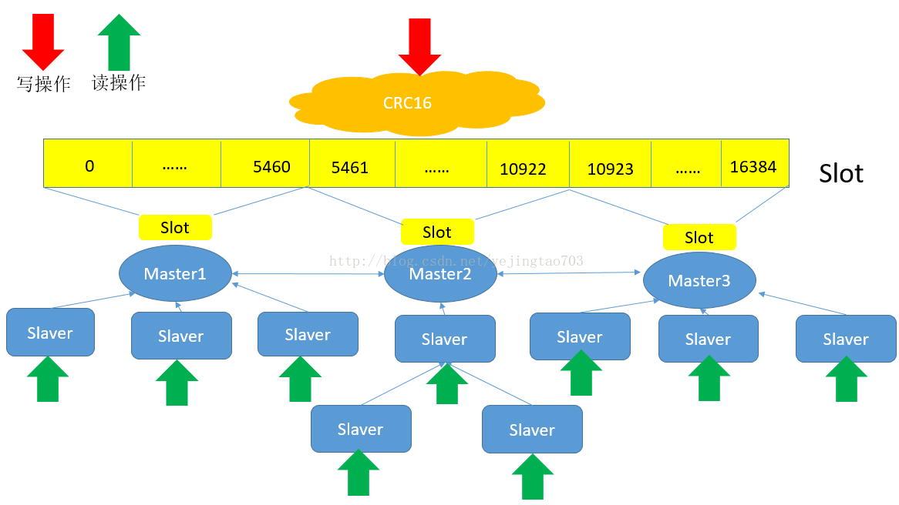

# redis cluster

## 基本原理

一致性hash + 主从模式

每个node负责一个区间（一个slot），有一个或多个备用节点。
每个master节点会相互通信，监听存活状态。

### 请求转发

cluster默认不会代理请求，当客户端一个请求连接的node没有对应的key时，会返回`MOVED254127.0.0.1:6381`，需要客户端再发起连接，到127.0.0.1:6381上。

### resharding

重新分片过程中，key与slot的关系不变，node与slot的节点改变。需要将key迁移到新的node上。

将slot x从node A迁移到node B，此时x在A和B上都会存在，A上slot状态是migrating，B上slot状态是importing。

请求达到A上时，如果key存在，直接处理，不存在，回复ask。客户端收到ask后连接到新的node。
如果包含多个key，全部存在则处理；都不存在回复ask；部分存在返回 try again，当迁移完成后返回ask。

请求达到B上时，如果之前接收过ask请求，直接执行；没有接收过ask，则回复moved。

迁移过程中，slot和node的映射关系不会变化，请求还是会达到A。当slot迁移完毕，会清除migrating和importing状态，并将迁移信息传播给其他node，集群中的slot映射关系发生了改变。

***读写分离先不管***

## 集群健康度判断

### 单个master节点挂了

当集群中有一半以上的节点ping不通时，认为这个节点失败。此时切换成备用节点。

### 集群失败

1. 当集群中有一半以上的master节点失败，不管是否有备用节点，都认为集群失败。
2. 当集群中有master节点失败，且没有可用备用节点时，认为集群失败。（可以调redis参数，容忍部分失败）

### multikeys操作

cluster中要求所有的multikeys操作中key必须在一个node上。
对于hash到不同节点的key，可以用hash tag机制，强行hash到一个node。
resharding期间，multikeys操作可能不可用。

## redis主从同步

### 全同步

1. slave发送sync指令给master。
2. master执行bgsave命令，并将之后执行的写命令存入缓冲区。
3. bgsave完成后，将rdb文件发送给slave。
4. 将缓冲区内写命令发送给slave，slave执行这些写命令。

### 数据修改同步

master执行命令后，使用propagate()命令，一方面写入aop，另一方面将操作扩散到slave中。

### 2.8后的优化

之前，slave断电后，需要重新完整同步一遍master。
2.8的优化是如果条件允许，主服务器可以将主从服务器连接断开期间执行的写命令发送给从服务器，从服务器只要接收并执行这些写命令。

#### 部分同步

主从通过一个“复制偏移量”判断是否同步。
主每向从传播一个字节，就将本地偏移量+1，从收到后也会将本地偏移量+1。当同步时，主从的偏移量总是相等的。

当偏移量不相同时，会执行同步。
优先使用复制缓冲区。缓冲区保存了一段时间内主传播的偏移量和对应数据。
如果从偏移量+1的数据仍在缓冲区中，可以只同步缓冲区中数据，如果不在，需要重新全量同步。

同时每个从库还保存了上一个主的id，如果断线重连后发现主的id和之前不同，需要重新全量同步。