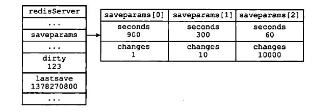

# 准备分享的小知识点

## 底层数据结构

### 动态字符串SDS

- len + char[] + free
- 最后一位还是保持c的特点\0，这样可以重用部分c库

### 跳跃表

- 平均O(logN)

### 压缩表

- 列表和hash建的底层实现之一。当元素个数比较少，且每个元素的长度比较短，则启用压缩表
- 结构
    1. zlbytes，整个列表长度
    2. zltail，列表尾节点距离起始的偏移量，快速定位
    3. zllen，列表节点数量
    4. zlend，标识列表结束
> zlbytes + zltail + zllen + entry1...entryN + zlend
- entry结构
    1. previous_entry_length，前一个节点长度，用户反向遍历
    2. encoding，当前节点的编码和长度
    3. content，内容
- 更新时的连锁更新，原因是previous_entry_length这个字段的长度和之前节点的整体长度有关。插入/删除节点时，由于新节点长度影响，会连锁导致其他节点的previous_entry_length字段长度变化。最坏时间O(N^2)
- 作为list底层结构使用条件（可配置）
    1. 列表存储的所有字符串元素长度小于64字节
    2. 元素数量小于512
- 作为hashmap底层结构（可配置）
    1. 方式：列表的entries保持 key,value,key,value这种方式排列
    2. 条件1，所有键、值元素长度小于64字节
    3. 条件2，键值对数量小于512

### 有序集合的实现

- ziplist或者skiplist
- 用ziplist时，按照 element,score,element,score 的形式，以score排序存储
- 用skiplist时，会同时用skiplist和hashtable存储。why？
    1. 查找元素用hashtable，O(1)
    2. 范围操作用skiplist，O(logN)
    3. 底层的element和score复用

## redis "数据库"

- 数据库第一层固定的接口，比如数据key是dict，过期key是expires。
- dict是key-value结构，key是set key value这些命令中的key，每个value可能会是不同类型
- expires保存所有需要过期的key，当然，底层的数据实体和dict是共用的。
- 过期key的删除策略。定时清理 + 惰性删除（取时check）
- 过期对RDB文件和AOF的影响（具体到备份再说）

## 持久化

### RDB(Redis DataBase)

- 某个时间点将数据写入一个临时文件，持久化结束后，用这个临时文件替换上次持久化的文件，达到数据恢复。
- 启动redis的server时会从dump.rdb中先同步数据。
- 优点：使用单独子进程来进行持久化，主进程不会进行任何IO操作，保证了redis的高性能。
- 缺点：RDB是间隔一段时间进行持久化，如果持久化之间redis发生故障，会发生数据丢失。所以这种方式更适合数据要求不严谨的时候。
- 定时保存的实现方式：redis服务器会定时扫面配置的条件saveparams。只要有一个条件满足，则会执行

### AOF(Append-only file)

- redis的binlog
- 策略
    1. always：每一条aof记录都立即同步到文件，这是最安全的方式，也以为更多的磁盘操作和阻塞延迟，是IO开支较大。
    2. everysec(推荐)：每秒同步一次，性能和安全都比较中庸的方式，也是redis推荐的方式。如果遇到物理服务器故障，有可能导致最近一秒内aof记录丢失(可能为部分丢失)。
    3. no：redis并不直接调用文件同步，而是交给操作系统来处理，操作系统可以根据buffer填充情况/通道空闲时间等择机触发同步；这是一种普通的文件操作方式。性能较好，在物理服务器故障时，数据丢失量会因OS配置有关。

#### AOF文件重写

- AOF文件重写：处理集合时，需要多条命令，此时可以读取集合中键的值，合并成一条插入命令

#### AOF重写缓冲区

redis服务器用子进程完成AOF文件重写，不会阻塞主进程。此时会有一个问题，重写过程中，新的写命令怎么处理？

1. 子进程重写AOF时，主进程的命令会写入重写缓冲区。
2. 当重写完成时，会向主进程请求缓冲区，追加到新的AOF文件。
3. 追加后，原子性的覆盖原AOF文件。

想主进程请求缓冲区到覆盖过程，会阻塞父进程。

