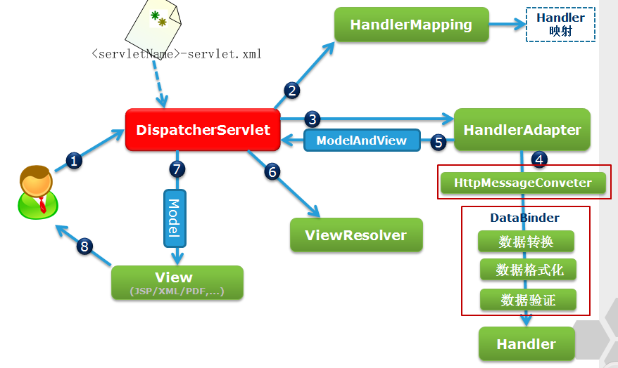

# mvc

## 一个简单的get请求执行过程



1. tomcat将请求发给DispatcherServlet，调用doService。DispatcherServlet经过一些处理后，调用doDispatch
2. 开始找HandlerMapping。HandlerMapping负责映射用户的URL和对应的处理类，执行过程中默认加载了两个RequestMappingHandlerMapping(处理）和BeanNameUrlHandlerMapping（基于beanName找映射，需要配置）。尝试RequestMappingHandlerMapping，会根据request中的url和已经加载的映射做匹配，匹配到了，返回RequestMappingHandlerMapping。
3. 找到合适的HandlerAdapter。主要是为了解决不同Handler不同处理方式。见 [spring概念](./spring相关概念.md#适配器模式)。开始执行。
    1. 先是HandlerExecutionChain.applyPreHandle，这里会执行interceptors的preHandle。
    2. 再是HandlerAdapter.handle。会执行ServletInvocableHandlerMethod#invokeAndHandle，invoke后会用注册号的returnValueHandlers来处理返回结果。不同的returnValueHandlers有不同的处理类型，根据这个来选择合适的handler。我们这个场景会选择到`并将结果写到输出流中，对于前端来说一个请求就完成了。
    3. 执行完后，是applyPostHandle。这里会执行interceptors的postHandle。
4. 见3.2。如果是要返回一个页面，执行的handler不一样。比如简单返回一个jsp，则是一个ViewNameMethodReturnValueHandler，将view的name设置到ModelAndViewContainer中。
5. 返回一个ModelAndView到DispatcherServlet。
6. 用加载好的ViewResolverl解析view，项目中常配置InternalResourceViewResolver，解析内部资源。
7. 解析完成后返回一个View。
    1. 在返回给前端前，还有一些后续处理。调用HandlerExecutionChain#triggerAfterCompletion，会执行interceptors的afterCompletion。
    2. 发布一个ServletRequestHandledEvent。
8. 返回。

### RequestMappingHandlerMapping加载过程

实现了接口InitializingBean，在bean加载完成后会自动调用afterPropertiesSet方法，在此方法中调用了initHandlerMethods()来实现初始化。
过程就是遍历项目中的bean，遇到@Controller或者@RequestMapping的bean，根据RequestMapping的配置，生成配置信息RequestMappingInfo。再注册到MappingRegistry中。

### url匹配规则

RequestMappingHandlerMapping支持通配符匹配(指的是项目中的路径)。
优先级关系大致是

1. 更精确匹配更优先
2. ? 优先于 *
3. 更少的通配符优先于更多的通配符。

### 对于页面来说什么时候已经返回？？

当执行到  AbstractMessageConverterMethodProcessor.java:239，调用 `org.springframework.http.converter.HttpMessageConverter#write` 后，前端已经接受到结果。后面的处理是后端内部的事情了。

### 处理 @ResponseBody 返回中文乱码

此时StringHttpMessageConverter会生效，而默认是 text/plain, */*;charset=ISO-8859-1，所以中文乱码。

可以在`<mvc:annotation-driven>`中加配置（下面的*/*要慎重）

```xml
<mvc:annotation-driven>
    <mvc:message-converters>
        <bean class="org.springframework.http.converter.StringHttpMessageConverter">
            <constructor-arg index="0" value="UTF-8"/>
            <property name="supportedMediaTypes">
                <list>
                    <value>*/*;charset=UTF-8</value>
                </list>
            </property>
        </bean>
    </mvc:message-converters>
</mvc:annotation-driven>

```

加上后，会在默认加载的MessageConvertor前再加一个MessageConvertor。
要注意*/*，如果写成 text/plain，那 text/html 或者其他类型的请求仍然不会走这个convertor。
如果可以确定不要默认的convertor或者愿意手动copy一遍，可以设置 `<mvc:message-converters register-defaults="false">`

### springmvc DispathcerServlet默认配置

下面是经常用到的

```java

org.springframework.web.servlet.HandlerMapping=org.springframework.web.servlet.handler.BeanNameUrlHandlerMapping,org.springframework.web.servlet.mvc.method.annotation.RequestMappingHandlerMapping

org.springframework.web.servlet.HandlerAdapter=org.springframework.web.servlet.mvc.HttpRequestHandlerAdapter,org.springframework.web.servlet.mvc.SimpleControllerHandlerAdapter,org.springframework.web.servlet.mvc.method.annotation.RequestMappingHandlerAdapter

org.springframework.web.servlet.HandlerExceptionResolver=org.springframework.web.servlet.mvc.method.annotation.ExceptionHandlerExceptionResolver,org.springframework.web.servlet.mvc.annotation.ResponseStatusExceptionResolver,org.springframework.web.servlet.mvc.support.DefaultHandlerExceptionResolver

org.springframework.web.servlet.RequestToViewNameTranslator=org.springframework.web.servlet.view.DefaultRequestToViewNameTranslator

org.springframework.web.servlet.ViewResolver=org.springframework.web.servlet.view.InternalResourceViewResolver
```

### 返回一个viewName和json

返回一个json需要用@ResponseBody，这里会用RequestResponseBodyMethodProcessor处理返回结果，RequestResponseBodyMethodProcessor#handleReturnValue这个方法会直接在outputStream中写入数据，前端可以立即接受到返回值。

返回一个viewName会用到ViewNameMethodReturnValueHandler。
这个handler会拼好ModelAndView，在DispatcherServlet#render中使用。render首先使用注册好的viewResolvers定位到view，再调用view.render。最后通过tomcat返回给前端（这个是tomcat的源码）。

#### 一个知识点

spring默认使用jackson进行json序列化，对应的messageConverter是 MappingJackson2MessageConverter 。如果路径中有jackson相关类，会自动加载进来。在springboot-web中也是默认包含了jackson的。

当返回的对象，没有get方法时，会抛出一个“没有合适的converter”异常，但是实际上是有 MappingJackson2MessageConverter 的。原因是当 MappingJackson2MessageConverter 进行write时，发现对象type没有任何可以访问的属性（代码在com.fasterxml.jackson.databind.ser.BeanSerializerBuilder#build中），会使用一个UnknownTypeSerializer，最终会抛出异常。

#### 不同的handler

- ModelAndViewMethodReturnValueHandler 判断返回值是否是ModelAndView
- ModelMethodProcessor 判断返回值是否是Model
- ViewMethodReturnValueHandler 判断返回值是否是View
- HttpEntityMethodProcessor 判断返回值是HttpEntity，且不是RequestEntity。
- ModelAttributeMethodProcessor 判断方法上是否有ModelAttribute注解。这个处理器上annotationNotRequired==false
- RequestResponseBodyMethodProcessor 判断返回值方法上是否有ResponseBody注解。或者返回值所在容器（）是否有ResponseBody注解。
- ViewNameMethodReturnValueHandler 判断返回值是否是void或者CharSequence。
- MapMethodProcessor 判断返回值是否是map
- ModelAttributeMethodProcessor 这个处理器上annotationNotRequired为true，只要不是简单类型，都会判断为true。
- 其他。。。