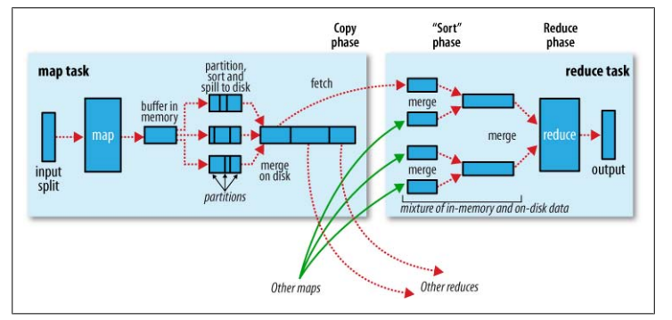

# Map-Reduce

## example源码

[github](https://github.com/apache/hadoop/tree/trunk/hadoop-mapreduce-project/hadoop-mapreduce-examples/src/main/java/org/apache/hadoop/examples)

## WordCount

### code

```java
package priv.cxs.data;

import org.apache.commons.lang3.StringUtils;
import org.apache.hadoop.conf.Configuration;
import org.apache.hadoop.fs.FileSystem;
import org.apache.hadoop.fs.Path;
import org.apache.hadoop.io.IntWritable;
import org.apache.hadoop.io.Text;
import org.apache.hadoop.mapreduce.Job;
import org.apache.hadoop.mapreduce.Mapper;
import org.apache.hadoop.mapreduce.Reducer;
import org.apache.hadoop.mapreduce.lib.input.FileInputFormat;
import org.apache.hadoop.mapreduce.lib.output.FileOutputFormat;

import java.io.IOException;

/**
 * @author xiaoshuang.cui
 * @date 2018/11/23 上午11:33
 **/
public class WordCount {

    private static final String DEFAULT_INPUT = "/user/xiaoshuang.cui/mapred/wordcount/input";

    private static final String DEFAULT_OUTPUT = "/user/xiaoshuang.cui/mapred/wordcount/output";

    public static void main(String[] args) throws IOException, ClassNotFoundException, InterruptedException {

        Path input = new Path(args.length > 0 && StringUtils.isNotBlank(args[0]) ?  args[0] : DEFAULT_INPUT);
        Path output = new Path(args.length > 1 && StringUtils.isNotBlank(args[1]) ? args[1] : DEFAULT_OUTPUT);

        Configuration conf = new Configuration();

        Job job = Job.getInstance(conf, "word count");
        job.setJarByClass(WordCount.class);
        job.setMapperClass(TokenizerMapper.class);
        job.setCombinerClass(IntSumReducer.class);
        job.setReducerClass(IntSumReducer.class);
        job.setOutputKeyClass(Text.class);
        job.setOutputValueClass(IntWritable.class);
        FileInputFormat.addInputPath(job, input);
        FileOutputFormat.setOutputPath(job, output);

        //remove output
        FileSystem fileSystem = output.getFileSystem(conf);
        fileSystem.deleteOnExit(output);

        System.exit(job.waitForCompletion(true) ? 0 : 1);
    }

    private static class TokenizerMapper extends Mapper<Object, Text, Text, IntWritable> {
        private final static IntWritable one = new IntWritable(1);
        private Text word = new Text();

        @Override
        protected void map(Object key, Text value, Context context) throws IOException, InterruptedException {
            for (String split : value.toString().split("\t")) {
                word.set(split);
                context.write(word, one);
            }
        }

    }

    private static class IntSumReducer extends Reducer<Text, IntWritable, Text, IntWritable> {

        @Override
        protected void reduce(Text key, Iterable<IntWritable> values, Context context) throws IOException, InterruptedException {
            int sum = 0;
            for (IntWritable value : values) {
                Integer count = value.get();
                sum += count;
            }
            context.write(key, new IntWritable(sum));
        }
    }
}
```

### pom

```xml
<?xml version="1.0" encoding="UTF-8"?>
<project xmlns="http://maven.apache.org/POM/4.0.0"
         xmlns:xsi="http://www.w3.org/2001/XMLSchema-instance"
         xsi:schemaLocation="http://maven.apache.org/POM/4.0.0 http://maven.apache.org/xsd/maven-4.0.0.xsd">
    <modelVersion>4.0.0</modelVersion>

    <groupId>priv.cxs</groupId>
    <artifactId>data_study</artifactId>
    <version>1.0.0</version>

    <dependencyManagement>
        <dependencies>
            <dependency>
                <groupId>org.apache.hadoop</groupId>
                <artifactId>hadoop-common</artifactId>
                <version>2.9.2</version>
            </dependency>

            <dependency>
                <groupId>com.google.guava</groupId>
                <artifactId>guava</artifactId>
                <scope>provided</scope>
                <version>23.0</version>
            </dependency>

            <dependency>
                <groupId>org.apache.hadoop</groupId>
                <artifactId>hadoop-mapreduce-client-core</artifactId>
                <version>3.1.1</version>
            </dependency>

            <dependency>
                <groupId>org.apache.hadoop</groupId>
                <artifactId>hadoop-mapreduce-client-jobclient</artifactId>
                <version>3.1.1</version>
            </dependency>
        </dependencies>
    </dependencyManagement>

    <dependencies>
        <dependency>
            <groupId>org.apache.hadoop</groupId>
            <artifactId>hadoop-common</artifactId>
        </dependency>
        <dependency>
            <groupId>org.apache.hadoop</groupId>
            <artifactId>hadoop-mapreduce-client-core</artifactId>
        </dependency>
        <dependency>
            <groupId>org.apache.hadoop</groupId>
            <artifactId>hadoop-mapreduce-client-jobclient</artifactId>
        </dependency>
    </dependencies>
</project>
```

### cmd

hadoop jar jars/data_study-1.0.0.jar priv.cxs.data.WordCount

另外 -libjars mylib.jar 可以将jar加入classpath中。

## 问题

- [ ] 怎么解决guava版本冲突问题？
- [ ] mapreduce的 -files参数怎么用？要启动shareCacheManager？炸了炸了

## to be read

http://blog.51cto.com/datainsight/1423475

## shuffle

