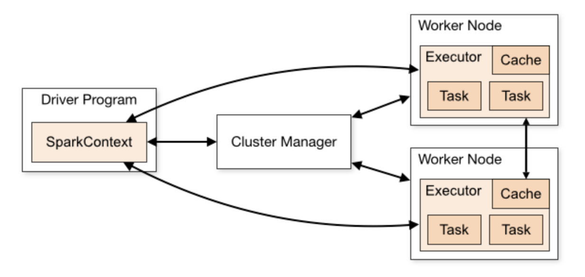
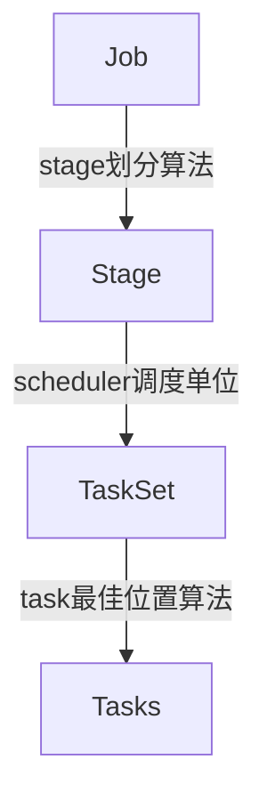
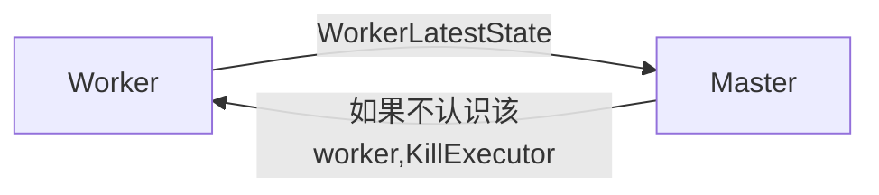
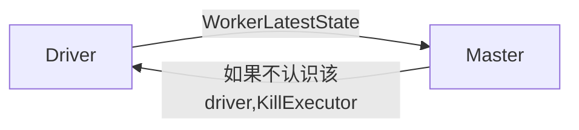
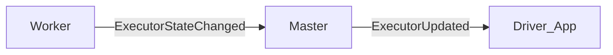
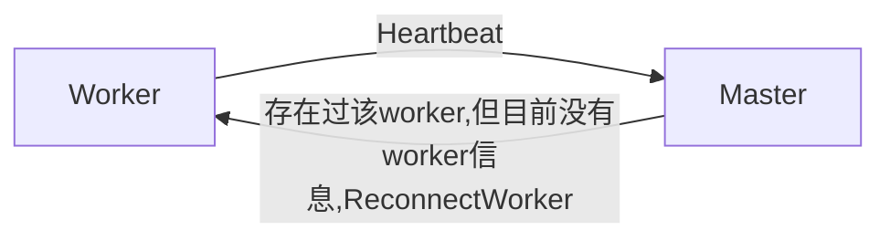
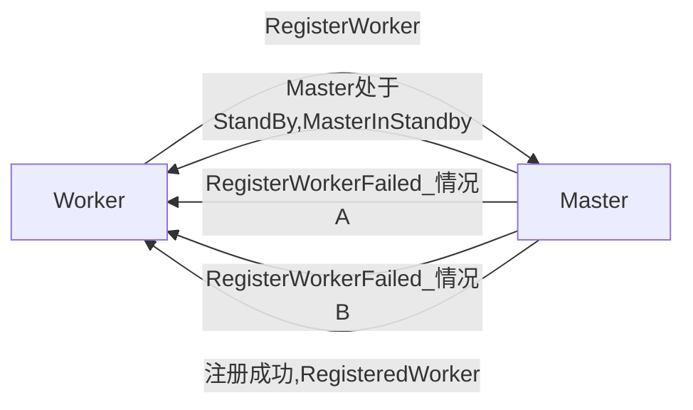
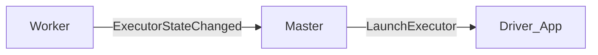

# spark

## 概念与理论

### 架构



#### 概念

##### Driver

主要完成任务的调度以及和executor和cluster manager进行协调。有client和cluster模式。client模式driver在任务提交的机器上运行，而cluster模式会选择机器中的一台机器启动driver。driver会执行代码中的main方法，创建SparkContext，并将application中的代码发送给executor，最后SparkContext会将task发送给executor执行。

##### Worker

集群中可以运行任务的节点。

##### Executor

worker中运行任务的节点。

##### Job, Stage, Task

可以认为每一个action都会产生一个job。
一个job会拆分成不同stage。
一个stage会分成不同的task。task是被executor执行的最小单元。



job划分stage最重要的原则`从宽依赖处分割`。
task的数量由partition数量决定。
DagScheduler将stage封装成taskSet。

#### 宽窄依赖

窄依赖: 父RDD仅被一个子RDD依赖。
宽依赖: 父RDD不同数据被不同子RDD依赖。

cartesion(笛卡尔积)方法中，虽然父RDD被不同子RDD依赖，但仍然是窄依赖。`个人理解是因为不需要shuffle，而是将每个RDD都拷贝到其他RDD`

#### spark中常见操作

### spark shuffle过程

## 核心模块

### hdfs数据读取

spark是怎么读取文件的？是按照文件流的方式读取文件，还是说一次读取一个文件块，加载到内存？有shuffle和没有shuffle的时候，读取时怎么进行的？

Spark中的Task只有两个子类，一个是ResultTask，一个是ShuffleMapTask。当需要有shuffle的时候，会生产一个或者多个ShuffleMapTask。任何一个有输出的Job，都会生成ResultTask，用于计算出结果。

对于一个简单的count程序，spark经过一系列初始化和运行后，会直接进入ResultTask。

#### 文件split数量计算

首先分析spark是如何计算出读取文件split数量的：

1. SparkContext.runJob之后，会调用Rdd的partitions方法得到partition信息，最终调用的是HadoopRDD.getPartitions
2. HadoopRDD调用`getInputFormat(jobConf).getSplits(jobConf, minPartitions)`，这里用的是FileInputFormat
3. 遍历目录下所有文件，获取每个文件的blockLocations（每个文件块）。计算出读取时文件块的目标大小，公式是`Math.max(minSize, Math.min(goalSize, blockSize))`。如果有1000个1M的小文件，最终会生成1000个split，如果是1个1G的大文件，最终会生成8个128M的split。

spark中，将hdfs文件抽象成了FileSplit，记录了文件名，偏移量，host等信息。

#### split和block一些疑问

- spark生成的split和hdfs的物理block是什么对应关系？
- 如果spark设置的最小split是200M，会怎么处理？一个split装了128M的block，剩下的72M怎么办，和其他split共享一个block吗？
- split和partition的关系是怎么样的？

#### 具体的文件读取

Executor开始执行后，如下执行流程：

1. org.apache.spark.executor.Executor

    ```scala
    val res = task.run(
        taskAttemptId = taskId,
        attemptNumber = taskDescription.attemptNumber,
        metricsSystem = env.metricsSystem)
        threwException = false
        res
    }
    ```

2. org.apache.spark.scheduler.ResultTask

    ```scala
    //这里的func是反序列化生成，没有看到具体实现
    func(context, rdd.iterator(partition, context))
    ```

3. org.apache.spark.rdd.MapPartitionsRDD#compute -> org.apache.spark.rdd.HadoopRDD#compute

每一个executor运行一次run，处理的是一个split。具体读取hdfs就在HadoopRDD#compute中。

compute中通过InputFormat得到RecordReader，测试时用的分别是FileInputFormat和LineRecordReader。
具体的从block读取数据的过程，由DFSInputStream实现，待补充。

尝试解答一下[split和block一些疑问：](####split和block一些疑问)

- spark中的split和hdfs的block没有直接的对应关系，split只是记录了文件和对应的读取偏移量，最终落到哪个block，是由hadoop底层计算得到的。
- 网上说split不能跨文件，也就是两个split不能共享一个文件，这个待确认。这里说的文件应该是hdfs上的一个文件，而不是一个block。
- 一个split对应一个task，如果没有shuffle，那么每个resultTask生成一个partition。map阶段partition数量不变，但是reduce阶段会变化，和具体的操作有关。

- spark partition的生成规则。

对于读入数据时的partition数量，需要通过计算得到。简单计算方式如下，默认hadoop配置的块大小是128M，那么如果有小文件小于128M，则生成一个partition，大文件按照128M切分，每切分一个生成一个partition。

spark shuffle时，默认是200个partition。通过`--conf spark.sql.shuffle.partitions`可以配置。

#### RecordReader

对于普通的text文件，使用的是LineRecordReader，按行读取数据。

org.apache.hadoop.mapred.LineRecordReader#next
    org.apache.hadoop.util.LineReader#readLine(这里并不是一次读取一行，而是读取一定字节数并缓存起来，每次读取一行是从缓存中读字节直到一个换行符)
        org.apache.hadoop.hdfs.DFSInputStream#read
            org.apache.hadoop.hdfs.DFSInputStream#readWithStrategy

在readWithStrategy中，`currentNode = blockSeekTo(pos);`来根据读取的位置确定是哪一个block。

### Executor将数据传输给Driver过程

```scala
  def runJob[T, U: ClassTag](
      rdd: RDD[T],
      func: (TaskContext, Iterator[T]) => U,
      partitions: Seq[Int]): Array[U] = {
    val results = new Array[U](partitions.size)
    runJob[T, U](rdd, func, partitions, (index, res) => results(index) = res)
    results
  }
```

这里会new一个array用来存放执行结果。继续跟踪，会发现这个ResultHandler `(index, res) => results(index) = res`会传给JobWaiter。它在一个EventLoop中，监听receive事件，接受executor返回的结果。当taskSucceeded时，调用ResultHandler将结果放入array中。

下面看Executor是怎么发送结果的。

Executor执行方法是 org.apache.spark.executor.Executor.TaskRunner#run。当执行完一系列计算后，会将result序列化成ByteBuffer，再通过ExecutorBackend，将buffer发送出去。发送实际使用的是netty(NettyRpcEnv)。根据发送目的地址是不是本地，会选择postOneWayMessage还是postToOutbox。

### Spark Rpc 模型

最基本的使用方法

```scala
//server端创建
val config = RpcEnvServerConfig(new RpcConf(), "hello-server", "localhost", 52345)
val rpcEnv: RpcEnv = NettyRpcEnvFactory.create(config)
val helloEndpoint: RpcEndpoint = new HelloEndpoint(rpcEnv)
rpcEnv.setupEndpoint("hello-service", helloEndpoint)
rpcEnv.awaitTermination()

//client端使用
val rpcConf = new RpcConf()
val config = RpcEnvClientConfig(rpcConf, "hello-client")
val rpcEnv: RpcEnv = NettyRpcEnvFactory.create(config)
val endPointRef: RpcEndpointRef = rpcEnv.setupEndpointRef(RpcAddress("localhost", 52345), "hell-service")
val future: Future[String] = endPointRef.ask[String](SayHi("neo"))
future.onComplete {
    case scala.util.Success(value) => println(s"Got the result = $value")
    case scala.util.Failure(e) => println(s"Got error: $e")
}
Await.result(future, Duration.apply("30s"))
```

#### RpcEnv

对于server side来说，RpcEnv是RpcEndpoint的运行环境，负责RpcEndpoint的整个生命周期管理，它可以注册或者销毁Endpoint，解析TCP层的数据包并反序列化，封装成RpcMessage，并且路由请求到指定的Endpoint，调用业务逻辑代码，如果Endpoint需要响应，把返回的对象序列化后通过TCP层再传输到远程对端，如果Endpoint发生异常，那么调用RpcCallContext.sendFailure来把异常发送回去。

对client side来说，通过RpcEnv可以获取RpcEndpoint引用，也就是RpcEndpointRef的。

有两个重要方法:

- `org.apache.spark.rpc.RpcEnv#setupEndpoint` 注册一个RpcEndpoint。具体的会在Dispatcher的endpointRefs中保存Endpoint和它对应的一个EndpointRef。
- `org.apache.spark.rpc.RpcEnv#setupEndpointRef` 获取一个EndpointRef（虽然方法名是setup，实际是一个生成新ref的操作）。具体的会根据参数中的address生成一个EndpointRef，同时用一个RpcEndpointVerifier校验该ref是否存在。*这是一个同步方法，在校验完成前不会返回*

#### RpcEndpoint

一个RpcEndpoint更像是一个响应请求的server，看它的几个核心方法：

- `org.apache.spark.rpc.RpcEndpoint#receive` 接受一个消息，不回复
- `org.apache.spark.rpc.RpcEndpoint#receiveAndReply` 接受一个消息，回复

从这两个方法来看，都是接受消息，所以行为更像是一个server端。

#### RpcEndpointRef

ref的核心方法包括：

- `org.apache.spark.rpc.netty.NettyRpcEndpointRef#send` 发送一个消息，不需要回复
- `org.apache.spark.rpc.netty.NettyRpcEndpointRef#ask` 发送一个消息，需要回复

新版spark，ref就一个实现，NettyRpcEndpointRef。发送消息时，如果是发送给本地，则直接通过dispatcher放入本地的inbox中并通知处理；如果是发送给远程，则放入本地的outBox中，异步发送。

不同endpoint的ref，其不同只是持有的address不同，实际上就是只有通信地址的不同。

#### RpcEndpoint和RpcEndpointRef的关系

虽然ref这个后缀看上去很像是指针类似的引用，或者至少是某种形式的包装，实际上并没有这么直接的关系。

endpoint在注册到RpcEnv时，会同时在RpcEnv中生成并保存一个对应的ref，这个ref的address是RpcEnv中设置的address。

就我目前看到的，获取ref有两种方式。

- endpoint中通过self获得自己的ref。是从dispatcher保存的关系中直接获取。
- 接受其他endpoint发送的消息，其中包含了发送发的ref信息。反序列化后得到远端的ref。例如 Master会发送RegisteredWorker消息给Worker，Worker拿到消息中master的ref，并修改本地保存的master信息。

##### 几对 Master Worker消息









##### 比较复杂的交互



图上情况A: master中已经包含了该worker的id，返回`Duplicate worker ID`

图上情况B: master注册时，发现该地址下已经有worker，且`state != UNKNOWN`，返回`Attempted to re-register worker at same address`

发送RegisteredWorker后，master会调用schedule方法，开始启动worker上的executor(org.apache.spark.deploy.master.Master#startExecutorsOnWorkers)。向worker发送LaunchExecutor，来给executor分配完资源，同时向driver发送ExecutorAdded。



#### 从Master recovery过程看SparkRpc的使用

```sequence
Master->Master: 被选择为leader，发送ElectedLeader消息
Master->Master: registerApplication
Master->Application: 发送MasterChanged，将app状态置为UNKNOWN
Application->Master: 发送MasterChangeAcknowledged，master将app状态置为WAITING
Master->Master: registerWorker，将worker状态重置为UNKNOWN
Master->Worker: 发送MasterChanged
Worker->Master: 发送WorkerSchedulerStateResponse，master将该worker状态置为ALIVE
Master->Master: 发送CompleteRecovery
Master->Master: 开始completeRecovery，状态临时改为COMPLETING_RECOVERY
Master->Master: 移除全部UNKNOWN状态的worker
Master->Application: 向UNKNOWN状态的发送ApplicationRemoved_finished消息
Application->Application: stop
Master->Worker: 对于每个向UNKNOWN状态的app，向所有worker发送ApplicationFinished消息
Worker->Worker: maybeCleanupApplication
Master->Driver: 对于没有worker的driver，删除或者重启
Master->Master: 将WAITING状态的app置为RUNNING
Master->Master: 状态改为ALIVE
Master->Worker: schedule
```

removeWorkers的子流程

```sequence
Master->Driver: 对worker包含的每个Executor，向其对应的driver发送ExecutorUpdated_lost消息
Master->Master: 更新本地的executor信息
Master->Master: 对worker中包含的driver，重启或者删除driver，并执行schedule
Master->Application: 对每个不是Complete的app，发送WorkerRemoved消息
```

##### 存疑

- spark是怎么处理消息的延迟问题的？例如Master向Worker发送MasterChanged，怎么能保证及时收到Worker回复的WorkerSchedulerStateResponse？
- schedule是怎么样的过程？Master的removeDriver和schedule是怎么搭配工作的？

## 遇到的问题

### Task not serializable

由于Spark程序中的map、filter等算子内部引用了类成员函数或变量导致需要该类所有成员都需要支持序列化，又由于该类某些成员变量不支持序列化，最终引发Task无法序列化问题。

### spark-sql遇到 `Filtering is supported only on partition keys of type string`

用spark-sql执行下面语句 "select * from t where month in ('201903', '201904')" 会报错 `Filtering is supported only on partition keys of type string`
month是分区字段，int类型。相同的sql在hive中执行没有问题，但是在spark中报错。
网上有说将 hive.metastore.try.direct.sql=false，但是无效。

最终解决方案是用or代替in。

## spark实战

- 分区数设置推荐为集群core的3-4倍。

- cogroup可以将两个PairRDD按照key聚合，效果类似 fullOuterJoin，但是在join前，会将各自rdd中相同的key聚合成一个Iterable。最终结果的value是一个包含两个Iterable的Tuple。

- 如何优化spark的groupByKeyAndSortValues？用repartitionAndSortWithinPartition。后者能在shuffle过程中同时进行排序，且不需要value的聚合过程。具体方案如下：

```scala
val rdd: RDD[(K, V)] = xxx

rdd = rdd.map((k, v) => (kv, null))

rdd.repartitionAndSortWithinPartition(myPartitioner) //这里的partitioner只以拼接后的kv中的k做hash
```

- The groupByKey transformation can be memory expensive because it has to get all the values of each key in memory, so you have to be careful when using it. We recommend using aggregateByKey, reduceByKey, or foldByKey for simpler scenarios that don’t require full grouping to occur, such as calculating the average per key.

- hive窗口函数中rank()和dense_rank()。两个rank都会存在并列排名，不过后者在后续排名时不会留下空档。

- hive窗口函数中， `order by xx` 默认的从句是 `order by xx RANGE BETWEEN UNBOUNDED PRECEDING AND CURRENT ROW`，这个和指定范围 `order by xx ROWS BETWEEN UNBOUNDED PRECEDING AND CURRENT ROW`不一样。举例，排序后的值如下：a=1, b=2, c=3, d=3, e=4。当计算到c这行时，默认的order by会将d的值也计算在内，因为RANGE是按值的范围取行，而指定的ROWS，则只会包含到c当前这行。

- left semi join。类似sql中的in字句，只返回满足on条件的左表数据，同时不会因为右表有多条导致重复。

- spark.shuffle.manager，spark shuffle时的存储管理方式，spark2.0默认是sort，但是sort有两种sort/tungsten-sort，默认是哪种？

- spark命令行应用程序参数要放在jar包名称后面，spark命令行系统参数要放在jar包名称前。

- spark配置优先级： 代码 > 命令行参数 > spark配置文件 > 系统变量

- 当本地使用的class和spark内部使用的class冲突时，通过`spark.executor.userClassPathFirst`,`spark.driver.userClassPathFirst`参数来控制是否优先加载用户的class。

- map和mapPartitions的区别。从方法签名上可以看出，map是对每个元素进行一次func操作，mapPartitions是对一个iter进行一次func操作。如果func是很简单的变形，两个方法的效率差不多，但是如果涉及到比较重的初始化工作，则优先使用mapPartitions。

- spark.speculation 推测机制。当判断某个task运行超过时间限制 spark.speculation.interval，spark会在其他executor上同时运行该task，如果其他executor返回了结果，则当前卡住的task会结束。spark.speculation.quantile 规定了启用推测所需完成的task数量的最小比例，如果当前完成的task比例小于设置，则不会启用推测。spark.speculation.multiplier 规定了推测机制启用的时间阈值比例，如果当前task运行时间超过了所有task的运行时间中位数 * 阈值比例，则会启用推测。

### spark on yarn 启动过程

1. client向resource manager提交一个application。
2. resource manager为ApplicationMaster申请资源，与一个node manager通信分配一个container，以启动ApplicationMaster。
3. ApplicationMaster向resource manager申请应用所需资源。
4. 申请到资源后ApplicationMaster与node manager通信，启动executor container。
5. 后续spark driver和executor的通信，不再经过yarn。

yarn container和spark的关系：一个container代表一个节点上的资源，一个节点可以生成多个container，但是一个container只能包含一个节点上的资源。启动后，一个container是一个jvm进程，也就对应了一个executor，可以执行多个task。

#### 延伸 —— yarn的资源调度策略

##### FIFO

##### Capacity

将整体资源划分成多个队列，每个队列可以再划分成自队列。每个队列中的任务，以FIFO形式调度。

可以设置用户使用的资源限制，用户提交的应用数量限制。

可以弹性分配，当一个队列资源有空闲时，可以暂时分配给其他队列使用。（此时空闲队列有新任务，不能抢占被临时分配出去的资源。）

每个队列中可以设置任务占用的“最大”，“最小”容量。

##### FAIR

公平性调度中，将任务按照“任务池”的方式组织起来，默认每个用户都有一个独立的任务池。每个池内部可以使用FAIR或者FIFO的方式调度。

任务池支持最小资源配置，当池中有任务时，会保证最小资源量，如果不满足最小资源，会从其他任务池的任务中抢占资源。当池中资源大于最小配置时，多余的资源可能会被其他池使用。

同时支持任务优先级，高优先级可以抢占低优先级任务资源。同时在竞争分配时，高优先级任务也能发到更多的资源。

## spark知识点

### spark任务提交启动过程

### spark各角色（例如driver）的作用

### DAG的生成过程，DAGScheduler

### 解决数据倾斜方案

### spark并行度默认方案与优化

### spark shuffle 过程与源码，与MR对比
