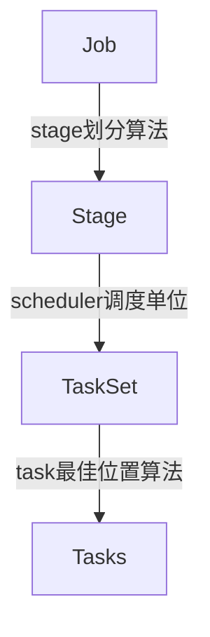

# spark

## 概念与理论

### 架构


#### 概念

##### Driver

主要完成任务的调度以及和executor和cluster manager进行协调。有client和cluster模式。client模式driver在任务提交的机器上运行，而cluster模式会选择机器中的一台机器启动driver。driver会执行代码中的main方法，创建SparkContext，并将application中的代码发送给executor，最后SparkContext会将task发送给executor执行。

##### Worker

集群中可以运行任务的节点。

##### Executor

worker中运行任务的节点。

##### Job, Stage, Task

可以认为每一个action都会产生一个job。
一个job会拆分成不同stage。
一个stage会分成不同的task。task是被executor执行的最小单元。


```mermaid
graph TB
Job--stage划分算法--> Stage
Stage--scheduler调度单位-->TaskSet
TaskSet--task最佳位置算法-->Tasks
```

job划分stage最重要的原则`从宽依赖处分割`。
task的数量由partition数量决定。
DagScheduler将stage封装成taskSet。

#### 宽窄依赖

窄依赖: 父RDD仅被一个子RDD依赖。
宽依赖: 父RDD不同数据被不同子RDD依赖。

cartesion(笛卡尔积)方法中，虽然父RDD被不同子RDD依赖，但仍然是窄依赖。`个人理解是因为不需要shuffle，而是将每个RDD都拷贝到其他RDD`

#### spark中常见操作

### spark shuffle过程

## 核心模块

### hdfs数据读取

spark是怎么读取文件的？是按照文件流的方式读取文件，还是说一次读取一个文件块，加载到内存？有shuffle和没有shuffle的时候，读取时怎么进行的？

Spark中的Task只有两个子类，一个是ResultTask，一个是ShuffleMapTask。当需要有shuffle的时候，会生产一个或者多个ShuffleMapTask。任何一个有输出的Job，都会生成ResultTask，用于计算出结果。

对于一个简单的count程序，spark经过一系列初始化和运行后，会直接进入ResultTask。

#### 文件split数量计算

首先分析spark是如何计算出读取文件split数量的：

1. SparkContext.runJob之后，会调用Rdd的partitions方法得到partition信息，最终调用的是HadoopRDD.getPartitions
2. HadoopRDD调用`getInputFormat(jobConf).getSplits(jobConf, minPartitions)`，这里用的是FileInputFormat
3. 遍历目录下所有文件，获取每个文件的blockLocations（每个文件块）。计算出读取时文件块的目标大小，公式是`Math.max(minSize, Math.min(goalSize, blockSize))`。如果有1000个1M的小文件，最终会生成1000个split，如果是1个1G的大文件，最终会生成8个128M的split。

spark中，将hdfs文件抽象成了FileSplit，记录了文件名，偏移量，host等信息。

#### split和block一些疑问

- spark生成的split和hdfs的物理block是什么对应关系？
- 如果spark设置的最小split是200M，会怎么处理？一个split装了128M的block，剩下的72M怎么办，和其他split共享一个block吗？
- split和partition的关系是怎么样的？

#### 具体的文件读取

Executor开始执行后，如下执行流程：

1. org.apache.spark.executor.Executor

    ```scala
    val res = task.run(
        taskAttemptId = taskId,
        attemptNumber = taskDescription.attemptNumber,
        metricsSystem = env.metricsSystem)
        threwException = false
        res
    }
    ```

2. org.apache.spark.scheduler.ResultTask

    ```scala
    //这里的func是反序列化生成，没有看到具体实现
    func(context, rdd.iterator(partition, context))
    ```

3. org.apache.spark.rdd.MapPartitionsRDD#compute -> org.apache.spark.rdd.HadoopRDD#compute

每一个executor运行一次run，处理的是一个split。具体读取hdfs就在HadoopRDD#compute中。

compute中通过InputFormat得到RecordReader，测试时用的分别是FileInputFormat和LineRecordReader。
具体的从block读取数据的过程，由DFSInputStream实现，待补充。

尝试解答一下[split和block一些疑问：](####split和block一些疑问)

- spark中的split和hdfs的block没有直接的对应关系，split只是记录了文件和对应的读取偏移量，最终落到哪个block，是由hadoop底层计算得到的。
- 网上说split不能跨文件，也就是两个split不能共享一个文件，这个待确认。这里说的文件应该是hdfs上的一个文件，而不是一个block。
- 一个split对应一个task，如果没有shuffle，那么每个resultTask生成一个partition。map阶段partition数量不变，但是reduce阶段会变化，和具体的操作有关。

#### RecordReader

对于普通的text文件，使用的是LineRecordReader，按行读取数据。

org.apache.hadoop.mapred.LineRecordReader#next
    org.apache.hadoop.util.LineReader#readLine(这里并不是一次读取一行，而是读取一定字节数并缓存起来，每次读取一行是从缓存中读字节直到一个换行符)
        org.apache.hadoop.hdfs.DFSInputStream#read
            org.apache.hadoop.hdfs.DFSInputStream#readWithStrategy

在readWithStrategy中，`currentNode = blockSeekTo(pos);`来根据读取的位置确定是哪一个block。

### Executor将数据传输给Driver过程

```scala
  def runJob[T, U: ClassTag](
      rdd: RDD[T],
      func: (TaskContext, Iterator[T]) => U,
      partitions: Seq[Int]): Array[U] = {
    val results = new Array[U](partitions.size)
    runJob[T, U](rdd, func, partitions, (index, res) => results(index) = res)
    results
  }
```

这里会new一个array用来存放执行结果。继续跟踪，会发现这个ResultHandler `(index, res) => results(index) = res`会传给JobWaiter。它在一个EventLoop中，监听receive事件，接受executor返回的结果。当taskSucceeded时，调用ResultHandler将结果放入array中。

下面看Executor是怎么发送结果的。

Executor执行方法是 org.apache.spark.executor.Executor.TaskRunner#run。当执行完一系列计算后，会将result序列化成ByteBuffer，再通过ExecutorBackend，将buffer发送出去。发送实际使用的是netty(NettyRpcEnv)。根据发送目的地址是不是本地，会选择postOneWayMessage还是postToOutbox。

### Spark Rpc 模型


## 遇到的问题

### Task not serializable

由于Spark程序中的map、filter等算子内部引用了类成员函数或变量导致需要该类所有成员都需要支持序列化，又由于该类某些成员变量不支持序列化，最终引发Task无法序列化问题。

### spark-sql遇到 `Filtering is supported only on partition keys of type string`

用spark-sql执行下面语句 "select * from t where month in ('201903', '201904')" 会报错 `Filtering is supported only on partition keys of type string`
month是分区字段，int类型。相同的sql在hive中执行没有问题，但是在spark中报错。
网上有说将 hive.metastore.try.direct.sql=false，但是无效。

最终解决方案是用or代替in。
