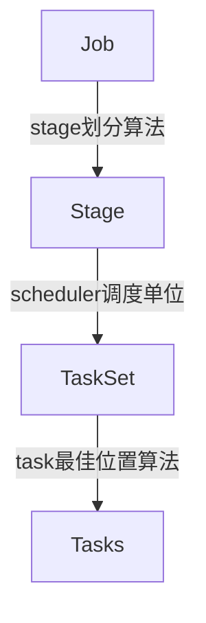

# spark

## 概念与理论

### 架构

#### 概念

##### Driver

主要完成任务的调度以及和executor和cluster manager进行协调。有client和cluster模式。client模式driver在任务提交的机器上运行，而cluster模式会选择机器中的一台机器启动driver。driver会执行代码中的main方法，创建SparkContext，并将application中的代码发送给executor，最后SparkContext会将task发送给executor执行。

##### Worker

集群中可以运行任务的节点。

##### Executor

worker中运行任务的节点。

##### Job, Stage, Task

可以认为每一个action都会产生一个job。
一个job会拆分成不同stage。
一个stage会分成不同的task。task是被executor执行的最小单元。

```mermaid
graph TB
Job--stage划分算法--> Stage
Stage--scheduler调度单位-->TaskSet
TaskSet--task最佳位置算法-->Tasks
```

job划分stage最重要的原则`从宽依赖处分割`。
task的数量由partition数量决定。
DagScheduler将stage封装成taskSet。

#### 宽窄依赖

窄依赖: 父RDD仅被一个子RDD依赖。
宽依赖: 父RDD不同数据被不同子RDD依赖。

cartesion(笛卡尔积)方法中，虽然父RDD被不同子RDD依赖，但仍然是窄依赖。`个人理解是因为不需要shuffle，而是将每个RDD都拷贝到其他RDD`

#### spark中常见操作

### spark shuffle过程

## 核心模块

### hdfs数据读取

#### RecordReader

对于普通的text文件，使用的是LineRecordReader，按行读取数据。

## 遇到的问题

### Task not serializable

由于Spark程序中的map、filter等算子内部引用了类成员函数或变量导致需要该类所有成员都需要支持序列化，又由于该类某些成员变量不支持序列化，最终引发Task无法序列化问题。

### spark-sql遇到 `Filtering is supported only on partition keys of type string`

用spark-sql执行下面语句 "select * from t where month in ('201903', '201904')" 会报错 `Filtering is supported only on partition keys of type string`
month是分区字段，int类型。相同的sql在hive中执行没有问题，但是在spark中报错。
网上有说将 hive.metastore.try.direct.sql=false，但是无效。

最终解决方案是将in用or替换。
