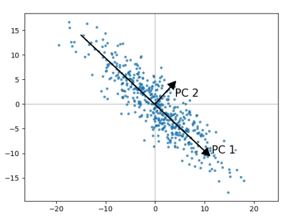
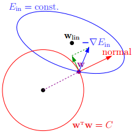

# 统计与机器学习

## 统计

### 方差 偏差

偏差 = bias
方差 = variance

### 抽样

bootstrapping抽样算法。对已有的观测样本反复的有放回抽样，通过多次计算这些放回抽样的结果，获取统计量的分布。

机器学习中，Bootstrap 方法指的是借助替换的随机采样，它是一个重采样，允许模型或算法更好地理解存在于其中的偏差、方差和特征。

### ROC, AUC

ROC(Receiver Operating Characteristic)，ROC曲线横坐标是FP，纵坐标是TP。
对于一个分类器，可以在平面上画出对应的FP/TP点。通过改变预测时使用的阈值可以得到多个点，得到的就是ROC曲线。
一个随机分类器，其曲线是(0,0)(1,1)的一条直线。
如果一个分类器效果好，那么曲线应该在(1,1)直线的上方。（保持TP高，FP小）。
AUC就是ROC曲线下方的面积，AUC越大，则可以认为效果越好。

ROC的一个特点是，当测试集中的正负样本比例变化时，曲线能基本保持不变（不考虑极端分布情况）。

一般来说，如果ROC是光滑的，那么基本可以判断没有太大的overfitting，AUC面积越大一般认为模型越好。

### 标准化 归一化

两者本质上都是数据的按比例压缩再平移。

归一化是将数据压缩到一个范围，一般用如下公式

```math
\frac{X - min(X)}{max(X) - min(X)}\quad
```

标准化使得每个特征中的数值平均变为0、标准差变为1。

```math
\frac{X - mean}{std}\quad
```

两种方法都不会影响数据的质量，例如数据的顺序。

怎么选择？网上的一种思路：

- 如果样本噪声不大，污染不严重，采用归一化比较好，量纲缩放到严格相同， 计算距离的时候带来的影响是等价的。
- 如果均值的信息是有意义的，建议不实用归一化，实用标准化。量纲不同但很接近，不要丢失核心关键。

### PCA 主成分分析

原理是在原空间中找到一组相互正交的坐标轴。第一个坐标轴是原数据中方差最大的方向，第二个坐标轴是与第一个坐标轴正交的平面中使得方差最大的坐标轴。第三个轴是与第一二坐标正交平面中方差最大的。依次类推。



例如将二维数据映射到一维上，数据越分散越好，也就是数据的方差越大越好。同时如果高维数据映射到低维，也是希望低维基向量之间关联性越小越好。也就是说相同特征之间方差越大越好，不同特征之间协方差越小越好。

实现时，通过计算数据的协方差矩阵，再得到特征值特征向量。最后选取特征值最大的k个特征对应的特征向量组成的矩阵。

## 机器学习

输入变量与输出变量均为连续变量的预测问题是回归问题。
输出变量为有限个离散变量的预测问题为分类问题。
输入变量与输出变量均为变量序列的预测问题为标注问题。

### L1,L2正则

从公式角度来说，L1正则是加上了各个系数的绝对值，L2正则是加上了各个系数的平方。

从物理角度来说（二维），L1是将系数的取值范围限制在以(0,0)一个菱形中，L2正则是限制在了一个圆形中。

以L2为例，如下图：



求解E最小值过程中，需要满足红色圆形的限制，梯度下降过程中最多只能沿着圆形边缘。当梯度和圆形切线垂直时，求得最小值。

```math
delta(E) + lamda * w = 0
```

把上面公式看成是一个函数的梯度，就是L2正则。

一般来说，L1得到的系数矩阵更稀疏，L2得到的矩阵更密集，但是值更小。从图形角度来看，L1菱形和cost梯度相交，更大概率是菱形的某个顶点，最优解多会出现在坐标轴上，导致某些系数为0。而L2圆形一般最优值不会在坐标轴上出现，所以矩阵更密集。

### 线性回归

y = w'x+e

用一个多元一维函数，拟合已有数据。

计算时，使用cost函数。通过找cost函数最小值，确定各项参数。求解时，假设所有样本的误差是独立同分布的，服从均值为0，方差为某个特定值的高斯分布。

求解有两个思路：

1. 最小二乘法。

    求解观测值与实际值差的平方和的最小值。最终转换成矩阵计算。

    ```math
    θ=(X^{T}X)^{-1}X^{T}Y
    ```

2. 极大似然法。

    极大似然法的核心思想是：当从模型总体随机抽取n组样本观测值后，最合理的参数估计量应该使得从模型中抽取该n组样本观测值的概率最大。

    剩下的推导过程就看不懂了。

特点：

1. 建模速度快，不需要很复杂的计算，在数据量大的情况下依然运行速度很快。
2. 可以根据系数给出每个变量的理解和解释。
3. 对异常值很敏感。

#### coursera学到的线性回归

教学中并没有提到极大似然法，而是使用梯度下降法以及矩阵运算（也就是最小二乘法）。

在梯度下降中，使用循环的方式计算最小值。在练习中，推导了出下面的公式，可以将每次循环的计算转变成一个矩阵计算：

```math
//TODO
```

同时，还特别提到了当数据值比较大时，需要主要特征的标准化。在实际练习过程中，确实遇到了值比较大而导致计算失败的情况。

两种方法相比，当特征数量较小时，使用最小二乘法。特征比较大时（例如超过了100000），考虑使用梯度下降。

### 逻辑回归

属于分类算法的一种。引入了逻辑函数，将 ax + b 映射到 [0,1] 区间。

常用的逻辑函数是 sigmoid函数。

```math
S(t) = 1/(1+e^{t})
```

导数为

```math
S^{'}(t) = S(t)(1-S(t))
```

损失函数是


通过梯度下降法求解。

### 决策树

决策树的学习本质上是从训练集中归纳出一组分类规则，得到与数据集矛盾较小的决策树，同时具有很好的泛化能力。

决策树有几种具体算法：ID3, C4.5, CART。

信息论中的熵：

```math
H(X) = -\sum_{i=1}^{n}p_{i}logp_{i}
```

条件熵H(Y|X)：已知X的情况下，随机变量Y的不确定性。

```math
H(Y|X) = -\sum_{i=1}^{n}p_{i}H(Y|X=x_{i})
```

信息增益：已知特征X，使得类别Y的信息不确定性减少的程度。

```math
g(Y, X) = H(Y) - H(Y|X)
```

为防止部分特征过于分散，导致分类后的信息熵为0，可以采用信息增益比。

```math
g_{R}(Y, X) = \frac{H(Y) - H(Y|X)}{H(X)}\quad
```

基尼指数：也是衡量样本不确定的方法。

```math
Gini(p) = 1 - \sum_{i=1}^{K}p_{k}^{2}
```

几个算法的基本计算过程都是：

1. 依次计算每个特征的增益，取增益最大的，作为下一个节点。
2. 在1的基础上，在每种取值的情况下，回到1，继续计算下一个节点。

C4.5在ID3的基础上，首先选用的是增益信息熵，其次有剪枝过程。

CART使用基尼指数，同时也有剪枝。而且CART生成的是二叉树。

对于可能有两个以上取值的特征，怎么能形成二叉树？
将这些取值，划分成两个集合，并分别计算其信息增益。

CART不仅可以作为分类模型，也可以用于回归。
特征的划分，也是将特征划分成两个集合，并以集合的均值作为预测值，计算与真实值的误差平方总和，能使得这个误差最小。

剪枝：

预剪枝：在构成树的过程中剪枝。每次要新增节点时，先在测试集合中计算新增节点是否能提高预测准确率，如果可以，则新增。（同时也会考虑树的复杂度。）

后剪枝：先将完整的树构建出来。剪枝只对底层节点（直接连接叶子的节点）进行，计算删除后在测试集中是否能提高预测准确率。

后剪枝决策树通常比预剪枝决策树保留了更多的分支；
后剪枝决策树的欠拟合风险很小，泛化性能往往优于预剪枝决策树；
后剪枝决策树训练时间开销比未剪枝决策树和预剪枝决策树都要大的多。

//TODO 剪枝的时候，是怎么判断是否保留节点的？是将当前决策树带入测试集去验证，还是使用loss函数计算？

### SVM

从最简单的线性svm说，其实是对线性回归的一种延伸。尝试用一个n-1的面对n维数据集进行划分，并且使得不同数据集到这个平面的最小距离最大。

```math
f(x) = w^{T}x + b
```

经过推导，最后求解方程是

```math
\max_{w,b} \frac{2}{||w||} \\
S.T. \quad y_{i}*(w^{T}x + b) \geq 1, i=1...m
```

#### ovo和ovr的区别

两种方式都能训练出多类别分类器。

ovr，是将每一类标签和其他标签分成两组，训练模型。一共训练n个模型。
ovo，是将每一个类别和另一个类别做为01分类器分别训练。一共训练 n*(n-1)/2 个模型。

多类别分类器在预测时，无论是ovo还是ovr，都有可能预测出不止一个结果。
对于ovo，有多个结果时，看结果的投票情况（哪种结果最多）；对于ovr，看每种结果的函数值。

### 随机森林 AdaBoost

都是集成方法，通过多个弱分类器，构建成一个大的更准确的分类器。

随机森林每次抽样不同的特征和不同的数据集。是有放回的抽样。

AdaBoost是每次训练全部特征和数据集。在一下次训练时，会参考上次训练的结果。每个样本，每个子分类器都有一个权重。一轮训练后，分错的样本权重增加，分对的样本的权重减小。同时，准确度高的分类器的权重增加，准确度低的分类器的权重减小。

#### 一篇博文的解释

AdaBoost法中，子分类器一般都是弱分类器，随机森林子分类器会采用强分类器。为什么？（更具体的表现是，AdaBoost算法调参时，子树的深度往往在6层即可，但是随即森林需要更高，大于10）

大致的解释如下：

AdaBoost中每次训练都依赖上次的结果，从而整体上在减少模型的偏差，但是最终方差会比较大。所以子分类器用弱分类器，有更小的方差，从而减少整体方差。

随机森林中，子分类器用的特征和数据集都是部分抽样的，导致每个子分类器的偏差会比较大，但方差比较小。所以选择强分类器，增加模型的复杂度，降低模型的偏差。

我个人直观的理解是，AdaBoost中每个分类器前同时训练了权重，导致更容易过拟合。随机森林每个子分类器可以看成是同一权重，外层模型更简单。

#### 随机森林优缺点

优点：

1. 可以处理分类和回归。
2. 抗过拟合。
3. 可以作用于高维数据，不用降维和归一化。
4. 容易并行训练。
5. 部分特征遗失，仍可以正常工作。
6. 可以看出不同特征的重要性。

缺点：

1. 取值分类较多的特征影响比较大。
2. 在噪音比较大的数据集上容易过拟合。

#### AdaBoost优缺点

优点：

1. 具有较低的泛化误差（泛化误差 = 方差 + 偏差 + 未知的噪音）
2. 可以配合多种分类器使用。
3. 不容易出现过拟合。

缺点：

1. 对异常数据敏感。异常数据容易预测错，从而对后续的训练有持续的影响。
2. 训练过程慢。

## 实践出真知

sklearn中的random_state，可以用在各种随机场合，主要是保证每次随机的种子是一致的。从而每次计算结果保持不变，便于调参等。

sklearn的缺失数据处理 sklearn.impute.SimpleImputer。

sklearn中PCA可以用pca.explained_variance_ratio_查看每个特征方差百分比。
