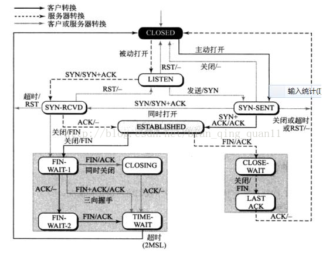

# 网络与http

## tcp

### 可靠性

1. 应用数据被分割成TCP认为最适合发送的数据块。
2. 当TCP发出一个段后，它启动一个定时器，等待目的端确认收到这个报文段。如果不能及时收到一个确认，将重发这个报文段。
3. 当TCP收到发自TCP连接另一端的数据，它将发送一个确认。这个确认不是立即发送，通常将推迟几分之一秒。
4. TCP将保持它首部和数据的检验和。这是一个端到端的检验和，目的是检测数据在传输 过程中的任何变化。
5. 既然TCP报文段作为IP数据报来传输，TCP报文段可能会失序。TCP将对收到的数据进行重新排序，将收到的数据以正确的顺序交给应用层。
6. TCP还能提供流量控制。TCP连接的每一方都有固定大小的缓冲空间。TCP的接收端只允许另一端发送接收端缓冲区所能接纳的数据。这将防止较快主机致使较慢主机的缓冲区溢出

#### 为什么不是立即发送ack？

ACK的基本工作原理，当发送端发送第N-1个包后，接收端答复的ACK序列号实际上跟发送端发送下一个包，也就是第N个包的序列号一致。

- 收到数据包的序号前面还有需要接收的数据包。因为发送方发送数据时，并不是需要等上次发送数据被Ack就可以继续发送TCP包，而这些TCP数据包达到的顺序是不保证的，这样接收方可能先接收到后发送的TCP包（注意提交给应用层时是保证顺序的）。
- 为了降低网络流量，ACK有延迟确认机制。
- ACK的值到达最大值后，又会从0开始。

### 状态机



图中 SYN/SYN+ACK 表示“收到SYN，发送SYN+ACK”

SYN_RCVD：服务端在接收到客户端的SYN连接请求后发送SYN+ACK给客户端，然后进入该状态，在接收到客户端的ACK报文之后进入ESTABLISHED状态。

SYN_SENT：客户端在发送出连接请求SYN后进入该状态，当接收到服务端的SYN+ACK后，返回ACK确认报文，然后进入ESTABLISHED状态。

#### 为什么SYN_SENT状态下会收到SYN？

这是“同时打开”的情况，两台机器都把对方当成server去连接。
此时双方的状态变化都是 LISTEN -> SYN_SENT -> SYN_RCVD -> ESTABLISHED

#### FIN_WAIT_1收到FIN是什么情况

是“同时关闭”，双方都主动关闭连接，此时会互相发送FIN。
双方状态变化都是 ESTABLISHED -> FIN_WAIT_1 -> CLOSING -> TIME_WAIT -> CLOSED

#### FIN_WAIT_1收到FIN+ACK是什么情况

CLOSE_WAIT其实不是必须的，看server端是否还需要把剩余的数据发送完。

### 三次握手


#### 为什么是三次？

##### 一次

肯定不行。漏洞太多。

##### 两次

情况一：server ack延迟，client没收到，但server回复ack时已经建立连接。此时client超时，重新发送syn，但server已经是建立状态，不再响应ack，无法建立连接。

情况二：client第一次syn延迟，重新发第二次syn，和server成功建立连接。传输完数据后关闭连接。此时第一次延迟syn到达，server认为是另一次连接，重新和client建立了连接。（但是第二次建立并不是client期望的。）

##### 四次

第三步

- 如果是server发syn给client，则可以和第二步server回复ack合并。
- 如果是client发syn给server，然后server回复ack时建立连接，这应该也可以，但是还是多出了一次网络传输，没有必要。不对，这样不可以，如果由server主动发起连接建立syn，会出现两次中的情况二，如果要避免重新建立，需要client再做额外判断和网络传输去取消server端的established状态，反而麻烦。如下图

```sequence
client->server: syn,seq=1
server->client: ack=2
client->server: syn=j
server->client: (established)ack=j+1(established)
```

##### 三次怎么解决两次的问题

情况一下：client收不到ack，不会发起建立连接请求。

情况二下：server再次收到syn，会发ack给client，此时client有机会去判断是不是自己正常发出的syn，如果不是，不会发起建立连接请求。

#### 四次挥手


##### TIME_WAIT

持续2MSL（Maximum Segment Lifetime，一般定义成30s, 1min, 2min）。

为什么要TIME_WAIT？

- 可靠的连接终止。server发送的FIN可能由于网络延迟或者丢包，没有发到client，需要重试。TIME_WAIT可以给client充分的时间对FIN进行回复。
- 让剩余的数据包能被识别并丢弃。避免新建连接后，老连接中的残留数据在新连接中传输，造成不可知影响。

##### CLOSE_WAIT

目的是让server把剩余的数据传输完毕，毕竟不能说关闭就关闭。

### RST

发送RST后不需要等待ack。

导致“Connection reset”的原因是服务器端因为某种原因关闭了Connection，而客户端依然在读写数据，此时服务器会返回复位标志“RST”，然后此时客户端就会提示“java.net.SocketException: Connection reset”。

FIN的语义是“不再发送数据”，而关闭socket表示既不发送也不接收。

服务器返回了“RST”时，如果此时客户端正在从Socket套接字的输出流中读数据则会提示Connection reset”；

服务器返回了“RST”时，如果此时客户端正在往Socket套接字的输入流中写数据则会提示“Connection reset by peer”。

#### 出现RST的场景

1. 请求未打开的端口。
2. 在请求超时后，又收到对方的包。A发送SYN，B回复ack但是超时，此时A会发送一个RST。
3. 在已关闭的socket上收到数据包。A和B建立了连接，但是A重启了，此时B连接没有断。如果B发送数据给A，会收到A的RST。
4. buffer还有数据时应用程序关闭连接。B读取A发的5000字节数据，但是读了4096字节就关闭了socket，此时B会给A发送一个RST。
5. linux启用了TIME_WAIT快速回收。

## 拥塞控制

### 滑动窗口

任意时刻，发送方都维持了一个连续的允许发送的帧的序号，称为发送窗口；同时，接收方也维持了一个连续的允许接收的帧的序号，称为接收窗口。
拥塞窗口是“发送方能发送出去而没有收到ack的最大报文数”。

### 拥塞控制 = 慢启动 + 避免拥塞 + 快速重传 + 快速恢复

#### 慢启动（从1开始，指数增长）

开始发送数据时，如果立即所大量数据字节注入到网络，那么就有可能引起网络拥塞。慢开始的“慢”并不是指cwnd的增长速率慢，而是指在TCP开始发送报文段时先设置cwnd=1，使得发送方在开始时只发送一个报文段（目的是试探一下网络的拥塞情况），然后再指数增大窗口。

#### 避免拥塞

当慢启动窗口达到阈值时，改为线性增长。当发生超时时，阈值改为当前的一半，并将窗口设置为1，重新慢启动。

#### 快速重传 + 快速恢复

接收方收到失序的数据包时，会发送重复确认，让发送发尽早知道报文没有达到。当发送方连续收到三次重复确认时，触发快速重传，将没有ack的数据包重传，并减半窗口阈值。
由于能连续收到多个重复确认，发送发可以认为网络没有拥塞，所以此时不触发慢启动，而是启用避免拥塞。

## 正向代理与反向代理


## https

### 介绍

HTTPS：是以安全为目标的HTTP通道，简单讲是HTTP的安全版，即HTTP下加入SSL层，HTTPS的安全基础是SSL，因此加密的详细内容就需要SSL。
HTTPS协议的主要作用可以分为两种：一种是建立一个信息安全通道，来保证数据传输的安全；另一种就是确认网站的真实性。

HTTPS和HTTP的区别主要如下：

1. https协议需要到ca申请证书，一般免费证书较少，因而需要一定费用。
2. http是超文本传输协议，信息是明文传输，https则是具有安全性的ssl加密传输协议。
3. http和https使用的是完全不同的连接方式，用的端口也不一样，前者是80，后者是443。
4. http的连接很简单，是无状态的；HTTPS协议是由SSL+HTTP协议构建的可进行加密传输、身份认证的网络协议，比http协议安全。

### https建立连接过程


在https中，不仅服务端会产生一个私钥，并发给客户端一个公钥。客户端也会产生一个随机的通讯密码（图中的对称密钥），用于通信过程的加密。

### 扩展

#### 公钥、私钥、数字签名

公钥加密，私钥解密，一般用于数据传输加密。
私钥加密，公钥解密，一般用于数字签名。

RSA签名的整个过程：

1. 发送方采用某种摘要算法从报文中生成一个128位的散列值（称为报文摘要）；
2. 发送方用RSA算法和自己的私钥对这个散列值进行加密，产生一个摘要密文，这就是发送方的数字签名；
3. 将这个加密后的数字签名作为报文的附件和报文一起发送给接收方：
4. 接收方从接收到的原始报文中采用相同的摘要算法计算出128位的散列值；
5. 报文的接收方用RSA算法和发送方的公钥对报文附加的数字签名进行解密；
6. 如果两个散列值相同，那么接收方就能确认报文是由发送方签名的。

## I/O

### 种类

注意 同步/异步 和 阻塞/非阻塞 的区别。

I/O时系统内核分两部分，一是数据准备，而是数据复制。

#### 阻塞I/O

在数据准备和复制阶段，调用了系统函数的应用进程都会阻塞。

#### 非阻塞I/O

数据准备阶段不会阻塞，而是当未准备好时返回EAGAIN，I/O函数会循环测试标志位，直到数据准备完毕。复制步骤，还是阻塞。

#### IO复用模型

##### select

用户进程先调用select函数，并阻塞在select上，直到内核有数据准备好。
select中会不断轮询请求的数据（文件描述符）。

##### epoll

用户进程也会阻塞在epoll上，和select的区别是不用轮询，当epoll_wait检测到描述符事件发生并将此事件通知应用程序，简单说就是由等待的数据主动通知。

#### 异步I/O

用户进程调用后立即返回，系统调用通过特定通道将数据传输给用户进程。

#### 信号驱动I/O

和异步I/O一样，需要有特定通道来和内核交互，一般是信号处理程序。
用户进程调用后立即返回 -> 数据准备好后内核回调信号处理程序 -> 用户进程再次调用数据复制函数，阻塞。