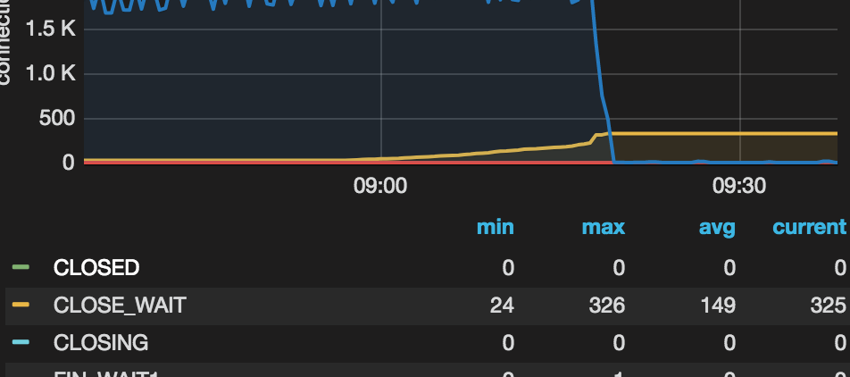
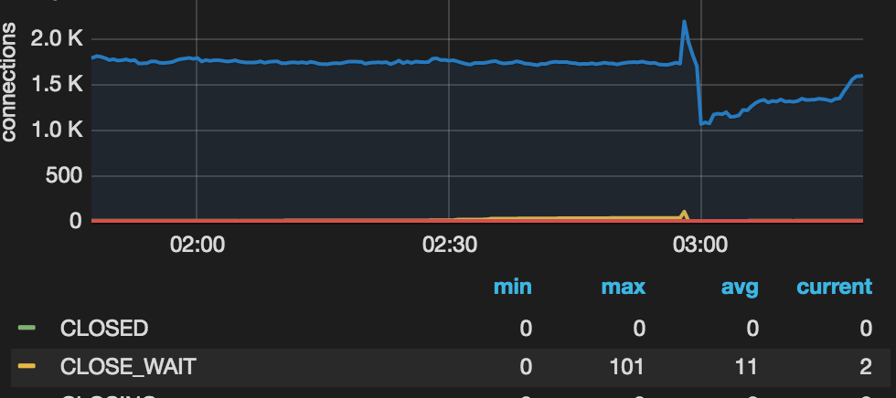

# 问题排查

## 问题一：大量的close_wait和syn_recv

### 具体情况

消息上传下载ng配置了两台机器，10.15和10.23早上8点多，机器上出现了大量的close_wait和syn_recv，导致上传下载功能瘫痪。

看23日监控，日常有24、25个close_wait，故障期间，close_wait骤增。



24凌晨，尝试排查问题。手动制造了一些会出现close_wait的现象。



尝试期间，调用了60~70次下载，结果出现了100+次clsoe_wait。（监控图可能有些偏差，但是总体量级是没问题的）

### 排查过程

首先怀疑是本地用的httpclient有问题。项目内用的是封装的TssHttpUtil，内部会用的是apache的httpclient，是DefaultHttpClient。但是这个用finally进行了close，而且如果出问题，也应该是会经常出问题。

其次怀疑是期间有网络异常等系统级别的问题，不过没有现场，不好排查。暂时放弃。

接着，回到了文件上传、下载这个功能上，因为非故障期间，close_wait也有25个。通过跟进javaswift源码，发现内部通信用的是apacha的httpclient，而且用的是PoolingHttpClientConnectionManager，其中这两个参数：MaxTotal=50, DefaultMaxPerRoute=25，数字上完美匹配。

同时，查看线上机器状态，用的是`netstat -apt | grep -i close_wait`，发现所有的close_wait都是连接到 l-icng***这个机器，看上去像是和文件服务器相关的。

此时，在本地进行了测试，尝试模拟线上问题。在跟进源码过程，发现源码如下：

```java
// org.javaswift.joss.command.impl.core.AbstractCommand#call

public N call() {
    logCall(request);
    try {
        response = httpClient.execute(request);
        HttpStatusChecker.verifyCode(getStatusCheckers(), response.getStatusLine().getStatusCode());
        return getReturnObject(response);
    } catch (CommandException err) {
        if (allowErrorLog) { // This is disabled, for example, for exists(), where we want to ignore the exception
            logError(request, err);
        }
        throw err;
    } catch (IOException err) {
        throw new CommandException("Unable to execute the HTTP call or to convert the HTTP Response", err);
    } finally {
        if (closeStreamAutomatically()) {
            try { close(); } catch (IOException err) { /* ignore */ }
        }
    }
}
```

如果访问资源不存在，HttpStatusChecker.verifyCode会抛异常，下面的catch后会继续抛出。
我们用的是org.javaswift.joss.model.StoredObject#downloadObjectAsInputStream()，这个会将inputStream暴露出来，不会自动关闭(closeStreamAutomatically() == false)。当抛出异常后，外部代码接收的是inputStream是个null，整个操作没有进行流的关闭。

之后再有请求，会卡在org.apache.http.impl.conn.PoolingClientConnectionManager#leaseConnection。

### 解决方案

方案一：
可以尝试直接用org.javaswift.joss.model.StoredObject#downloadObject()，这个可以直接读成一个byte[]，但是对于大文件，内存开销可能有点大。

方案二：
先用org.javaswift.joss.model.StoredObject#exists判断文件是否存在，不存在直接返回，不再调用downloadObjectAsInputStream()。

### 疑问

- [x] 不是qbcp机器主动连接文件服务器吗？为什么会有大量的close_wait，这个不是server端的状态吗？
- [x] 为什么会有300+个close_wait？按照刚才的分析，到了25个请求，不应该就停了吗？

### 问题总结

1. 导致故障的直接原因是下载不存在文件，然后根据上面说的流没有关闭，导致连接池耗干。
2. 为什么机器会停止服务http了？原因是25次流不关闭后，以后的下载请求也会卡住。我们的tomcat是bio，所以这些请求也无法返回，用jstack看，有200个tomcat线程处于wait状态。所以新来的请求也不会响应。
3. 为什么有20多个recv？原因是nginx会50ms发心跳检测请求，而一般recv的超时时间设置的是1min，正好会保持大约20个recv。
4. 为什么会有超过200个的close_wait？tomcat线程虽然满了，但是在nginx检测到心跳失败前，请求还是会过来，这些请求都不会返回，当客户端（这里是ng）超时后会发送FIN，服务端变成close_wait状态。所以不止有200个请求hang住了。